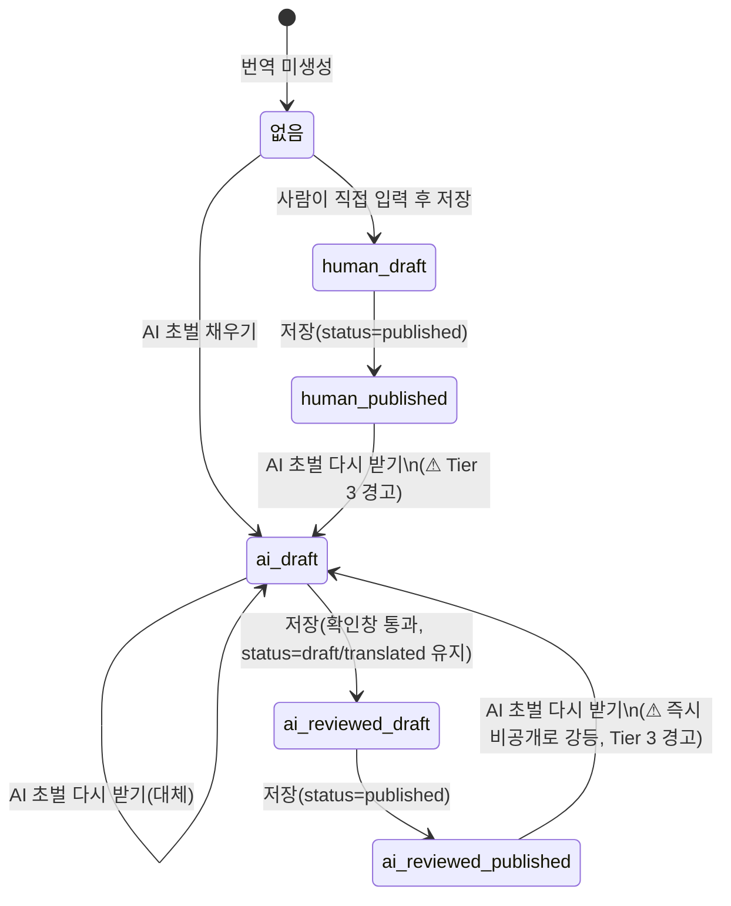

# Admin "AI 초벌 채우기" 화면 정의서

| 항목 | 내용 |
|---|---|
| 문서 종류 | UI Screen Spec (화면 흐름 / 상태 / 엣지케이스) |
| 작성자 | service-planner |
| 입력 문서 | [seepn-unified-platform-v1.0.prd.md](../../01-plan/features/seepn-unified-platform-v1.0.prd.md) §3.2.4 TR-2′/TR-3′/TR-4″ (L306-345) · [google-translation-api-evaluation.md](../../01-plan/features/google-translation-api-evaluation.md) §5(품질 리스크 Q-1~Q-6), §8.3(승인표) · `supabase/migrations/20260907100000_add_translation_source_column.sql`(Phase 0, 실행됨) |
| 그라운드 트루스 원칙 | 본 문서의 모든 화면 동작은 위 마이그레이션에 **실제로 존재하는** 컬럼/CHECK/RPC 시그니처를 근거로 한다. 아직 없는 동작(예: 표준 카테고리 RPC)은 "필요하지만 없음(Gap)"으로 명시한다 |
| 대상 화면 | `LandingCopyRow.tsx`, `CategoryRow.tsx`(CMS 카테고리), `CategoryDetailPanel.tsx`(표준 카테고리), `FaqRow.tsx`, `ArticleRow.tsx`(블로그만 — 사례 제외) |
| 명시적 제외 | `content_type='case_study'` (§3.5) |
| 후속 담당 | ux-writer(버튼/경고문구 최종 카피) → ui-ux-designer(배지·버튼 시안) → backend-developer(§6 API 계약, §7 Gap 해소) → frontend-developer(구현) → qa-reviewer |

---

## 0. 요약

| Gap/결정 | 내용 | 심각도 |
|---|:---|:---:|
| **결정** | AI 초벌 결과는 **즉시 DB에 `status='draft'`+`translation_source='ai'`로 저장**한다(2단계 미리보기 방식 아님) — Phase 0 RPC 주석이 이미 이 방식을 전제로 설계됨(§2.2) | — |
| **결정** | 저장(`저장` 버튼)은 기존 로직 그대로 두되(RPC가 `translation_source` 생략 시 자동 승격), 그 저장이 **`ai → ai_reviewed` 승격을 유발하는 첫 저장일 때만** 확인창을 추가한다(§4) | — |
| **⚠ Gap G-1** | `standard_category_translation`에는 (a) upsert RPC가 없고 (b) `(translation_source='ai' AND status='published')` 금지 CHECK도 없다 — 마이그레이션 자체가 "AI-fill 기능을 만드는 사람이 반드시 추가해야 한다"고 명시한 미해결 항목(`20260907100000` L70-78) | **차단** — §3.3, §7 |
| **⚠ Gap G-2** | `ArticleRow.tsx`는 현재 `content_type`을 prop으로 받지 않는다(`{ article, urlSegment }`만 받음, L118) — case_study 배제를 화면에서 판단할 근거 데이터가 컴포넌트에 없다 | **차단** — §3.5 |
| **⚠ Gap G-3** | `computeTranslationBadge`(`lib/admin/translationStatus.ts` L13-33)와 `TranslationRow` 타입(L5-9)은 `translation_source`를 아예 모른다 — AI 초안/검수완료 배지를 표시할 데이터 통로가 없다 | **차단** — §5 |
| **핵심 리스크(엣지케이스 1순위)** | 이미 **게시(published) 중인** 로케일 위에 AI 초벌을 다시 받으면, DB CHECK(`translation_source='ai' AND status='published'` 금지) 때문에 그 로케일은 **즉시 비공개(draft)로 강등**된다 — "덮어쓸지 경고할지"를 넘어 **라이브 콘텐츠가 내려가는 사고**다. §4 Tier 3 확인창으로 방어 | 높음 |

---

## 1. 공통 규칙

### 1.1 재사용 컴포넌트/유틸

| 요소 | 위치 | 이번 기능에서의 역할 |
|---|---|---|
| `TranslationRow`, `computeTranslationBadge` | `lib/admin/translationStatus.ts` | **확장 필요**(Gap G-3) — §5 |
| `TextEditor`/`TranslationEditor`/`FaqTranslationEditor`/`ArticleTranslationEditor` (로케일 카드) | 각 화면 컴포넌트 파일 | AI 초벌 버튼이 이 카드 안에 추가됨. 4곳 모두 구조가 동일(비소스 로케일 카드 = 대상) |
| `adminInputClass`, `adminButtonDestructiveClass` | `components/admin/styles.ts` | 신규 버튼 스타일은 기존 primary/destructive와 구분되는 **3번째 톤(outline/secondary)**이 필요 — ui-ux-designer 확인 필요(§5.3) |
| `window.confirm` 패턴 | `CategoryRow.tsx` L147, `ArticleRow.tsx` L142-147 | AI 초벌 덮어쓰기 확인창 / 저장 시 검수완료 승격 확인창에 동일 패턴 재사용(간단한 confirm으로 충분, 별도 모달 컴포넌트 불필요) |

### 1.2 소스/대상 로케일 매핑 (화면별, 코드 확인 완료)

| 화면 | 소스 로케일(원문, 수정 불가) | 대상 로케일(AI 초벌 버튼 노출) |
|---|---|---|
| 랜딩 카피 (`LandingCopyRow`) | `en` (L21) | `ja` |
| CMS 카테고리 (`CategoryRow`) | `en` (L22) | `ja` |
| 표준 카테고리 (`CategoryDetailPanel`) | `ko` (L18) | `en`, `ja` |
| 게시판 FAQ (`FaqRow`) | `en` (L23) | `ja` |
| 게시판 블로그 (`ArticleRow`, `content_type='blog'`만) | `en` (L24) | `ja` |

> **AI 초벌 버튼은 소스 로케일 카드에는 노출되지 않는다** — 원문을 스스로 번역할 수 없으므로 당연하지만, 명시적으로 못 박는다.

### 1.3 스코프 결정 — zh 로케일은 이번 범위에 포함하지 않는다

4개 테이블 모두 스키마상 `zh`를 지원하지만(`standard_category_translation`은 `20260830100000`로 zh 확장 완료, `content_translation`/`content_category_translation`도 CHECK가 `locale in ('en','ja','ko','zh')`), **현재 4개 화면의 `LOCALES` 상수 어디에도 zh 편집 카드가 렌더링되지 않는다**(전부 en/ja 또는 ko/en/ja만 배열에 있음). 이번 기능은 "이미 존재하는 로케일 편집 UI에 AI 초벌 버튼을 추가"하는 것이지 "신규 로케일 UI를 만드는 것"이 아니므로, **zh 카드 신설은 이번 범위에서 명시적으로 제외**한다. zh 편집 UI 자체가 필요한지는 별도 요청이며, 필요 여부는 §8 OQ-1로 product-manager에게 확인을 요청한다.

### 1.4 원문 길이 상한 — 20,000자, 필드 단위 적용

- privacy-security-officer 제안값(20,000자)을 **필드 1개당** 상한으로 적용한다(합산 아님). 다중 필드 로케일 카드(카테고리의 name+keywords, FAQ의 question+answer, 게시글의 title+excerpt+bodyMarkdown)는 **카드당 버튼 1개가 그 카드의 모든 필드를 한 번에 번역**하므로(§2.1), 그중 **하나라도 20,000자를 초과하면 버튼 전체를 비활성화**하고 어느 필드가 초과했는지 안내한다.
- 이 20,000자는 privacy-security-officer의 "제안"이며 최종 확정치가 아니다 — §8 OQ-3.

---

## 2. 공통 플로우

### 2.1 AI 초벌 채우기 — 클릭부터 저장까지

```mermaid
flowchart TD
    A["운영자가 대상 로케일 카드의<br/>'AI 초벌 채우기' 버튼 클릭"] --> D{"기존 번역 있음?"}
    D -->|없음/빈값| F["확인창 없이 진행"]
    D -->|있음, status=published| E3["🔴 Tier 3 경고: '현재 게시 중인 번역입니다.<br/>다시 받으면 즉시 비공개(초안)로 전환됩니다. 계속할까요?'"]
    D -->|있음, status≠published,<br/>translation_source=human/ai_reviewed| E2["🟠 Tier 2 경고: '사람이 작성/검수한 번역입니다.<br/>덮어쓸까요?'"]
    D -->|있음, status≠published,<br/>translation_source=ai(미검수)| E1["🟡 Tier 1 확인: '이미 AI 초안이 있습니다.<br/>새로 받으면 대체됩니다. 계속할까요?'"]
    E1 -->|취소| Z["아무 동작 없음"]
    E2 -->|취소| Z
    E3 -->|취소| Z
    E1 -->|확인| F
    E2 -->|확인| F
    E3 -->|확인| F
    F --> G["카드 disable + 로딩 스피너<br/>(텍스트/셀렉트/저장버튼 모두 비활성)"]
    G --> H["Server Action 호출<br/>(entity id + targetLocale만 전달, 원문 텍스트는 미전달)"]
    H --> I{"서버: 인증/권한 통과?"}
    I -->|실패| J1["에러: 권한 없음/세션 만료"]
    I -->|통과| K["서버가 DB에서 원문을<br/>직접 재조회(클라이언트 값 불신)"]
    K --> L{"원문 비어있음 또는<br/>필드별 20,000자 초과?"}
    L -->|예| J2["에러: 원문 문제(EMPTY_SOURCE/SOURCE_TOO_LONG)"]
    L -->|아니오| M["Google Cloud Translation API 호출"]
    M -->|타임아웃/429/기타 오류| J3["에러: 번역 서비스 오류, 재시도 유도"]
    M -->|성공| N["upsert RPC 호출<br/>p_status='draft', p_translation_source='ai'"]
    N --> O["번역 결과를 응답으로 반환"]
    O --> P["클라이언트: 응답값으로<br/>text/status 로컬 state 즉시 갱신<br/>(router.refresh()에 의존하지 않음, §6.4 참고)"]
    P --> Q["로딩 해제 + 'AI 초안' 배지 표시"]
    J1 --> R["로딩 해제, 버튼 재활성화, 기존 값 유지"]
    J2 --> R
    J3 --> R
```

### 2.2 저장 시 ai → ai_reviewed 승격 확인

기존 RPC(`upsert_content_translation`/`upsert_category_translation`, `20260907100000` L213-217, L303-307)는 **`p_translation_source`를 생략하면** "이전 값이 `ai`였을 경우 자동으로 `ai_reviewed`로 승격"한다. 이는 **수정 없이 저장만 다시 눌러도 검수 완료로 간주**되는 백엔드 기존 동작이며 바꿀 수 없다(이미 배포됨). 화면에서는 이 승격이 **"진짜 검수했다"는 의도적 확인 없이 조용히 일어나지 않도록** 저장 시점에 한 번 더 확인창을 추가한다.

```mermaid
flowchart TD
    A["운영자가 대상 로케일 카드의 '저장' 클릭"] --> B{"현재 translation_source == 'ai'?"}
    B -->|아니오 (human/ai_reviewed)| F["그대로 저장 진행 (기존 로직 변경 없음)"]
    B -->|예| C["확인창: 'AI 초안입니다. 저장하면<br/>검수완료로 표시되고, 이후 발행할 수 있게 됩니다.<br/>내용을 확인하셨습니까?'"]
    C -->|취소| Z["저장하지 않음"]
    C -->|확인| F
    F --> G["기존 upsert 서버 액션 호출<br/>(translation_source 파라미터는 여전히 미전달 —<br/>서버가 자동 승격 처리, 화면 로직 변경 없음)"]
    G -->|실패| H["에러: 저장 실패"]
    G -->|성공| I["배지 갱신: 'AI 초안' → '검수완료'"]
```

> 이 확인창은 **`translation_source='ai'`인 카드에서 저장을 누르는 매 순간마다** 뜬다(첫 저장뿐 아니라, `status='published'`을 고르고 저장하려 할 때도 동일 — 단 그 경우 서버가 어차피 `ai+published` 조합을 거부하므로, 확인 후 저장이 실패하면 "AI 초안은 검수 후에만 발행할 수 있습니다"라는 별도 에러로 안내한다). `ai_reviewed`나 `human` 상태에서는 뜨지 않는다.

### 2.3 상태 다이어그램 — `translation_source` × `status`



---

## 3. 화면별 정의

공통 메커니즘(§2)은 반복 서술하지 않고, 화면별 **차이점**만 표로 정리한다.

### 3.1 랜딩 카피 — `LandingCopyRow.tsx`

| 항목 | 내용 |
|---|---|
| 버튼 위치 | `ja` `TextEditor` 카드(L72-100) 헤더, 배지(`Badge`, L76) 왼쪽 |
| 대상 필드 | `text` (1개 필드, textarea) |
| 특이사항 | 필드가 1개뿐이라 §1.4의 "다중 필드 중 하나 초과" 케이스 없음 — 가장 단순한 케이스 |
| 필요 prop 추가 | `sourceText: string` (현재 `sourceUpdatedAt`만 전달, L48) — 클라이언트 측 사전 비활성화 판단(빈 값/길이초과)에 필요 |
| 신규 서버 액션 | `aiFillContentTranslationAction({ contentItemId, targetLocale })` — `app/admin/(protected)/content/actions.ts` |

### 3.2 CMS 카테고리 — `CategoryRow.tsx`

| 항목 | 내용 |
|---|---|
| 버튼 위치 | `ja` `TranslationEditor` 카드(L83-121) 헤더, 배지(L87) 왼쪽 |
| 대상 필드 | `name`(input) + `keywords`(쉼표구분 textarea, string[]) — **카드 버튼 1개가 두 필드를 함께 번역** |
| 특이사항 | `keywords`는 배열이라 서버가 각 키워드를 개별 문자열로 Google API에 전달(1회 배치 호출, §6.2)한 뒤 다시 쉼표구분 문자열로 조립해 반환. 키워드처럼 짧고 문맥 없는 단어는 오역 위험이 상대적으로 높음(고유명사 왜곡) — Advanced 글로서리 적용이 특히 중요한 지점이라는 점을 backend-developer에게 재확인 요청 |
| 필요 prop 추가 | `sourceText: string`(name), `sourceKeywords: string[]` |
| 신규 서버 액션 | `aiFillCategoryTranslationAction({ categoryCode, targetLocale })` — `app/admin/(protected)/content/actions.ts` |

### 3.3 표준 카테고리 — `CategoryDetailPanel.tsx` ⚠ Gap G-1

| 항목 | 내용 |
|---|---|
| 버튼 위치 | `en`, `ja` `TranslationEditor` 카드(L64-96) 헤더, 배지(L68) 왼쪽 — **2개 카드 모두에 버튼 노출**(소스가 `ko`라 대상이 2개) |
| 대상 필드 | `name`(input) 1개 |
| **화면이 요구하는 동작(백엔드 구현 방식과 무관)** | (1) AI 초벌 결과는 다른 3개 화면과 **동일하게** `status='draft'` + `translation_source='ai'`로 즉시 저장되어야 한다. (2) `ai + published` 조합은 다른 3개 화면과 동일하게 **저장 자체가 거부**되어야 한다(현재는 CHECK도 없고 RPC도 없어 이 화면만 방어선이 없는 상태). (3) 저장 시 `ai → ai_reviewed` 자동 승격 부기(§2.2)가 동일하게 동작해야 한다 |
| **Gap 상세** | `20260907100000` 마이그레이션 자신의 주석(L70-78)이 이미 "표준 카테고리용 AI-fill을 만드는 사람은 반드시 같은 가드(RPC raise + table CHECK)를 추가해야 한다"고 명시. 현재 `upsertStandardCategoryTranslationAction`(`app/admin/(protected)/categories/actions.ts` L169-205)은 direct `.upsert()`이고 `UpsertStandardCategoryTranslationInput`엔 `translation_source` 필드 자체가 없다 |
| **service-planner 권고(최종 결정은 backend-developer)** | 신규 RPC(`upsert_standard_category_translation`)를 신설해 다른 두 RPC와 동일한 패턴(감사로그, source_synced_at 부기, 자동승격 로직)으로 통일할 것을 권고한다. 근거: (a) 현재 action이 이미 `source_synced_at`을 수작업으로 복제하고 있어(L166-168 주석) 승격 로직까지 손으로 더 얹으면 TOCTOU 위험이 커짐(같은 마이그레이션 L132-140이 이미 지적한 문제의 재발), (b) 다른 두 테이블과 RLS 우회 방어 수준을 맞춰야 함(같은 마이그레이션 L88-96의 "RLS만으론 못 막는다" 분석이 이 테이블에도 그대로 적용됨) |
| 필요 prop 추가 | `sourceText: string` (ko `name`) |
| 신규 서버 액션 | `aiFillStandardCategoryTranslationAction({ categoryId, targetLocale })` |
| 선택 사항(Should, MVP 아님) | 패널 상단에 "전체 언어 AI 초벌 채우기"(en+ja 동시) 편의 버튼 — 대상 로케일이 2개뿐인 이 화면에서만 가치가 있어 다른 화면엔 만들지 않음 |

### 3.4 게시판 FAQ — `FaqRow.tsx`

| 항목 | 내용 |
|---|---|
| 버튼 위치 | `ja` `FaqTranslationEditor` 카드(L75-108) 헤더, 배지(L79) 왼쪽 |
| 대상 필드 | `question`(input) + `answer`(textarea) — 카드 버튼 1개가 두 필드 함께 번역 |
| 필요 prop 추가 | `sourceQuestion: string`, `sourceAnswer: string` |
| 신규 서버 액션 | `aiFillFaqTranslationAction({ contentItemId, targetLocale })` — `app/admin/(protected)/board/actions.ts` |

### 3.5 게시판 블로그 — `ArticleRow.tsx` (`content_type='blog'`만, 사례 제외) ⚠ Gap G-2

| 항목 | 내용 |
|---|---|
| 버튼 위치 | `ja` `ArticleTranslationEditor` 카드(L77-116) 헤더, 배지(L81) 왼쪽 |
| 대상 필드 | `title`(input) + `excerpt`(textarea) + `bodyMarkdown`(textarea, 가장 길어 20,000자 초과 가능성이 가장 높은 필드) |
| **`case_study` 배제 방식** | 버튼을 **비활성화가 아니라 아예 렌더링하지 않는다**(요청사항 원문 그대로 채택 — 사례는 실명·직함 등 제3자 PII가 관행적으로 들어가는 콘텐츠라 privacy-security-officer가 별도 게이트 확정 전까지 손대지 않기로 한 항목이므로, "언젠가 켤 수 있는 비활성 버튼"으로 보이면 안 됨) |
| **Gap 상세 (필수 선행 작업)** | `ArticleRow`는 현재 `{ article, urlSegment }`만 받고 `content_type`을 모른다(L118). `blog/page.tsx`(L31), `example/page.tsx`(L32) 둘 다 `<ArticleRow article={record} urlSegment={...} />`만 호출 — **어느 쪽 페이지도 `content_type`을 넘기지 않는다.** frontend-developer는 (1) 두 `page.tsx`에서 `contentType="blog"`/`contentType="case_study"` prop 추가 전달, (2) `ArticleRow`/`ArticleTranslationEditor`가 이를 받아 `contentType === 'case_study'`일 때 AI 초벌 버튼 트리를 렌더링하지 않도록 분기해야 한다 |
| **서버 측 방어(필수, UI만 믿지 않음)** | `aiFillArticleTranslationAction`은 클라이언트가 무엇을 보냈든 **서버에서 `content_item.content_type`을 직접 조회해 `case_study`면 즉시 거부**한다(`errorCode: 'CASE_STUDY_NOT_ALLOWED'`) — UI 비노출은 실수 방지용이고, 실제 정책 경계는 서버여야 한다는 이 프로젝트의 기존 원칙(CLAUDE.md, privacy-security-officer 개인정보 게이트 원칙)과 일치 |
| 필요 prop 추가 | `sourceTitle: string`, `sourceExcerpt: string`, `sourceBodyMarkdown: string`, `contentType: 'blog' \| 'case_study'` |
| 신규 서버 액션 | `aiFillArticleTranslationAction({ contentItemId, targetLocale })` — `app/admin/(protected)/board/actions.ts` |

---

## 4. 엣지케이스 총정리표 (4개 화면 공통)

| # | 상황 | 처리 | 우선순위 |
|---|---|---|:---:|
| E-1 | 원문이 비어있음(공백만 포함) | 버튼 자체를 **비활성화**(클라이언트 사전 판단, `sourceText.trim()===''`) + 툴팁 "원문이 비어 있어 번역할 수 없습니다". 클라이언트 우회 시 서버도 `EMPTY_SOURCE`로 재차 거부 | 필수 |
| E-2 | 원문이 20,000자(필드당) 초과 | 버튼 비활성화 + "원문이 너무 깁니다({N}자/최대 20,000자). 직접 입력해주세요." 클라이언트 우회 시 서버도 `SOURCE_TOO_LONG`으로 재차 거부 | 필수 |
| E-3 | 기존 번역이 있는 상태에서 다시 AI 초벌 실행 | §2.1의 Tier 1/2/3 확인창(내용 유무·작성주체·게시여부 3단계) | 필수 |
| **E-4** | **이미 게시(published) 중인 로케일 위에 AI 초벌을 다시 받음** | Tier 3 경고("즉시 비공개로 전환됩니다") — DB CHECK가 `ai+published`를 막기 때문에 저장이 성공하면 반드시 `status='draft'`로 강등됨. **경고 없이 조용히 라이브 콘텐츠가 내려가면 안 됨** | **최우선** |
| E-5 | 저장 버튼을 수정 없이 다시 누름(AI 초안을 그대로) | §2.2 확인창 — "검수완료로 표시됩니다. 확인하셨습니까?" | 필수 |
| E-6 | 여러 로케일(en/ja, 표준카테고리는 ko소스+en/ja)을 한 번에 요청할지 | **개별(로케일 카드당 버튼 1개)로 확정.** 근거: 기존 코드가 이미 로케일별로 완전히 분리된 저장 단위(별도 상태/에러/저장버튼)를 쓰고 있어, 여러 로케일을 한 서버 액션에 묶으면 "2개 중 1개만 실패"하는 부분 실패 처리가 새로 필요해지고 UI 상태 관리가 복잡해짐. 표준 카테고리(대상 2개)에 한해 "전체 언어" 편의 버튼은 Should(§3.3) | 필수(정책) |
| E-7 | API 타임아웃 | 버튼 재활성화, "번역 서비스 응답이 지연되고 있습니다. 잠시 후 다시 시도해주세요." 기존 텍스트/상태값은 그대로 유지(초기화하지 않음) | 필수 |
| E-8 | API 429(rate limit) | 동일 UX, 문구만 "번역 요청이 많아 일시적으로 제한되었습니다." **자동 재시도는 하지 않는다**(수동 재클릭만, §8 OQ-4) | 필수 |
| E-9 | API 기타 오류(4xx/5xx, 네트워크 단절 포함) | "번역 서비스에서 오류가 발생했습니다. 직접 입력하거나 잠시 후 다시 시도해주세요." | 필수 |
| E-10 | 서버 액션 자체가 실패(세션 만료, 권한 없음) | 기존 저장 실패 패턴과 동일한 톤 유지 + "권한이 없거나 세션이 만료되었습니다. 다시 로그인해주세요." (AAL2 세션 만료는 이 Admin 콘솔에서 실제로 발생 가능한 케이스 — RPC가 `is_aal2()`를 요구함, `20260907100000` L173-176) | 필수 |
| E-11 | 버튼 연타(중복 요청) | `translating` state로 버튼/카드 전체 disable — 로딩 중 재클릭 물리적으로 차단 | 필수 |
| E-12 | AI 초벌 진행 중 사용자가 다른 화면으로 이동/새로고침 | 서버 액션은 이미 DB에 저장을 마쳤거나 안 했거나 둘 중 하나로 끝남(진행 중 상태가 DB에 남지 않음) — 재진입 시 있으면 반영된 값, 없으면 이전 값 그대로 보임. 별도 처리 불필요 | 낮음 |
| E-13 | 원문(소스 로케일)을 방금 수정했지만 아직 저장하지 않은 상태에서 대상 로케일의 AI 초벌 클릭 | 서버는 **DB에 마지막으로 저장된 원문**을 기준으로 번역한다(클라이언트가 들고 있는 미저장 원문이 아님, §2.1 "K" 단계). 카드 하단에 상시 안내 문구 "※ 최근 저장한 원문 기준으로 번역합니다" 표시 (소스 dirty-state를 부모로 끌어올려 버튼을 막는 방식은 Should — 구현 비용 대비 이득이 낮아 MVP에서는 문구 안내로 대체) | 중간 |
| E-14 | 동시 편집 — 다른 관리자가 같은 로케일 행을 거의 동시에 수정/AI초벌 실행 | **이번 기능이 새로 만드는 문제가 아니라 기존 저장 플로우에 이미 있던 구조적 한계**(마지막 저장이 이김, `updated_at` 낙관적 잠금 없음). 이번 기능 범위에서 새로 해결하지 않고 기존 한계를 그대로 승계한다는 점만 명시(§8 OQ-5로 별도 백로그 여부 확인) | 낮음(기존 한계 승계) |
| E-15 | `case_study` 화면에서 어떤 경로로든(직접 API 호출 등) AI 초벌 요청이 들어옴 | 서버가 `content_type` 재조회 후 `CASE_STUDY_NOT_ALLOWED`로 무조건 거부(§3.5) — UI 비노출과 무관하게 항상 유효한 방어선 | 필수 |
| E-16 | 키워드(CMS 카테고리) 배열 중 일부 항목만 비어있음 | 빈 문자열 항목은 번역 호출에서 제외하고 그대로 빈 값 유지(에러 아님) | 낮음 |
| E-17 | Google Translate가 원문과 동일한 문자열을 그대로 반환(번역 불가 언어쌍 등) | 정상 성공으로 처리하고 그대로 저장 — 운영자가 검수 단계에서 육안으로 발견해 수정하는 것을 기대(§2.2 확인창이 안전망) | 낮음 |

---

## 5. 시각적 요소 요구사항 (배지) — Gap G-3 해소안

### 5.1 `TranslationRow`/`computeTranslationBadge` 확장 (`lib/admin/translationStatus.ts`)

- `TranslationRow` 타입에 `translation_source: 'human' | 'ai' | 'ai_reviewed'` 필드를 추가한다.
- 기존 `computeTranslationBadge`(상태/최신성 배지)는 **그대로 둔다**(하위 호환, 기존 4개 화면 모두 이미 이 함수를 쓰고 있어 시그니처를 건드리면 4곳 동시 회귀 위험).
- **신규 함수 `computeSourceBadge(row: TranslationRow | null)`을 추가**해 두 번째 배지를 별도로 계산한다(가산적 확장, 기존 호출부 무영향).

| `translation_source` | 배지 노출 여부 | 라벨(안, ux-writer 최종화 필요) | 톤 |
|---|:---:|---|---|
| `human` (또는 행 없음) | **노출 안 함** — 사람이 작성한 것이 기본값이므로 배지로 강조할 필요 없음(시각적 노이즈 최소화) | — | — |
| `ai` | 노출 | "AI 초안 · 미검수" | `warning`(주황 — 발행 전 반드시 확인 필요하다는 신호) |
| `ai_reviewed` | 노출 | "AI 초안 · 검수완료" | `info`(파랑 — 사람이 손댔거나 확인한 상태) |

- 화면 배치: 기존 상태 배지(미번역/번역필요/번역중/게시됨 등) **오른쪽에 나란히** 두 번째 배지로 표시. 두 배지가 동시에 노출될 수 있음(예: "번역완료" + "AI 초안·미검수" = 다 채워졌지만 아직 사람이 안 봤다는 뜻).

### 5.2 상태(status) 드롭다운 연동 — 발행 옵션 가드

- 카드의 `translation_source`가 `ai`인 동안은 상태 드롭다운의 **"게시됨" 옵션을 비활성화**(선택은 가능하되 저장 시 서버가 거부하는 것보다, 애초에 고를 수 없게 하는 편이 왕복 실패를 줄임)하고, 비활성 옵션에 툴팁 "AI 초안은 검수 후 발행할 수 있습니다"를 붙인다.
- 저장 후 `ai_reviewed`로 승격되면(§2.2) 다음 렌더에서 "게시됨" 옵션이 자동으로 다시 활성화된다 — **별도 로직 불필요**, `translation_source` 값에 따른 조건부 렌더링 하나로 해결됨.

### 5.3 버튼 스타일 (ui-ux-designer 확인 필요)

- "AI 초벌 채우기" 버튼은 기존 `저장`(primary, 파랑 채움)이나 `삭제`(destructive, 빨강)와 톤이 겹치면 안 된다 — **outline/secondary 톤 신설** 필요(예: 회색 테두리 + 회색 텍스트, 로딩 중엔 스피너 아이콘으로 교체). 정확한 색상/아이콘은 ui-ux-designer 몫이며, 이 문서는 "저장/삭제와 구분되는 3번째 톤이 필요하다"는 요구사항까지만 명시한다.

---

## 6. 서버 액션 계약 (backend-developer 핸드오프용 개요)

> 상세 계약(정확한 함수 시그니처, DB 트랜잭션 경계)은 backend-developer가 확정한다. 이 절은 화면이 요구하는 **요청/응답 최소 형태와 에러 코드 집합**만 못박는다.

### 6.1 공통 요청/응답 형태

```
요청: { <entityId>: string, targetLocale: string }
// entityId 이름은 화면마다 다름: contentItemId | categoryCode | categoryId

성공 응답: {
  success: true,
  body: { ...번역된 필드들... },   // 화면별 body 형태는 기존 upsert 액션과 동일 shape
  status: 'draft',
  translationSource: 'ai',
}

실패 응답: {
  success: false,
  errorCode:
    | 'EMPTY_SOURCE'
    | 'SOURCE_TOO_LONG'      // + maxLength, actualLength, field
    | 'TRANSLATE_TIMEOUT'
    | 'RATE_LIMITED'
    | 'TRANSLATE_API_ERROR'
    | 'ACCESS_DENIED'
    | 'CONFIG_ERROR'
    | 'CASE_STUDY_NOT_ALLOWED'   // ArticleRow 전용
    | 'INVALID_TARGET_LOCALE'   // 2026-09-08 qa-review 이후 추가 — targetLocale이 소스 로케일과 같은 우회 호출 방어
    | 'SAVE_FAILED',            // 2026-09-08 backend-developer 추가 — 번역 성공, upsert RPC 단계 실패
  message?: string,
}
```

> **2026-09-08 qa-reviewer 발견 사항 반영**: 최초 구현에서 5개 액션 모두 `targetLocale`이 소스 로케일과 같은지 서버가 검증하지 않는 허점이 있었다(권한만 있으면 Server Action을 직접 호출해 원문 행 자체를 "자기 자신을 재번역한 결과"로 덮어쓸 수 있었음 — E-4와 동일한 사고 패턴을 방어선 없이 재현). `INVALID_TARGET_LOCALE` 추가와 함께 5개 액션 모두에 런타임 검증이 추가됐다. 최종 카피는 `admin-ai-translation-draft.copy.md` §4 참고.

### 6.2 서버 처리 순서(필수 준수 사항)

1. 기존 upsert 액션과 동일한 인증/권한 재검증(`is_active_admin` + `is_aal2` + `has_menu_permission('content_management','update')`) — **클라이언트가 이미 확인했다고 서버가 생략하면 안 됨**(privacy-security-officer S-1: 번역 API 호출은 반드시 서버에서만, 이 원칙은 인증도 동일하게 서버가 다시 확인해야 함을 포함).
2. **원문은 클라이언트가 보낸 값이 아니라 서버가 DB에서 직접 재조회**한다(entityId + 소스 로케일로 조회) — §4 E-13 근거.
3. 원문 trim 후 빈 값이면 `EMPTY_SOURCE`, 필드별 20,000자 초과면 `SOURCE_TOO_LONG`.
4. `ArticleRow` 경로는 여기서 `content_item.content_type`을 조회해 `case_study`면 `CASE_STUDY_NOT_ALLOWED` 즉시 반환(§3.5, §4 E-15).
5. Google Cloud Translation API 호출(다중 필드는 1회 배치 호출로 묶어 "1건씩"이라는 TR-4″-1d 원칙을 유지 — 여러 필드/키워드를 한 API 호출에 배열로 담는 것은 배치 파이프라인이 아니라 "버튼 1클릭 = 서버 액션 1회 호출"의 구현 디테일이므로 원칙 위반 아님).
6. 성공 시 해당 upsert RPC를 `p_status='draft'`, `p_translation_source='ai'`로 호출(표준 카테고리는 §3.3 Gap 해소 후 동일 패턴 적용).
7. 번역 결과를 응답으로 반환(§6.4).

### 6.3 Google Translate 호출부 위치 — 서버 전용 모듈 격리 권고

privacy-security-officer S-1("번역 API 호출은 반드시 서버에서만")과 이 저장소에 실제로 있었던 사고 사례(`'use client'` 파일에 같이 둔 상수/헬퍼가 서버에서 조용히 빈 값으로 읽히는 버그, 프로젝트 메모리 참고)를 감안해, Google Translate 호출 래퍼는 **`'use client'` 컴포넌트와 같은 파일에 두지 말고 독립된 서버 전용 모듈**(예: `lib/server/googleTranslate.ts`)로 분리할 것을 권고한다. 최종 파일 위치는 backend-developer 판단.

### 6.4 클라이언트 반영 방식 — `router.refresh()`만으로는 부족함

현재 4개 화면의 로케일 카드들은 `useState(row?.text ?? '')`처럼 **마운트 시점에만** 초기값을 읽고, `key` prop으로 리마운트시키는 구조가 아니다(예: `LandingCopyRow`의 `TextEditor`는 부모가 `key`를 안 줌). 따라서 AI 초벌 후 `router.refresh()`만 호출하면 **서버 컴포넌트는 새 데이터를 들고 있어도 이미 마운트된 클라이언트 카드의 로컬 state는 갱신되지 않는다.** 반드시 **서버 액션의 반환값(`body`, `status`, `translationSource`)으로 로컬 state를 명시적으로 `setState`** 해야 한다(§2.1 "P" 단계). `router.refresh()`는 다른 화면 요소(예: 목록의 요약 배지) 동기화용으로 추가 호출은 무방하나, 카드 자체의 반영은 그것에 의존하면 안 된다.

---

## 7. Gap 정리 (backend-developer 확인 필요)

| Gap | 내용 | 영향받는 화면 | 심각도 |
|---|---|---|:---:|
| G-1 | `standard_category_translation`에 upsert RPC 없음 + `ai+published` 금지 CHECK 없음 | 표준 카테고리(§3.3) | 차단 |
| G-2 | `ArticleRow`가 `content_type`을 prop으로 안 받음 | 게시판 블로그(§3.5) | 차단 |
| G-3 | `computeTranslationBadge`/`TranslationRow`가 `translation_source`를 모름 | 4개 화면 전체(§5) | 차단 |

---

## 8. Open Questions (product-manager / ceo-advisor 확인 필요)

| ID | 질문 | 이 문서의 기본 가정(확인 전까지) |
|---|---|---|
| **OQ-1** | zh 로케일 편집 UI가 4개 화면에 아직 없는데, 이번 기능이 zh 카드를 새로 노출해야 하는지, 아니면 기존 en/ja(+표준카테고리 ko소스+en/ja)만 대상으로 하는지 | zh 신설 안 함(§1.3) — "AI 초벌 자동화"와 "신규 로케일 UI 추가"는 별개 요청으로 간주 |
| **OQ-2** | 표준 카테고리(G-1)에 신규 RPC를 만들지, 기존 direct-CRUD 액션에 로직을 얹을지 — 최종 판단은 backend-developer 몫이라 명시됐으나, 일정/우선순위 조율이 필요하면 product-manager 확인 요청 | RPC 신설 권고(§3.3) — 반대 시 최소한 CHECK 제약은 반드시 동반되어야 함 |
| **OQ-3** | 20,000자 상한의 최종 확정치·단위(필드당 vs 전체 합산)를 privacy-security-officer가 확정해야 함 — 현재는 "제안"일 뿐 | 필드당 20,000자로 설계(§1.4) |
| **OQ-4** | API 실패 시 자동 재시도(횟수/백오프)를 넣을지, 수동 재클릭만 지원할지 | 수동 재클릭만(자동 재시도 없음, §4 E-8) |
| **OQ-5** | 동시 편집 낙관적 잠금(E-14)을 이번 기능과 함께 고칠지, 별도 백로그로 둘지 | 이번 범위에서 해결 안 함, 기존 한계 승계 |

---

## 9. 후속 핸드오프

| 대상 | 요청 |
|---|---|
| ux-writer | §2.1 Tier 1/2/3 경고문구, §2.2 검수완료 확인문구, §4 에러 메시지 전체 최종 카피 — **확정 완료, [admin-ai-translation-draft.copy.md](./admin-ai-translation-draft.copy.md) 참고** (용어 수정 2건: 배지 라벨 "AI 초안"→"AI 번역"으로 변경(상태 드롭다운의 "초안"과 충돌 방지), "발행"→"게시"로 통일) |
| ui-ux-designer | §5.3 버튼 톤(3번째 outline/secondary 스타일), §5.1 배지 2종(AI 초안/검수완료) 시안 |
| backend-developer | §6 서버 액션 계약 확정, §7 Gap 3건 해소(특히 G-1은 표준 카테고리 화면 착수 전 선결) |
| frontend-developer | §3.5 Gap G-2(`ArticleRow`에 `contentType` prop 배선) 및 각 화면 `sourceXxx` prop 추가, §6.4 로컬 state 갱신 방식 반드시 준수 |
| qa-reviewer | §4 엣지케이스 표(특히 E-4 게시 중 콘텐츠 강등, E-15 case_study 서버 방어) 회귀 테스트 시나리오화 |
| product-manager / ceo-advisor | §8 Open Questions 5건 확인 |
