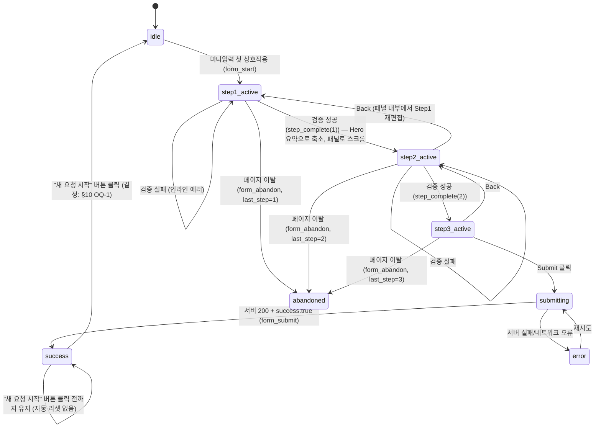

# FKP v0.2 Phase 2 — 접수(Request) 플로우 재정의 스펙

> **한 줄 요약**: Hero의 미니입력은 "관심 표시용 별도 폼"이 아니라 **기존 3단계 폼의 Step 1 그 자체**다. Step 1은 Hero로 옮기고, Step 2·3은 Hero 바로 아래 "이어가기 패널"로 옮긴다. 페이지 전체에서 **활성 편집 상태인 폼 인스턴스는 항상 정확히 1개**다.

| 항목 | 내용 |
|------|------|
| 문서 종류 | Service Flow Spec (PDCA Design phase) |
| 작성자 | service-planner |
| 작성일 | 2026-08-24 |
| 상태 | Final — OQ-1/2/3 대표 확정 반영 완료(2026-08-25, §10). OQ-4는 비차단으로 실행 단계 재량 |
| 입력 문서 | [fkp-v0.2-platform-foundation.prd.md](../../01-plan/features/fkp-v0.2-platform-foundation.prd.md) §4.2 (E2-R1~R9), §6 Phase 2 |
| 후속 담당 | ui-ux-designer(시안) → ux-writer(카피) → frontend-developer(구현) → qa-reviewer |

### Pipeline References

| Phase | Document | Status |
|-------|----------|--------|
| Plan | [fkp-v0.2-platform-foundation.prd.md](../../01-plan/features/fkp-v0.2-platform-foundation.prd.md) | ✅ |
| Design (본 문서) | 접수 플로우 스펙 | ✅ Final |
| Design (시안) | ui-ux-designer Figma/화면 시안 | ❌ 본 문서 완료 후 착수 |
| Design (카피) | ux-writer 카피 가이드 | ❌ 시안 완료 후 착수 |
| Code | frontend-developer 구현 | ❌ 미착수 |

---

## Context Anchor

| Key | Value |
|-----|-------|
| **WHY** | 접수폼이 페이지 최하단에 있어 스크롤 도달률에 전환율이 묶여 있다(PRD P-4). Hero에서 접수를 시작할 수 있게 해 전환율을 올린다 |
| **WHO** | 랜딩에 처음 도착한 해외 기업 담당자(en/ja) — 관심이 식기 전에 즉시 행동하고 싶은 사용자 |
| **RISK** | "Hero에도 폼, 하단에도 폼"이 되어 (1) 리드 중복 집계 (2) 사용자 혼란("두 번 써야 하나?")이 발생하는 것 — PRD E2-R4, 본 문서의 핵심 존재 이유 |
| **SUCCESS** | Hero 입력값이 손실 없이 이어지고, 접수 경로가 하나로 통합되어 리드 중복 집계가 없으며, 퍼널 이벤트가 세분화되고, 375px에서 헤드라인/CTA가 첫 화면에서 밀려나지 않는다 |
| **SCOPE** | In: Home(`/[locale]`)의 Hero~접수 섹션 재구성, 헤더 내비게이션 진입점, `/[locale]/request` 신규 페이지, 퍼널 이벤트 재정의 / Out: 실제 화면 시안(픽셀 레이아웃), 카피, 코드 구현, A/B 테스트 인프라(PRD §9 비목표) |

---

## 1. 핵심 결정 질문에 대한 답 (Executive Decisions)

PM이 요청한 3가지 핵심 질문에 먼저 명확히 답한다. 근거는 §2~§6에서 상세화한다.

### 결정 1 — Hero 미니폼은 "진짜 시작"인가, "관심 표시 후 스크롤 유도"인가?

> **답: 진짜 시작이다.** Hero의 미니입력 2필드(`whatLookingFor`, `category`)는 기존 `Step1` 컴포넌트를 **그대로** Hero 안에 배치한 것이다. 입력값은 새로 만드는 "관심 표시용 필드"가 아니라 실제 `RequestFormState`의 Step 1 데이터 그 자체이며, 유효성 검증을 통과하면 **동일한 상태 객체를 들고** Step 2로 진행한다. 재입력·재확인·"계속하시겠습니까?" 같은 중간 확인 단계는 없다.

### 결정 2 — 기존 "하단 3단계 폼"은 없어지는가, 재사용되는가, 별도로 남는가?

> **답: 물리적으로 분리 배치되어 재사용된다. 완전히 별도로 남지 않는다.**
> - `Step1`(2필드) → Hero 섹션 안으로 이동
> - `Step2` + `Step3` + `SubmitStatus`(기존 하단 폼의 나머지) → Hero **바로 아래**, 새 섹션 "이어가기 패널"(`#request-form`)로 이동. 페이지 하단(WhyUs 다음)에 있던 기존 위치는 사라진다
> - 동일한 3단계 폼 컴포넌트 세트가 **한 페이지 안에서 두 곳에 동시에 활성 상태로 존재하는 일은 없다.** Step 1이 진행 중일 때 이어가기 패널은 비어 있거나 접혀 있고(높이 0), Step 2·3이 진행 중일 때 Hero의 필드는 편집 불가능한 요약(recap)으로 축소된다(§4)
> - 별도로 `/[locale]/request` 페이지(E2-R7)에는 Step1+2+3이 **원래 하단 폼 그대로의 형태(한 화면에 연속 배치)** 로 재사용된다. Hero 분리 없이, 지금의 "3단계 폼 섹션"과 사실상 동일한 컴포넌트 구성

### 결정 3 — 헤더 내비게이션 진입점(E2-R2) 클릭 시 정확히 어디로 이동하는가?

> **답: 현재 페이지와 진행 상태에 따라 분기한다.** (상세 로직 §5)
> - Home이고 아직 시작 전(idle) → Hero의 미니입력으로 스크롤 + 첫 필드 포커스
> - Home이고 진행 중(step 2·3) → 이어가기 패널로 스크롤 (진행 중인 입력을 잃지 않기 위해 **페이지 이동시키지 않는다**)
> - Home이 아닌 다른 페이지(예: `/privacy`, `/terms`) → `/[locale]/request` 페이지로 **이동**
> - 이미 `/[locale]/request`에 있음 → 해당 페이지 상단으로 스크롤(별도 이동 없음)

---

## 2. 최종 단일 플로우 (Home 기준)

### 2.1 페이지 섹션 순서 (변경 후)

```
Header (로고 + "Request" 내비 진입점 + 언어전환)
  ↓
Hero
  - Headline
  - Subheadline
  - [미니입력: whatLookingFor(textarea) + category(select)]   ← Step1 컴포넌트 그대로
  - Primary CTA ("Start My Request")
  ↓
RequestFormContinuation  (id="request-form")                  ← 신설 섹션
  - idle 상태: 렌더링 안 함 (DOM에 없음 또는 height:0, 레이아웃에 공백을 만들지 않음)
  - step 1 완료 후: Step1 요약(recap, 수정 가능) + Step2 노출
  - step 2 완료 후: Step1 요약 + Step2 요약(recap, 수정 가능) + Step3 노출
  - 제출 중/성공/실패: SubmitStatus
  ↓
HowItWorks
  ↓
Categories
  ↓
WhyUs
  ↓
Footer
```

> 기존 순서(Header→Hero→HowItWorks→Categories→WhyUs→RequestForm→Footer) 대비, RequestFormContinuation을 Hero 바로 다음으로 옮긴 것이 유일한 섹션 순서 변경이다. HowItWorks/Categories/WhyUs는 내용·순서 변경 없음.

### 2.2 단계별 서술

1. **방문 (idle)**
   Home 진입. Hero에 Headline/Subheadline/미니입력 2필드/CTA가 보인다. RequestFormContinuation은 DOM에 없거나 높이 0 — 페이지에 빈 폼 섹션이 노출되지 않는다.

2. **미니입력 상호작용 시작**
   사용자가 `whatLookingFor` 또는 `category` 중 아무 필드나 처음 조작(focus 또는 change)하는 순간 `form_start` 발생(§6). 아직 페이지 이동·스크롤 없음.

3. **Step 1 제출 ("Start My Request" 클릭)**
   - 클라이언트 검증(`validateStep1`, 기존 로직 그대로: 둘 다 필수)
   - 실패 시: Hero 내부에 인라인 에러 표시, 상태 변화 없음, 이벤트 없음
   - 성공 시: `step_complete(1)` 발생 → 내부 상태 `step=2`로 전이 → **Hero는 요약 상태로 축소**(예: "찾으시는 것: {요약} · {카테고리} — [수정]") → 화면이 `#request-form`(이어가기 패널)로 부드럽게 스크롤 → 패널의 Step2 첫 필드에 포커스

4. **Step 2 작성 및 제출**
   - 이어가기 패널 상단에 Step1 요약(수정 가능), 그 아래 Step2 6개 필드
   - "Back" 클릭 시: 요약이 다시 편집 가능한 Step1 폼으로 펼쳐짐. **Hero로 스크롤 백업하지 않는다** — Step1 재편집은 항상 이어가기 패널 안에서 이루어진다(§4.2)
   - "Next" 클릭 → 검증 통과 시 `step_complete(2)` → `step=3` → Step2도 요약으로 축소, Step3 노출(같은 패널 내, 추가 스크롤 불필요)

5. **Step 3 작성 및 제출**
   - 회사명/웹사이트, 연락처, 개인정보/이용약관 동의(기존 로직 그대로)
   - "Submit" 클릭 → 클라이언트 검증 → `POST /api/requests` (Phase 1에서 이미 구현된 단일 경로, 변경 없음)
   - 서버 성공 확인 시에만 `form_submit` 발생 (Phase 1의 F-3 수정 방식 그대로 유지)
   - 성공: SubmitStatus="success"("감사합니다") 화면이 **유지된다. 자동으로 리셋되지 않는다.** 이 화면에는 "새 요청 시작" 버튼이 함께 노출된다(§4.2, 결정 확정: §10 OQ-1)
   - 실패: SubmitStatus="error" + 재시도 버튼(기존 로직 그대로)

6. **새 요청 시작 (사용자 액션, 선택적)**
   success 화면에서 사용자가 "새 요청 시작" 버튼을 클릭해야만 Hero·패널이 `idle`로 리셋된다. 버튼을 누르지 않는 한 success 화면은 계속 유지되며(같은 페이지에 머무는 한 사라지지 않음), 리셋 후 Hero로 scroll되어 다음 요청을 처음부터 입력할 수 있다.

7. **이탈(어느 단계에서든)**
   `form_start`가 발생한 이후, `form_submit` 도달 전에 탭을 닫거나 페이지를 벗어나면 `form_abandon` 발생(§6). 재방문 시 상태는 보존되지 않는다(§8 Edge Case E-6).

### 2.3 상태 다이어그램



---

## 3. `/[locale]/request` 전용 페이지 (E2-R7)

| 항목 | 내용 |
|------|------|
| 목적 | 아웃리치(명함, 이메일, SNS)에서 직접 링크 가능한 고정 URL 제공. 이미 관심이 확정된 방문자에게 마케팅 섹션 없이 바로 접수를 제공 |
| 구성 | Header(로고+언어전환만, "Request" 내비는 자기 자신이므로 숨김 또는 비활성 표시) → 짧은 한 줄 컨텍스트(카피는 ux-writer) → **Step1+Step2+Step3 연속 배치**(Hero 분리 없음, 기존 하단 폼과 동일한 형태) → Footer |
| Home과의 관계 | 완전히 별도의 페이지지만 **동일한 폼 엔진(동일 상태 로직, 동일 `POST /api/requests`)**을 재사용. Home의 Hero/패널 분리 UI와 다른 프레젠테이션일 뿐, 데이터 계약은 동일 |
| 중복 집계 여부 | 없음. 사용자는 한 세션에서 Home 또는 `/request` 중 하나로만 실제 제출을 완료한다. 두 화면이 동시에 열려 있어도 각각은 독립된 페이지 로드이며 서버는 제출된 건별로만 저장한다(기존 Phase1 서버 검증 로직과 동일) |
| Header 내비 CTA 대상 | `/[locale]/request` (§5) |

---

## 4. 화면/컴포넌트 정의서

### 4.1 Hero

| 구성요소 | 동작 | 상태별 표시 | 예외처리 |
|---|---|---|---|
| Headline, Subheadline | 정적 텍스트, 항상 최상단 노출 | 모든 상태에서 위치·내용 불변(§7 반응형 원칙 1) | — |
| 미니입력(`whatLookingFor`, `category`) — 기존 `Step1` 컴포넌트 재사용 | 포커스/입력 시 `form_start`(최초 1회, Categories 카드 클릭으로 인한 프리필도 동일하게 취급 — §5.1) | idle: 빈 입력, 플레이스홀더 노출 / step1_active: 사용자가 입력한 값 유지 / step2 이후~success: **편집 불가 요약 카드**로 축소, "[수정]" 클릭 시 이어가기 패널의 Step1로 스크롤(§4.2). success 상태에서도 직전 제출값 그대로 요약 유지(리셋 전까지 값을 지우지 않음, "새 요청 시작" 클릭 시에만 idle 빈 값으로 초기화) | 필수값 미입력 시 인라인 에러(기존 `validation.required` 문구 재사용). 자동 포커스(autofocus) 금지(§7 원칙 3) |
| Primary CTA ("Start My Request") | 클릭 시 Step1 검증 실행 → 성공하면 `step_complete(1)` + 패널로 스크롤 | idle/step1_active: 활성 / step2 이후~success: 텍스트가 "Continue My Request"로 바뀌며 클릭 시 이어가기 패널로 스크롤(재검증 없이 이동만) | 검증 실패 시 스크롤하지 않고 에러만 노출 |

### 4.2 RequestFormContinuation (`#request-form`, 이어가기 패널)

| 구성요소 | 동작 | 상태별 표시 | 예외처리 |
|---|---|---|---|
| 섹션 컨테이너 | idle일 땐 렌더링하지 않거나 height:0 | idle: 미노출(페이지에 빈 섹션 공백 없음) / step2 이후: 노출 | — |
| Step1 요약(recap) | 패널 진입 시 상단에 읽기 전용 요약으로 표시 | step2·3 진행 중: 접힘(collapsed) / "[Edit]" 클릭 시 펼쳐져 기존 `Step1` 폼 그대로 노출(이 시점부터는 **Hero가 아니라 이 패널이 Step1의 유일한 편집 위치**) | Step1을 패널에서 재편집 후 다시 Next → 재검증, 통과 시 다시 요약으로 접힘 |
| Step2 필드(기존 `Step2` 컴포넌트 그대로) | Next/Back | step2_active: 노출 및 편집 가능 / step3 진행 중: 접혀서 요약 표시 | 필수값 미입력 시 기존 인라인 에러 로직 그대로 |
| Step3 필드(기존 `Step3` 컴포넌트 그대로) | Submit/Back | step3_active: 노출 | 기존 로직 그대로 (동의 미체크 시 제출 불가 등) |
| SubmitStatus | 제출 결과 표시 | loading/success/error | success 시 **자동으로 사라지지 않는다.** "새 요청 시작" 버튼을 누르기 전까지 화면에 유지(결정 확정: §10 OQ-1) |
| "새 요청 시작" 버튼 (신규) | success 화면에 노출. 클릭 시 Hero·패널 상태를 `idle`로 리셋하고 Hero로 smooth scroll | success 상태에서만 노출. idle/step1~3/loading/error에서는 노출되지 않음 | 리셋 애니메이션 도중 중복 클릭 방지를 위해 클릭 직후 버튼을 짧게 비활성화하는 것을 권고(디테일은 frontend-developer 재량) |

### 4.3 Header 내비게이션 진입점 (E2-R2)

| 구성요소 | 동작 | 상태별 표시 | 예외처리 |
|---|---|---|---|
| "Request" 메뉴/CTA (헤더 상시 노출) | 클릭 시 §5의 분기 로직 실행 | 항상 노출(로그인 불필요, 모든 페이지 공통) | 스크롤 대상 섹션이 아직 DOM에 마운트되지 않은 극히 짧은 순간(SSR hydration 직후) 클릭 시 — 클릭 핸들러는 클라이언트 상태가 준비된 이후에만 바인딩되어야 함(hydration 이전 클릭은 기본 no-op) |

### 4.4 Categories (Home) — category 프리필 진입점 (신규, OQ-2 확정 반영)

> PRD E2-R1~R9에는 없었으나 대표 결정으로 Phase 2 범위에 포함되었다(§10 OQ-2). 기존 `Categories` 컴포넌트(5개 카드, 정적 표시)에 클릭 상호작용을 추가한다.

| 구성요소 | 동작 | 상태별 표시 | 예외처리 |
|---|---|---|---|
| 카테고리 카드(5개, 기존 `Categories` 컴포넌트) | 클릭 시 폼의 `category` 값을 해당 카드 값으로 설정 + §5.1 분기 로직에 따라 scroll | 카드 콘텐츠(이름/키워드) 자체는 변경 없음. 클릭 가능함을 나타내는 hover/cursor 스타일만 추가 | 클릭이 실제로 `category`를 바꿨다는 시각 피드백 필요(예: scroll 도착 지점에서 해당 카테고리가 선택된 상태로 보임). 카드 클릭은 **값을 프리필할 뿐 제출을 트리거하지 않는다** — 새로운 제출 경로가 생기는 것이 아니다(§9) |

---

## 5. 헤더 내비게이션 진입점 — 분기 로직 (E2-R2 상세)

| 현재 페이지 | 플로우 상태 | 클릭 시 동작 |
|---|---|---|
| Home (`/[locale]`) | idle | Hero 미니입력으로 smooth scroll + 첫 필드 focus |
| Home | step1_active | Hero 미니입력으로 smooth scroll (이미 보이는 위치면 포커스만) |
| Home | step2_active / step3_active | 이어가기 패널(`#request-form`)로 smooth scroll. **`/request`로 이동시키지 않는다** — 진행 중 입력 손실 방지가 최우선 |
| Home | success ("감사합니다" 화면 유지 중, 아직 "새 요청 시작"을 누르기 전 — 결정: §10 OQ-1) | 이어가기 패널(`#request-form`)로 scroll — success 화면과 "새 요청 시작" 버튼이 있는 위치. **자동으로 리셋하지 않는다**, 리셋은 오직 사용자가 그 버튼을 직접 눌렀을 때만 발생 |
| Home 이외 페이지 (`/privacy`, `/terms` 등) | — | `/[locale]/request`로 이동 |
| `/[locale]/request` | — | 페이지 최상단으로 scroll (이동 없음) |

> 이 로직은 클라이언트 상태(플로우 상태)를 헤더 컴포넌트가 읽을 수 있어야 구현 가능하다. 정확한 구현 방식(Context/상태 라이브러리/커스텀 훅)은 frontend-developer 재량이나, **"같은 페이지에서 진행 중인 입력을 유지한 채로 이동 없이 스크롤한다"는 동작 계약은 반드시 지켜야 한다.**

### 5.1 Categories 카드 클릭 — category 프리필 분기 로직 (신규, OQ-2 확정 반영)

> §4.4의 카드 클릭은 §5와 동일한 원칙("진행 중인 입력을 잃지 않는다")을 따라 상태별로 분기한다.

| 현재 플로우 상태 | `category` 처리 | scroll 동작 |
|---|---|---|
| idle | Hero 미니입력의 `category`를 클릭값으로 프리필. 이 프리필은 §6의 `form_start` 최초 상호작용 조건을 만족하는 것으로 간주해 `form_start`가 발동한다 | Hero로 smooth scroll + `whatLookingFor` 필드에 포커스(카테고리는 이미 채워졌으므로 나머지 입력을 유도) |
| step1_active | `category` 값을 클릭값으로 덮어씀(기존 선택값이 있어도 교체) | Hero로 scroll(이미 보이는 위치면 생략) + `category` 필드 하이라이트 |
| step2_active / step3_active | 이어가기 패널의 Step1 요약을 "[Edit]"과 동일한 방식으로 펼치고 `category`를 클릭값으로 프리필(§4.2, §8 E-1과 동일 메커니즘 재사용 — 새 편집 경로를 만들지 않는다) | 이어가기 패널(`#request-form`)로 scroll |
| success ("감사합니다" 화면 유지 중) | "새 요청 시작"을 대신 실행한 것으로 간주해 플로우를 `idle`로 리셋한 뒤, 그 idle 상태의 Hero에 `category`를 프리필 | Hero로 scroll |

> 카드 클릭은 값을 "제안"할 뿐 제출을 트리거하지 않는다. 사용자가 나머지 필드를 채우고 CTA/Next/Submit을 직접 눌러야 다음 단계로 진행된다 — §9(E2-R4)의 "제출 지점은 패널의 Step3 하나뿐" 원칙은 이 기능 추가로도 깨지지 않는다.

---

## 6. E2-R5 퍼널 계측 이벤트 정의

> **선행 결정**: 기존 `cta_click` 이벤트(Hero CTA 클릭 시 발동)는 이번 개편으로 **폐지**한다. Hero CTA의 역할이 "스크롤 유도"에서 "Step1 제출"로 바뀌었고, 그 순간은 아래 `step_complete(1)`로 이미 계측되므로 별도 이벤트가 불필요하다. GA4 대시보드를 보는 marketer는 이 변경을 인지해야 한다(과거 `cta_click` 데이터와 새 이벤트는 연속되지 않음).

| 이벤트 | 발생 시점(정확한 트리거) | 파라미터 | 세션당 발생 횟수 | 비고 |
|---|---|---|---|---|
| `form_start` | 사용자가 Step1의 두 필드(`whatLookingFor`, `category`) 중 **아무거나 처음** focus 또는 change 하는 순간. Hero에서도, `/request` 페이지에서도 동일하게 이 시점에 발동. Categories 카드 클릭으로 인한 `category` 프리필(§5.1)도 최초 상호작용이면 동일하게 발동 | `source`(`home_hero` \| `request_page`), `locale` | 플로우 인스턴스당 최대 1회 ("새 요청 시작" 버튼으로 idle 리셋 후 새 요청을 시작하면 다시 1회 발동 가능, §10 OQ-1) | 페이지 로드(`page_view`)나 Hero 단순 스크롤 통과만으로는 발동하지 않는다 |
| `step_complete` | 해당 스텝의 클라이언트 검증(`validateStepN`)이 통과해 `step` state가 다음 단계로 전이되는 **바로 그 시점**(같은 이벤트 핸들러 내) | `step_no`(`1` \| `2`), `source`, `locale` | 스텝당 여러 번 가능 (Back 후 재통과 시 재발동 — 의도된 동작, §6 하단 주 참고) | `step_no=3`은 존재하지 않는다. Step3의 완료는 곧 `form_submit`이다 |
| `form_abandon` | `form_start`가 이미 발동했고, `status !== 'success'`인 상태에서 페이지가 숨겨짐(`visibilitychange`→`hidden` 또는 `pagehide`) | `last_step`(`1`\|`2`\|`3`), `source`, `locale` | 플로우 인스턴스당 최대 1회(latch) | success 도달 후에는 발동하지 않는다. 이미 `form_abandon`이 발동된 뒤 사용자가 돌아와 제출을 완료하면 `form_submit`도 정상 발동 — 두 이벤트가 같은 세션에 공존하는 것은 버그가 아니라 "이탈 후 복귀 완료"로 해석한다 |
| `form_submit` | 서버가 성공을 확인한 시점(`POST /api/requests` 응답이 `response.ok && body.success === true`)에만 — 제출 시도가 아니라 **확정된 성공**. Phase 1에서 이미 이 방식으로 수정됨(F-3), Phase 2는 이 계약을 유지만 한다 | `source`, `locale`, `category` | 성공 시 1회 (제출 중 버튼 비활성화로 중복 방지, 기존 로직 유지) | — |

**재통과 시 `step_complete` 재발동에 대한 주**: Back→Next를 반복하면 같은 `step_no`에 대해 이벤트가 여러 번 잡힐 수 있다. 이는 "각 스텝을 몇 번 통과 시도했는가"가 아니라 "전환 그래프(퍼널)에서 각 스텝이 몇 번 완주됐는가"를 보기 위함이며, 중복 제거가 필요하면 GA4 집계 단계에서 `session_id + step_no` 기준 distinct 처리한다(계측 코드에서 막지 않는다 — 사용자의 실제 왕복 행동을 있는 그대로 남기는 것이 디버깅에 유리하다).

**payload `source` 필드 추가 권고**: 현재 `RequestFormPayload`(`types/request-form.ts`)에는 `source` 필드가 없다. PRD E1-R5 스키마에는 이미 `source` 컬럼이 정의되어 있으므로, Phase 2에서 `source: 'home_hero' | 'request_page'`를 제출 payload에 추가해 서버에 저장할 것을 권고한다(백엔드 계약 변경이므로 backend-developer와 조율 필요 — 이 문서는 필요성만 지적하고 계약 확정은 넘긴다).

---

## 7. 반응형 원칙 (E2-R6) — ui-ux-designer에게 넘기는 제약

> 픽셀 단위 레이아웃은 ui-ux-designer 소관이다. 여기서는 반드시 지켜야 할 **원칙**만 정의한다.

1. **순서 불변**: Hero 내부 요소 순서는 항상 Headline → Subheadline → 미니입력 2필드 → CTA다. 어떤 브레이크포인트에서도 미니입력이 Headline/Subheadline보다 위로 오거나, 그 둘을 화면 밖으로 밀어내는 배치는 허용하지 않는다.
2. **375px 첫 화면 보장**: Headline + Subheadline은 375px 뷰포트의 최초 스크롤 없는 화면(above the fold) 안에 반드시 들어와야 한다(현재 Hero와 동일한 기준 유지). 미니입력·CTA는 약간의 스크롤이 필요해도 무방하다 — "밀려나면 안 된다"는 요구는 완전히 안 보이게 되는 것을 금지하는 것이지, 스크롤 자체를 금지하는 것이 아니다.
3. **자동 포커스 금지**: 미니입력 필드에 페이지 로드 시 autofocus를 걸지 않는다. 모바일에서 자동으로 키보드가 올라오면 Headline이 뷰포트에서 가려질 수 있다.
4. **미니입력은 정확히 2개 컨트롤로 고정**: `whatLookingFor`(textarea) + `category`(select) 이상으로 필드를 늘리지 않는다. 늘어나면 Hero 세로 길이가 통제 불가능해진다.
5. **패널은 Hero와 레이아웃적으로 독립**: 이어가기 패널(`#request-form`)의 높이 변화(Step2/3 노출 시 커짐)가 Hero의 레이아웃에 영향을 주지 않아야 한다(패널은 Hero의 자식이 아니라 Hero 다음의 형제 섹션).
6. **네이티브 컨트롤 우선**: `category` select는 커스텀 드롭다운 오버레이 대신 네이티브 `<select>`를 유지한다(현재 구현과 동일 — 모바일 접근성·구현비용 모두 유리).
7. **768/1440px**: 375px 원칙이 지켜지면 넓은 화면에서는 제약이 완화된다. 다만 미니입력 2필드는 넓은 화면에서도 시각적으로 Hero의 "부속"으로 보여야 하며, 별도의 독립 섹션처럼 크게 확장하지 않는다(Hero와 하단 3단계 폼이 시각적으로 "같은 것"임을 사용자가 인지하게 하기 위함).

---

## 8. 엣지케이스 / 예외 상황

| # | 상황 | 정의된 동작 |
|---|---|---|
| E-1 | Step1을 Hero에서 통과한 뒤, 사용자가 다시 Hero의 요약 카드 "[수정]"을 클릭 | 이어가기 패널로 스크롤 후 그 안에서 Step1이 펼쳐짐. Hero 자체는 다시 편집 가능한 폼으로 되돌아가지 않는다(§4.1) — Hero는 Step1의 "입구"일 뿐, step2 진입 이후의 "편집 위치"는 패널로 고정된다 |
| E-2 | 사용자가 Hero 미니입력에 값을 입력했지만 CTA를 누르지 않고 헤더 "Request" 내비를 클릭 | `form_start`는 이미 발동됨. 상태는 `step1_active`이므로 §5 표에 따라 Hero로 스크롤(이동 아님) — 입력값 보존됨 |
| E-3 | 사용자가 Home 또는 `/request`에서 접수를 진행 중(`step1_active`/`step2_active`/`step3_active`)인데 언어 전환(LanguageSwitcher) 클릭 | 언어 전환은 페이지를 새로 로드하므로 진행 중이던 클라이언트 상태는 여전히 소실된다(이 Phase에서 상태를 언어 간 유지하는 것은 요구사항 밖). **단, 확정 결정(§10 OQ-3)에 따라 경고를 추가한다**: 플로우 상태가 `idle` 또는 `success`가 **아닐 때만** LanguageSwitcher 클릭 시 confirm 다이얼로그를 띄운다("언어를 변경하면 입력하신 내용이 사라집니다. 계속하시겠습니까?" 류, 정확한 카피는 §11에서 ux-writer 확정). 사용자가 확인하면 기존과 동일하게 언어 전환 진행(입력 소실), 취소하면 언어 전환을 중단하고 원래 상태 유지. `idle`/`success` 상태에서는 잃을 입력이 없으므로 경고 없이 즉시 전환 |
| E-4 | `/request` 페이지에서 접수 도중 헤더 "Request" 내비를 클릭 | §3에서 이 메뉴는 자기 자신이므로 숨기거나 비활성 처리. 클릭 가능하게 둘 경우 페이지 최상단 scroll만 하고 상태는 보존(같은 페이지 내 스크롤이므로 리로드 없음) |
| E-5 | 봇/자동화가 Hero 미니입력만 채우고 이탈을 반복(스크래핑, 폼 테스트) | `form_start`가 과다 발생할 수 있음. honeypot·rate limit은 이미 Phase1(E1-R10)에서 실제 제출 단계에 존재하므로 리드 데이터 오염은 없음. GA4 이벤트 노이즈는 허용 범위로 간주(별도 봇 필터링은 본 Phase 범위 밖) |
| E-6 | 제출 성공 후 idle로 리셋된 상태에서 사용자가 브라우저 뒤로가기 | 리셋된 idle Hero가 다시 보임(빈 폼). 직전 제출 데이터가 남아있지 않음 — 의도된 동작(민감정보를 브라우저 히스토리에 남기지 않기 위함) |
| E-7 | Step2/3 진행 중 네트워크가 끊겨 자동저장/동기화가 없는 상태에서 실수로 새로고침 | 클라이언트 메모리 상태이므로 전량 소실. 이번 Phase는 draft 영속화(localStorage 등)를 요구사항에 포함하지 않는다(PRD E2-R1~R7에 없음) — 필요 시 별도 개선과제로 제안(§10) |
| E-8 | 동일 사용자가 Hero로 접수 시작 후, 새 탭에서 `/request`도 열어 별도로 작성·제출 | 두 탭은 완전히 독립된 페이지 로드이며 각각 독립된 상태를 가진다. 두 탭에서 각각 제출하면 서버 입장에서는 정당한 2건의 별도 제출로 처리된다(같은 사람이 두 번 제출한 것과 동일 취급 — 이는 "폼 중복 렌더링" 문제가 아니라 사용자의 의도적 행동이므로 이번 문서의 E2-R4 방지 대상이 아니다) |

---

## 9. E2-R4 리스크 해소 — 명시적 확인

| PRD가 지적한 위험 | 본 설계에서의 해소 방식 |
|---|---|
| "Hero에도 폼, 하단에도 폼"이 동시에 존재 | 물리적으로 **하나의 3단계 폼 컴포넌트 세트**(Step1/Step2/Step3/SubmitStatus)만 존재한다. Hero와 이어가기 패널은 이 세트의 **서로 다른 스텝을 서로 다른 시점에** 보여주는 두 개의 "창(window)"일 뿐, 각각이 독립된 데이터 상태를 갖는 별도 폼이 아니다. 어느 시점에도 두 창이 동시에 같은 스텝을 편집 가능한 상태로 보여주지 않는다(§2.3 상태 다이어그램에서 각 상태는 정확히 하나의 활성 편집 위치를 갖는다) |
| 같은 리드가 두 경로로 중복 제출될 위험 | 제출 버튼은 이어가기 패널의 Step3에만 존재한다(Hero에는 제출 버튼이 없다 — Hero의 CTA는 Step1 통과용). 물리적으로 "제출"이라는 행동이 발생할 수 있는 지점이 페이지에 하나뿐이므로 중복 제출 경로 자체가 존재하지 않는다. `/request` 페이지는 별개 URL이므로 "같은 페이지 안의 중복"이 아니라 §8 E-8처럼 별개의 정당한 제출로 취급한다 |
| 사용자가 "이거 두 번 써야 하나?" 혼란 | Hero에서 입력한 값이 요약(recap)으로 패널 상단에 그대로 보이므로(§4.2), 사용자는 자신이 입력한 내용이 이어지고 있음을 시각적으로 확인할 수 있다. 재입력을 요구하는 필드는 없다 |
| 계측 이중 집계 | `form_submit`은 오직 서버가 확정한 성공에서만 발동(§6). Hero 단계에서는 `form_submit`이 발동할 수 있는 지점이 물리적으로 없다 |

---

## 10. Open Questions — 결정 현황

§1~9는 확정 스펙이다. OQ-1/2/3은 대표가 2026-08-24 확정했고 본 문서 §2/§4/§5/§8/§11에 반영 완료됐다. OQ-4만 원래부터 비차단 항목으로 열어둔다.

| ID | 질문 | **최종 결정** | 반영 위치 |
|---|---|---|---|
| OQ-1 | 제출 성공 후 즉시 `idle`로 리셋할지, 버튼을 눌러야 리셋할지? | ✅ **버튼 눌러야 리셋.** success 화면 유지, "새 요청 시작" 버튼 클릭 시에만 idle로 전이 | §2.2 step5·6, §2.3 상태 다이어그램, §4.2 |
| OQ-2 | Categories 카드 클릭 시 `category` 프리필 포함 여부? | ✅ **포함.** 상태별 분기 로직까지 정의 | §4.4, §5.1 |
| OQ-3 | 언어 전환 시 입력 소실에 대해 경고를 추가할지? | ✅ **경고 추가.** `idle`/`success` 이외 상태에서 LanguageSwitcher 클릭 시 confirm 다이얼로그 | §8 E-3 |
| OQ-4 | 이어가기 패널 스크롤 애니메이션의 구체 수치, reduced-motion 대체 여부 | 비차단 — 원칙만 명시(§5), `prefers-reduced-motion` 존중은 구현 시 기본 준수 사항으로 간주(별도 확인 불요), 수치는 ui-ux-designer/frontend-developer 재량 | §5, §7 |

---

## 11. ui-ux-designer 핸드오프 요약

### 재사용해야 하는 기존 컴포넌트 (구조 변경 없이 위치만 이동)

- `components/RequestForm/Step1.tsx` → Hero 내부 및 이어가기 패널(재편집 시)에서 재사용
- `components/RequestForm/Step2.tsx`, `Step3.tsx`, `SubmitStatus.tsx`, `FormField.tsx`, `styles.ts` → 이어가기 패널에서 그대로 재사용
- 기존 검증 로직(`validateStep1/2/3`), `submitRequest`, `POST /api/requests` 계약 → 변경 없음

### 새로 필요한 화면 요소 (시안 대상)

1. Hero의 "요약(recap) 카드" 상태 (Step1 통과 후 Hero가 어떻게 축소되어 보이는지)
2. 이어가기 패널 상단의 Step1/Step2 요약(collapsed recap + "[Edit]") 시각 디자인
3. 헤더의 "Request" 내비 진입점 (텍스트 링크 vs 버튼, 위치)
4. `/[locale]/request` 페이지의 미니멀 레이아웃(마케팅 섹션 없는 버전)
5. 성공 후 idle 리셋 트랜지션(§10 OQ-1 답변에 따라 형태 결정)

### 명시적 제약 (§7 요약)

- Hero 요소 순서 불변: Headline → Subheadline → 미니입력 → CTA
- 375px에서 Headline/Subheadline은 무조건 최초 뷰포트 안
- 미니입력 필드는 2개 고정, 자동 포커스 금지
- 이어가기 패널은 Hero와 레이아웃적으로 독립(패널 높이 변화가 Hero에 영향 없음)
- `category`는 네이티브 select 유지

### 카피가 바뀌는 지점 (ux-writer 확인 필요, 본 문서는 결정하지 않음)

- Hero CTA 텍스트: "스크롤 유도" 뉘앙스 → "접수 시작" 뉘앙스로 변경 필요 (예: 기존 어떤 문구든 "Start My Request" 류로)
- Step2 진입 후 Hero 요약 카드의 CTA 텍스트: "Continue My Request"
- 헤더 내비 진입점 라벨
- `/request` 페이지의 한 줄 컨텍스트 문구
- **"새 요청 시작" 버튼 라벨** (§4.2, §10 OQ-1) — success 화면에 노출
- **언어 전환 경고 confirm 다이얼로그 문구** (§8 E-3, §10 OQ-3) — en/ja 각각, "계속"/"취소" 버튼 라벨 포함
- Categories 카드에 hover 시 표시할 문구/시각 힌트가 필요하면 함께 확정 (§4.4 — 클릭 가능함을 알리는 요소)

---

## 12. PRD 요구사항 추적표 (Traceability)

| PRD ID | 본 문서에서 해소한 위치 |
|---|---|
| E2-R1 (Hero 최소입력 시작) | §2.2 step1~3, §4.1 |
| E2-R2 (내비 진입점) | §4.3, §5 |
| E2-R3 (손실 없는 이어짐) | §1 결정1, §2.2 step3, §9 표 3행 |
| E2-R4 (단일 플로우, 중복 방지) | §9 전체 |
| E2-R5 (퍼널 이벤트) | §6 |
| E2-R6 (모바일 375px) | §7 |
| E2-R7 (전용 페이지) | §3 |
| E2-R9 (화면 설계는 본 문서 범위 밖) | §11에서 ui-ux-designer로 명시적 이관 |

---

## 13. v1.2 개정 — Hero 내 가로 스텝 전환 + 제출 컨펌 모달 (2026-08-25, 대표 확정)

> **배경**: v1.1 구현(이어가기 패널이 Hero 아래로 스크롤되는 방식)을 실제로 확인한 대표가, "하단에 노출되지 않고 Hero 영역 안에서 3단계가 가로로 전환"되는 방식을 요청했다. 이 절은 §2·§4·§5.1·§9의 **해당 부분을 대체(supersede)**한다. §1(핵심 결정), §3(`/request` 페이지), §6(퍼널 이벤트), §7(반응형 원칙), §8(엣지케이스, E-1 제외)은 이 개정과 무관하게 그대로 유효하다.

### 13.1 최종 결정 (대표 확정)

1. **하단 "이어가기 패널" 구조는 폐지된다.** Step1/2/3은 전부 Hero 카드 **안에서만** 존재하고, 이동 시 스크롤이 아니라 **가로 슬라이드 전환**으로 다음/이전 단계를 보여준다. (`RequestFormContinuation` 섹션 및 `#request-form` 스크롤 타깃은 Home에서 제거된다 — `/[locale]/request` 페이지는 원래부터 이 컴포넌트를 쓰지 않으므로 영향 없음)
2. **Step3 완료 후 곧바로 제출하지 않는다.** Step3에서 "제출" 버튼을 누르면 화면 **정중앙에 컨펌 모달**이 뜨고, 모달에는 **1~3단계에서 입력한 내용 전체를 요약**해서 보여준다. 모달에서 확정해야만 실제로 `POST /api/requests`가 호출된다. 취소하면 모달만 닫히고 Step3로 그대로 복귀(입력값 보존).

### 13.2 새 상호작용 모델

```
Hero 카드
 ├─ Headline / Subheadline (모든 단계에서 위치·내용 불변, §7 원칙1 그대로 유지)
 └─ Step Carousel (overflow-hidden 컨테이너, 내부를 translateX로 이동)
     ├─ Panel 1 (Step1: whatLookingFor + category) — "Start My Request" → Panel 2로 슬라이드
     ├─ Panel 2 (Step2: partnerType/purpose/description/budget/timeline/englishSpeaking)
     │    "Back" → Panel 1로 슬라이드(값 보존, 재편집)
     │    "Next" → Panel 3로 슬라이드
     └─ Panel 3 (Step3: companyNameWebsite/contact/동의)
          "Back" → Panel 2로 슬라이드(값 보존, 재편집)
          "제출" → §13.3 컨펌 모달 오픈 (슬라이드 아님, 오버레이)
```

- 한 번에 정확히 1개 패널만 보인다(다른 패널은 `translateX`로 화면 밖에 위치, `aria-hidden`/`inert` 처리해 스크린리더·탭 포커스가 숨겨진 패널로 넘어가지 않게 한다).
- 전환은 `prefers-reduced-motion` 존중 — 해당 시 애니메이션 없이 즉시 전환(기존 `lib/dom/scrollTo.ts`의 `prefersReducedMotion()` 재사용).
- **E2-R4(활성 편집 폼 정확히 1개) 재확인**: 이 모델에서는 애초에 DOM에 "동시에 편집 가능한 패널"이 구조적으로 1개만 노출되므로(나머지는 `aria-hidden`), v1.1의 recap 카드 방식보다 오히려 원칙을 더 단순하게 만족한다. RecapCard/이어가기 패널 관련 §4.2, §9 서술은 이 절로 대체된다.
- Step1 통과 후에도 Hero의 Headline/Subheadline은 그대로 유지된다(§7 원칙1 불변) — 바뀌는 것은 카드 내부의 스텝 패널뿐이다.
- 헤더 "Request" 내비 진입점(§5)은 단순화된다: Home에서는 진행 상태(step1~3)와 무관하게 **항상 Hero로 스크롤**(패널이 따로 없으므로 "패널로 스크롤"과 "Hero로 스크롤"의 구분이 사라짐). 그 외 페이지 → `/request` 이동, `/request` 자신 → 최상단 스크롤은 기존과 동일.

### 13.3 제출 컨펌 모달 (신규)

| 항목 | 내용 |
|---|---|
| 트리거 | Step3(Panel 3)의 제출 버튼 클릭 + 클라이언트 검증(`validateStep3`, 동의 체크 포함) 통과 시 |
| 위치 | 화면 정중앙 오버레이(모달), 배경 스크림 클릭 시 취소와 동일하게 닫힘 |
| 내용 | 1~3단계에서 입력한 값 전체를 사람이 읽기 쉬운 요약으로 표시: `whatLookingFor`, `category`(라벨), `partnerType`(라벨), `purpose`, `description`, `budget`(라벨), `timeline`(라벨), `englishSpeaking`(라벨), `companyNameWebsite`, `contact`. 동의 체크박스 상태는 요약에 포함하지 않는다(이미 Step3에서 확인된 사실이므로 중복 표시 안 함) |
| 버튼 | "확인/제출" — 클릭 시 모달은 loading 상태로 전환(스피너), 실제 `POST /api/requests` 호출. 성공 시 모달이 닫히고 Hero 카드가 success 상태(기존 `SubmitStatus`)로 전환. 실패 시 모달 안에 에러 표시 + 재시도 버튼(모달을 닫지 않음) / "취소" — 모달만 닫고 Step3로 복귀, 입력값 완전 보존, 아무 것도 전송되지 않음 |
| 접근성 | 모달 오픈 시 포커스를 모달 내부(제목 또는 확인 버튼)로 이동, `Esc` 키로 취소와 동일하게 닫힘, 모달이 열려 있는 동안 배경 콘텐츠는 `inert` 처리 |
| 다국어 | 요약 항목의 라벨(카테고리명, 예산 구간명 등)은 각 select의 dictionary 라벨을 그대로 재사용 — 새 카피 불필요. 모달 제목/버튼/안내 문구만 ux-writer 신규 카피 필요(§13.5) |

### 13.4 Categories 프리필 로직 갱신 (§5.1 대체)

가로 전환 모델에서는 "패널"이 없으므로 §5.1의 step2/3 분기(패널의 Step1 recap을 펼치는 방식)가 성립하지 않는다. 아래로 대체한다.

| 현재 카루셀 위치 | `category` 처리 | 전환 동작 |
|---|---|---|
| Panel 1 (step=1) | 클릭값으로 프리필(§5.1 기존 로직과 동일) | Hero로 scroll(§13.2와 동일한 하이라이트 피드백 유지, 2026-08-25 수정분) |
| Panel 2 또는 Panel 3 (step=2/3) | 클릭값으로 프리필 | 카루셀을 **Panel 1로 슬라이드**(뒤로 가기와 동일한 전환)해서 바뀐 카테고리를 바로 보여줌 — 사용자가 Step2/3에서 입력한 값은 유지된 채로, 다시 Next를 눌러 그대로 복귀 가능 |
| 컨펌 모달이 열려 있는 상태 | 모달을 닫고 Panel 1로 슬라이드 + 프리필 | 모달이 열려 있다는 것은 이미 Step3까지 완료했다는 뜻이므로, Panel 1로 되돌아가는 것이 §13.2의 Back 개념과 일관 |
| success (제출 완료) | 기존과 동일: 리셋 후 Panel 1에 프리필 | Hero로 scroll |

### 13.5 ux-writer 신규 카피 필요 항목

- 컨펌 모달 제목 (예: "제출 전 확인해주세요")
- 컨펌 모달 안내 문구 (예: "아래 내용으로 요청을 접수합니다. 계속하시겠습니까?")
- 모달 "확인/제출" 버튼 라벨, "취소" 버튼 라벨
- 모달 내 요약 섹션의 필드 그룹 라벨(예: "찾으시는 것" / "상세 정보" / "연락처") — 있으면 가독성이 좋아지나 필수는 아님, ux-writer 재량

### 13.6 이번 개정으로 폐기되는 것

- `components/RequestFormContinuation.tsx`, `#request-form` 스크롤 타깃 — 삭제
- `components/RequestForm/RecapCard.tsx`의 Hero 내 recap 용도 — Hero 자체가 카루셀이 되므로 "Step1 완료 후 recap 카드"라는 개념이 없어진다(모든 이전 입력은 그냥 그 스텝 패널로 돌아가면 보임). RecapCard 컴포넌트 자체는 컨펌 모달의 요약 섹션에서 재사용 가능하면 재사용, 아니면 삭제
- "새 요청 시작" 버튼(§2.2 step6, §4.2)은 유지 — success 상태에서 동일하게 필요

---

## Version History

| Version | Date | Changes | Author |
|---------|------|---------|--------|
| 1.0 | 2026-08-24 | 초안 작성 — Hero=Step1, 이어가기 패널=Step2/3, `/request` 전용페이지, 헤더 내비 분기 로직, 퍼널 이벤트 4종 정의, E2-R4 리스크 해소 근거, 반응형 원칙, Open Questions 4건 | service-planner |
| 1.2 | 2026-08-25 | 대표가 v1.1 구현을 실사용 검토한 뒤 요청 — 이어가기 패널(스크롤 방식) 폐지, Hero 카드 내 가로 스텝 전환(카루셀)로 대체, Step3 제출 시 입력내용 요약이 포함된 컨펌 모달 추가(§13). Categories 프리필 로직(§13.4)과 헤더 내비(§13.2)를 카루셀 모델에 맞게 갱신 | 대표 요청 반영 |
| 1.1 | 2026-08-25 | OQ-1/2/3 대표 확정 반영: "새 요청 시작" 버튼(§2.2, §4.2), Categories 프리필 분기(§4.4, §5.1), 언어전환 경고 confirm(§8 E-3). §10 Open Questions를 결정 현황으로 갱신, §11 ux-writer 카피 항목 3건 추가. 문서 상태 Draft → Final | service-planner (문서 결정 반영 재개) |
