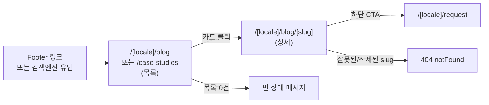

# FKP v0.2 Phase 5-D — 블로그/사례/FAQ 스펙

> **한 줄 요약**: 블로그·사례는 목록+상세 2단 라우트(`/[locale]/blog`, `/[locale]/case-studies` + 각 `[slug]`)로, FAQ는 상세 라우트 없는 단일 아코디언 페이지(`/[locale]/faq`)로 노출한다. 마크다운은 새 npm 의존성을 추가하지 않고 이미 존재하는 `lib/legal/renderMarkdown.tsx`의 의존성 없는(dependency-free) 렌더러를 공통 모듈로 확장해 재사용한다. 관리자 화면은 기존 "콘텐츠관리" 탭 구조(카테고리/랜딩카피)에 탭 3개(블로그/사례/FAQ)만 추가하고, 새 메뉴·권한 코드는 만들지 않는다.

| 항목 | 내용 |
|------|------|
| 문서 종류 | Service Flow Spec (PDCA Design phase) |
| 작성자 | service-planner |
| 작성일 | 2026-08-27 |
| 상태 | Draft — §10 Open Questions 확인 후 Final 전환 |
| 입력 문서 | [fkp-v0.2-platform-foundation.prd.md](../../01-plan/features/fkp-v0.2-platform-foundation.prd.md) §8.1.1 OQ-1("광범위 CMS 채택"), `supabase/migrations/20260827100000_phase5_content_management_schema.sql` (이미 적용된 불변 스키마) |
| 참고 구현 | `app/admin/(protected)/content/*`(카테고리/랜딩카피 관리자 UI), `lib/admin/translationStatus.ts`, `lib/content/getLandingCopy.ts`, `lib/legal/renderMarkdown.tsx`, `app/[locale]/page.tsx`(ISR 60s 패턴) |
| 후속 담당 | ux-writer(신규 dictionary 키 카피) → ui-ux-designer(카드/아코디언 시안, 선택적) → backend-developer(content_item CRUD RPC 3종 + 공개 조회 계약) → frontend-developer(라우트/컴포넌트 구현) → qa-reviewer |

### Pipeline References

| Phase | Document | Status |
|-------|----------|--------|
| Plan | [fkp-v0.2-platform-foundation.prd.md](../../01-plan/features/fkp-v0.2-platform-foundation.prd.md) §8.1.1 | ✅ |
| Design (데이터 모델) | `supabase/migrations/20260827100000_phase5_content_management_schema.sql` | ✅ 적용 완료, 변경 불가 |
| Design (관리자 UI 패턴 선례) | `app/admin/(protected)/content/*`(Phase 5-B/5-C) | ✅ 구현 완료 |
| Design (본 문서) | 블로그/사례/FAQ 라우트·화면·마크다운 정책 스펙 | 🟡 Draft |
| Design (카피) | ux-writer — 신규 dictionary 키(§8) | ❌ 본 문서 완료 후 착수 |
| Code | backend-developer(RPC 3종) → frontend-developer(라우트/컴포넌트) | ❌ 미착수 |

---

## Context Anchor

| Key | Value |
|-----|-------|
| **WHY** | 랜딩페이지 하나만으로는 SEO 유입 채널이 없고, 리드 전환 전 "이 서비스가 신뢰할 만한가"를 뒷받침할 사례·설명 콘텐츠가 없다. PRD가 이미 광범위 CMS 채택을 확정(§8.1.1 OQ-1)했고 DB 스키마도 4가지 콘텐츠 타입(`landing_copy`/`blog`/`case_study`/`faq`)을 전제로 이미 적용돼 있다 — 랜딩카피(5-C)는 이미 나갔고, 이번은 나머지 3타입을 실제 화면으로 잇는 차례다 |
| **WHO** | (독자) 검색엔진 유입 또는 사례 링크로 처음 들어오는 잠재 리드, 아직 접수 전 단계 / (작성자) 대표 본인 — 콘텐츠관리 화면에서 직접 글을 쓰고 게시하는 유일한 운영자 |
| **RISK** | 부가 기능임에도 스코프가 랜딩카피 수준으로 커지는 것(전용 CMS 에디터, 이미지 업로드, 태그/검색 등). 1인 운영 리드 인테이크 서비스에 맞지 않는 과투자 위험 |
| **SUCCESS** | 대표가 관리자 화면에서 슬러그+제목+요약+본문만 입력하면 공개 URL이 즉시(ISR 60초 이내) 생기고, 새 npm 의존성·새 권한 코드·새 DB 스키마 변경 없이 이번 스프린트 안에 배포 가능하다 |
| **SCOPE** | In: `/[locale]/blog`(+`[slug]`), `/[locale]/case-studies`(+`[slug]`), `/[locale]/faq`, 관리자 "블로그"/"사례"/"FAQ" 탭 3개, 공용 마크다운 렌더러 확장, content_item CRUD RPC 3종의 계약 정의 / Out: 이미지 업로드, 태그/카테고리 필터, 검색, 페이지네이션, 댓글, RSS, sitemap.xml, 조회수, 관련글 추천, 새 마크다운 라이브러리, 헤더 내비게이션 확장(§4.4에서 근거 설명) |

---

## 1. 핵심 결정 요약 (Executive Decisions)

PM/대표가 열어둔 5가지 질문에 먼저 답하고, 근거는 §2~§9에서 상세화한다.

### 결정 1 — URL 라우트 구조

> 블로그·사례는 **목록+상세 2단 라우트**, FAQ는 **상세 라우트 없는 단일 페이지**로 확정한다.

| 콘텐츠 | 목록 | 상세 |
|---|---|---|
| 블로그 (`content_type='blog'`) | `/[locale]/blog` | `/[locale]/blog/[slug]` |
| 사례 (`content_type='case_study'`) | `/[locale]/case-studies` | `/[locale]/case-studies/[slug]` |
| FAQ (`content_type='faq'`) | `/[locale]/faq` (아코디언, 전체 목록) | 없음 |

- URL 세그먼트는 en/ja 공통(로케일별로 다른 영문 세그먼트를 쓰지 않는다) — 기존 `/privacy`, `/terms`, `/request`와 동일한 원칙.
- DB의 `content_type='case_study'`(스네이크케이스, 불변)와 공개 URL 세그먼트 `case-studies`(케밥케이스, 복수형)는 **의도적으로 다르다.** 코드에서 이 매핑은 상수 하나로 고정한다(§2.2).
- `slug`는 `content_key`에서 타입 프리픽스를 제거한 나머지이며, 로케일마다 달라지지 않는다(콘텐츠 아이템 1개 = URL 1개, 언어는 같은 URL 아래에서 번역만 바뀐다). 예: `/en/blog/launching-in-japan`과 `/ja/blog/launching-in-japan`은 같은 글의 다른 언어판이다.

### 결정 2 — 관리자 화면 필드

> 블로그·사례는 **슬러그/정렬순서/활성 여부 + (언어별) 제목·요약·본문마크다운·게시상태**, FAQ는 **슬러그(내부 식별용)/정렬순서/활성 여부 + (언어별) 질문·답변·게시상태**. 발행일 필드는 스키마에 없으므로 만들지 않는다(§2.3, §10 OQ-6).

### 결정 3 — 마크다운 렌더링

> **새 npm 의존성을 추가하지 않는다.** 이미 존재하는 `lib/legal/renderMarkdown.tsx`(의존성 없는 라인 기반 파서)를 공용 모듈로 확장해 재사용한다. 근거는 §5.

### 결정 4 — FAQ 페이지 위치

> **홈페이지 아코디언이 아니라 별도 페이지(`/[locale]/faq`)로 제안한다.** 근거: (1) 블로그·사례가 이미 목록 페이지 패턴을 갖게 되므로 FAQ만 다른 위치(홈 하단)에 두면 3개 콘텐츠 타입의 노출 방식이 제각각이 되어 유지보수·QA 부담이 늘어난다, (2) 홈페이지 섹션 순서는 Phase 2 스펙(§7 반응형 원칙)이 이미 확정한 계약이라 새 섹션을 끼워 넣으려면 그 스펙을 다시 열어야 한다, (3) 별도 페이지가 SEO 관점에서도 FAQ 전용 색인 페이지로 유리하다. **단, 이는 제안이며 대표 확인이 필요하다(§10 OQ-1).**

### 결정 5 — 홈페이지 미리보기 섹션

> **추가하지 않는다.** 범위 최소화 원칙에 따라 이번 Phase는 "블로그/사례/FAQ가 독립적으로 존재하고 검색엔진에 색인될 수 있다"까지만 만족한다. 홈페이지에서는 Footer에 텍스트 링크 3개(Blog/Case Studies/FAQ)만 추가한다(§4.4). 헤더 내비게이션도 확장하지 않는다 — Header는 Phase 2 스펙(§4.3)이 "로고 + Request + 언어전환"으로 이미 확정한 좁은 계약이고, 거기에 3개 링크를 더 넣는 것은 모바일 헤더 레이아웃을 다시 설계해야 하는 별도 과제이기 때문이다.

---

## 2. 데이터 모델 재확인 및 네이밍 컨벤션

> §2는 이미 적용된 불변 스키마(`20260827100000_phase5_content_management_schema.sql`)를 어떻게 "쓸지"에 대한 **운영 컨벤션**이다. 컬럼/제약조건 자체를 바꾸는 내용은 없다.

### 2.1 `content_key` 네이밍 컨벤션 (신규 확정, 코드로 강제)

`content_item.content_key`는 DB에서 `^[a-z][a-z0-9_.-]{1,149}$`만 강제한다. 그 안에서 아래 컨벤션을 **서버 액션 레이어에서 강제**한다(기존 `landing.*` 프리픽스 관례의 연장):

```
content_key = "{content_type}.{slug}"
  blog       → "blog.launching-in-japan"
  case_study → "case_study.acme-corp-expansion"
  faq        → "faq.pricing-1"
```

- `slug` 자체는 관리자 화면에서 입력받는 값이며 별도 정규식 `^[a-z][a-z0-9-]{1,64}$`로 검증한다(대문자/공백/언더스코어 금지 — URL에 그대로 쓰이므로 카테고리 `code`보다 엄격).
- `content_key` 조합·검증은 새 서버 액션(§6.3)이 담당하고, DB의 unique 제약이 최종 방어선이다.
- **슬러그는 불변이다.** 생성 후에는 수정 API를 제공하지 않는다(카테고리 `code`가 불변인 것과 동일한 정책). 오타 수정이 필요하면 삭제 후 재생성만 가능하다 — 이 정책의 트레이드오프는 §10 OQ-5에서 대표 확인을 요청한다.

### 2.2 `content_type` ↔ URL 세그먼트 매핑 (신규 확정, 상수 1개로 고정)

| `content_type` (DB) | URL 세그먼트 | 목록 정렬 |
|---|---|---|
| `blog` | `blog` | `sort_order DESC` (최신이 위) |
| `case_study` | `case-studies` | `sort_order DESC` (최신이 위) |
| `faq` | `faq` (상세 없음) | `sort_order ASC` (관리자가 논리적 순서로 배치) |

> 구현 위치 제안: `lib/content/contentTypes.ts`에 `CONTENT_TYPE_URL_SEGMENT`, `URL_SEGMENT_TO_CONTENT_TYPE` 양방향 상수, `toContentKey(type, slug)`, `slugFromContentKey(type, key)` 유틸을 둔다.

### 2.3 `body` jsonb shape (스키마 주석 그대로, 재확인만)

```
blog / case_study: { "title": string, "excerpt": string, "body_markdown": string }
faq:               { "question": string, "answer": string }
```

- **발행일 필드는 없다.** `sort_order`(수동 정렬)와 `content_item.created_at`(행 생성 시각, 아이템 레벨 트리거가 `updated_at`만 갱신하므로 안정적)만 존재한다. 목록 카드에 날짜를 보여줘야 한다면 `created_at`을 "작성일" 프록시로 쓰되, 이는 실제 "발행" 시점과 다를 수 있음을 인지하고 쓴다(§10 OQ-6).
- `status`(draft/translated/published)는 로케일별 독립 워크플로 축이다. en이 draft여도 ja가 published면 ja 방문자에게는 노출된다 — 기존 카테고리/랜딩카피와 동일한 정책을 그대로 따르고, 이번 Phase에서 별도 제약을 추가하지 않는다(§9 E-3).

---

## 3. 공개 사이트 화면 흐름

### 3.1 방문자 플로우 (블로그/사례 공용)



### 3.2 관리자 작성 플로우 (블로그/사례/FAQ 공용)

```mermaid
flowchart TD
    A[콘텐츠관리 > 블로그/사례/FAQ 탭] --> B["+ 새 글 추가"]
    B --> C[슬러그/정렬순서 입력]
    C --> D[EN 제목·요약·본문 입력\n(FAQ는 질문·답변)]
    D --> E[create_content_item RPC]
    E --> F[upsert_content_translation\nlocale=en, status=draft]
    F --> G[목록에 초안 상태로 표시]
    G --> H[편집 펼치기]
    H --> I[EN 상태를 translated/published로 변경 후 저장]
    H --> J[JA 탭에서 번역 입력 후 저장]
    I --> K{공개 사이트}
    J --> K
    K -->|최대 60초 후 ISR 재생성| L[방문자에게 노출]
```

---

## 4. 화면 정의서 — 공개 사이트

### 4.1 블로그/사례 목록 페이지 (`/[locale]/blog`, `/[locale]/case-studies` — 동일 템플릿)

| 구성요소 | 동작 | 상태별 표시 | 예외처리 |
|---|---|---|---|
| Header(공용, 변경 없음) | 기존 `Header` 컴포넌트 그대로 재사용 | — | — |
| 페이지 타이틀(h1) | 정적 텍스트("Blog"/"Case Studies", dict 신규 키) | — | — |
| 카드 목록 | `content_type` + `locale` 기준 게시된(published) 항목을 §2.2 정렬 순서로 표시. 카드 = 제목 + 요약(2~3줄 clamp) + "더 보기" 링크(→ 상세) | 정상: N개 카드 그리드/리스트 / 0건: 빈 상태 문구("아직 게시된 글이 없습니다", dict 신규 키) 노출, 에러 아님 | DB 조회 실패(Supabase 환경설정 오류 등) 시에도 **빈 상태와 동일하게 표시**한다(서버 로그에만 에러 기록) — `getLandingCopyMap`이 조용히 폴백하는 것과 동일한 graceful-degradation 원칙을 재사용. 트레이드오프: 실제 장애 시 방문자에게는 "글이 없음"으로 보인다(§9 E-6에서 재확인) |
| 페이지네이션 | **없음(MVP)** | 목록이 아무리 길어도 한 페이지에 전부 렌더링 | 글이 수십 건 이상으로 늘어나면 후속 과제로 페이지네이션/무한스크롤 검토(비차단, 이번 스펙 범위 아님) |
| SEO 메타데이터 | `generateMetadata`로 title/description(dict)·canonical(`/{locale}/blog`) 설정 | — | — |
| ISR | `export const revalidate = 60`(홈/`/request`와 동일 패턴) | — | — |

### 4.2 블로그/사례 상세 페이지 (`/[locale]/blog/[slug]`, `/[locale]/case-studies/[slug]` — 동일 템플릿)

| 구성요소 | 동작 | 상태별 표시 | 예외처리 |
|---|---|---|---|
| Header(공용) | 재사용 | — | — |
| 뒤로가기 링크 | 목록으로 돌아가기("← Back to Blog", `LegalPage`의 `backToHome` 패턴 재사용) | — | — |
| 타이틀(h1) | 해당 로케일(또는 en 폴백, §4.3) 제목 | — | — |
| 본문 | `body_markdown`을 §5 공용 렌더러로 렌더링 | — | 렌더러가 지원하지 않는 마크다운 문법(이미지, 코드블록 등)은 **일반 텍스트로 그대로 출력**될 뿐 에러를 던지지 않는다(§5 렌더러 스펙) |
| 하단 CTA(신규, 권장) | "Looking for a Korean partner? Start your request" 류 버튼 → `/[locale]/request` | 모든 상세 페이지 공통 노출 | 이 CTA는 **링크일 뿐 폼을 재렌더링하지 않는다** — Phase 2 스펙의 "활성 편집 폼은 페이지당 정확히 1개" 원칙(E2-R4)과 무관하게, 별도 페이지로 이동시키는 내비게이션이므로 원칙 위반이 아니다. 카피는 §10 OQ-3에서 대표 확인 |
| slug가 존재하지 않거나 비공개(is_active=false 또는 published 아님) | `notFound()` 호출 | Next.js 기본 404 렌더링(로케일별 커스텀 404 카피는 MVP 범위 밖, §10) | 크롤러/봇이 삭제된 URL로 재방문(백링크) 시에도 동일하게 404 — 소프트 삭제(비활성화) 권장 문구를 관리자 화면에 노출(§6.4) |
| SEO 메타데이터 | 제목/요약 기반 `generateMetadata`, canonical(`/{locale}/blog/{slug}`), OG 태그 | — | — |
| ISR | `revalidate = 60`, `generateStaticParams`는 로케일에는 적용하되 **slug에는 적용하지 않는다**(빌드 타임에 DB 목록을 알 수 없고, 최근 Amplify가 정적 export에서 Next SSR 빌드로 전환됐으므로 정적 파라미터 강제가 불필요해짐) | — | — |

### 4.3 로케일 폴백 정책 (블로그/사례/FAQ 공통, 신규 확정)

> 요청 로케일(예: ja)에 게시된 번역이 없고 소스 로케일(en)에는 게시된 번역이 있는 경우, **en 콘텐츠를 그대로 보여준다.** `getLandingCopyMap`이 이미 쓰고 있는 폴백 규칙(타깃 우선, 없으면 소스)을 그대로 재사용한다. 폴백 중임을 알리는 배지·문구는 **추가하지 않는다**(MVP, 기존 랜딩카피 폴백에도 표시가 없다). 이 폴백은 항목 단위로 적용되므로, 목록 페이지에서 en만 번역된 글과 ja까지 번역된 글이 섞여 보일 수 있다 — 의도된 동작이다.

### 4.4 FAQ 페이지 (`/[locale]/faq`)

| 구성요소 | 동작 | 상태별 표시 | 예외처리 |
|---|---|---|---|
| Header(공용) | 재사용 | — | — |
| 페이지 타이틀(h1) | "FAQ" (dict 신규 키) | — | — |
| 아코디언 목록 | `content_type='faq'` 게시된 항목을 `sort_order ASC`로 표시. 클릭 시 답변 펼침/접힘 | **여러 항목을 동시에 펼칠 수 있다**(하나 열면 다른 게 닫히는 "single-open" 동작은 구현하지 않는다 — MVP 단순화, 신규 클라이언트 컴포넌트 하나로 충분) | 0건: 목록 페이지와 동일한 빈 상태 문구 재사용 |
| 상세 라우트 | 없음 — 개별 FAQ 항목은 페이지 내 앵커(`#faq-{slug}`)로만 링크 가능(선택적, 구현 재량) | — | — |
| SEO 메타데이터 | title/description(dict), canonical(`/{locale}/faq`). FAQPage 구조화 데이터(JSON-LD)는 **이번 Phase 범위 밖**(SEO 효과는 있으나 비용 대비 후순위, 후속 과제로 명시) | — | — |
| ISR | `revalidate = 60` | — | — |

### 4.5 Footer 진입점 (신규, 홈/블로그/사례/FAQ/request/privacy/terms 전 페이지 공용)

| 구성요소 | 동작 | 상태별 표시 | 예외처리 |
|---|---|---|---|
| Blog / Case Studies / FAQ 텍스트 링크 3개(신규) | 기존 Privacy/Terms 링크 그룹에 나란히 추가 | 항상 노출, 현재 페이지 자기 자신이어도 그대로 노출(Privacy/Terms 링크와 동일하게 "현재 페이지 표시" 처리 안 함 — 기존 Footer 정책과 일관) | — |

> Header는 변경하지 않는다(§1 결정 5의 근거 재확인).

---

## 5. 마크다운 렌더링 정책

### 5.1 권장안

> **새 npm 의존성(react-markdown, marked, remark 등)을 추가하지 않는다.** `lib/legal/renderMarkdown.tsx`의 라인 기반 파서를 `lib/content/renderMarkdown.tsx`(가칭)로 일반화해 블로그/사례 본문에도 재사용하고, 인라인 링크 문법만 추가한다.

### 5.2 근거

1. **이미 프로젝트 안에 명시적 선례가 있다.** `lib/legal/renderMarkdown.tsx` 최상단 주석: "no markdown library — User-facing pages stay Tailwind-only". 이는 이전에 이미 한 번 검토되고 확정된 원칙이며, 본 Phase가 그 결론을 뒤집을 만한 새로운 요구사항(리치 임베드, 사용자 생성 콘텐츠 등)을 갖고 있지 않다.
2. **CLAUDE.md 운영 원칙상 새 런타임 의존성 추가는 대표 승인이 필요한 사안이다.** 부가 기능(SEO 보강용 블로그)을 위해 승인 왕복 비용을 들이는 것은 "MVP 최소 스펙" 요청과 상충한다.
3. **작성자가 신뢰된 단일 관리자(대표)뿐이다.** 임의의 제3자 마크다운을 안전하게 파싱해야 하는 보안 요구(XSS sanitizer, AST 검증 등)가 없다 — `react-markdown` 계열이 갖는 방어적 기능 대부분이 이 서비스 규모에서는 오버엔지니어링이다.
4. **번들/성능**: 마크다운 라이브러리(remark/rehype 생태계)는 수십 KB 이상을 SSR/클라이언트 번들에 추가한다. 저트래픽 마케팅 페이지에 맞지 않는 비용이다.

### 5.3 지원 서브셋 (확정)

| 문법 | 지원 여부 | 비고 |
|---|---|---|
| `# `, `## ` 헤딩 | ✅ | 기존 파서 그대로 |
| `**bold**` | ✅ | 기존 파서 그대로(인라인 처리) |
| `- ` 불릿 리스트, `1. ` 번호 리스트 | ✅ | 기존 파서 그대로 |
| `\| ... \|` 테이블 | ✅ | 기존 파서 그대로(사례 스펙 비교표 등에 유용) |
| `[text](url)` 링크 (신규 추가) | ✅ | **구현 필수 요구사항**: `url`이 `http://`, `https://`, 또는 `/`로 시작하지 않으면 렌더링하지 않고 텍스트로만 출력한다(`javascript:` 등 스킴 인젝션 방지, 방어적 코딩 — 작성자가 신뢰된 관리자여도 실수 방지 차원) |
| 이미지, 코드블록, 인용(`>`), 3단계 이상 헤딩, 중첩 리스트, raw HTML | ❌ | 지원 안 함. 필요해지면 §10 OQ-4로 다시 논의(새 라이브러리 도입 여부 재검토 트리거) |

### 5.4 개행 처리

렌더러가 파싱하지 못하는 나머지 텍스트는 기존 파서의 "문단(paragraph)" 분기(빈 줄로 문단 구분)를 그대로 따른다 — "개행만 처리하는 단순 텍스트"보다 위 서브셋 지원이 이미 존재하므로, 굳이 더 단순화할 이유가 없다.

---

## 6. 관리자 화면 정의서

### 6.1 콘텐츠관리 탭 구조 변경

`ContentTabs`에 탭 3개를 추가한다. 탭 순서: **카테고리 → 랜딩카피 → 블로그 → 사례 → FAQ** (기존 2개 뒤에 신규 3개 추가, 기존 탭 순서/동작 변경 없음).

### 6.2 블로그/사례 탭 — 새 글 작성 폼 (동일 UI, `content_type`만 다름)

| 필드 | 타입 | 필수 | 검증/기본값 |
|---|---|---|---|
| 슬러그 | text input | ✅ | `^[a-z][a-z0-9-]{1,64}$`, placeholder "예: launching-in-japan" |
| 정렬순서 | number input | ✅ | 기본값 = 기존 최대 `sort_order` + 10 (없으면 10) — 목록이 `DESC` 정렬이므로 기본값이 곧 "최신 글이 맨 위" |
| 활성 | checkbox | — | 기본 `true` |
| EN 제목 | text input | ✅(저장 시) | — |
| EN 요약 | textarea | ✅(저장 시) | placeholder에 권장 글자수 안내(예: "150자 내외 권장") |
| EN 본문(마크다운) | textarea(large, `min-h` 크게, monospace 폰트 권장) | ✅(저장 시) | §5.3 지원 서브셋 안내 문구를 폼 하단에 노출 |

- 저장 흐름: `createContentItemAction`(슬러그+정렬순서+활성여부 → `create_content_item` RPC) 성공 후, 곧바로 `upsertArticleTranslationAction`(locale='en', status='draft')을 호출해 제목/요약/본문을 저장한다. 두 호출 사이 실패 시의 부분 상태 허용 정책은 기존 `createCategoryAction`과 동일(§6.3 주석 참고 — "미번역" 상태로 남고 이후 편집 화면에서 채우면 됨).
- 생성 직후에는 목록에 "초안(draft)" 배지로 나타난다. 게시하려면 편집 화면에서 상태를 `published`로 바꿔 저장해야 한다.

### 6.3 블로그/사례 탭 — 목록 행 & 편집

기존 `CategoryRow`/`LandingCopyRow` 패턴을 그대로 따른다: 요약행(슬러그, 정렬순서, 활성 토글, EN/JA 상태 배지) + "편집" 클릭 시 EN/JA 2열로 펼쳐지는 번역 에디터(각 열에 제목/요약/본문 3필드 + 상태 select + 저장 버튼).

| 구성요소 | 동작 | 상태별 표시 | 예외처리 |
|---|---|---|---|
| 요약행 | 슬러그(읽기 전용, 수정 불가 — §2.1), 정렬순서(숫자 입력, 변경 시 "저장" 노출), 활성 체크박스 | `computeTranslationBadge` 재사용(EN/JA 각각 미번역/번역필요/번역중/번역완료/게시됨) | — |
| 편집(펼침) | EN/JA 각 열에 제목/요약/본문/상태 | 값이 없으면 빈 폼(신규 로케일 작성) | 저장 실패 시 기존 패턴과 동일하게 "저장 실패" 인라인 문구 |
| 비활성화(토글) | `is_active=false`로 저장 → 공개 사이트에서 즉시(ISR 반영 시점까지) 숨김, URL 접근 시 404 | **1차 권장 액션** — 관리자 화면에 "삭제 대신 비활성화를 권장합니다(URL이 사라지면 외부 백링크가 깨집니다)" 안내 문구 노출 | — |
| 삭제 | `deleteContentItemAction` → `delete_content_item` RPC, 해당 아이템의 모든 언어 번역을 `content_translation` FK CASCADE로 함께 삭제 | 삭제 전 `window.confirm`으로 강한 경고("삭제하면 모든 언어 번역이 함께 삭제되고 되돌릴 수 없습니다. 대신 비활성화를 사용하는 것을 권장합니다") | 카테고리 삭제(참조 무결성 제약)와 달리 `content_item`은 다른 테이블의 FK 대상이 아니므로 **항상 삭제 가능**하다(막히는 경우 없음) — 그래서 UI 경고가 유일한 안전장치임을 명시 |

### 6.4 FAQ 탭 — 새 글 작성 폼 & 목록

| 필드 | 타입 | 필수 | 검증/기본값 |
|---|---|---|---|
| 슬러그(내부 식별용) | text input | ✅ | `^[a-z][a-z0-9-]{1,64}$`, placeholder "예: pricing-1 (공개 URL에는 노출되지 않습니다)" |
| 정렬순서 | number input | ✅ | 기본값 = 기존 최대 `sort_order` + 10(없으면 10) — 목록이 `ASC` 정렬이므로 기본값이 "목록 맨 아래에 추가" |
| 활성 | checkbox | — | 기본 `true` |
| EN 질문 | text input | ✅(저장 시) | — |
| EN 답변 | textarea | ✅(저장 시) | — |

목록 행/편집/비활성화/삭제 동작은 §6.3과 동일한 패턴이되, 편집 폼 필드만 질문/답변 2개로 대체한다(제목/요약/본문 3필드 대신).

### 6.5 백엔드 계약 — 신규 SECURITY DEFINER 함수 3종 (backend-developer 구현 대상)

> `content_item`에 대한 CRUD RPC가 아직 없다(배경 정보 확인). `create_category`/`update_category`/`delete_category`(20260827120000)와 동일한 패턴으로 아래 3개를 신설한다. 실제 SQL 작성은 backend-developer 소관이며, 여기서는 **계약(시그니처·권한·감사로그·에러)만** 고정한다.

| 함수 | 파라미터 | 권한 게이트 | 감사 액션 | 비고 |
|---|---|---|---|---|
| `create_content_item` | `p_content_type text, p_content_key text, p_sort_order integer, p_is_active boolean default true` | `content_management` `create` | `content.create` | `source_locale`은 항상 `'en'`(컬럼 기본값 사용, 파라미터로 받지 않음) |
| `update_content_item` | `p_id uuid, p_sort_order integer, p_is_active boolean` | `content_management` `update` | `content.update` | **`content_key`는 파라미터에 없다 — 슬러그 불변 정책(§2.1)을 DB 함수 시그니처 레벨에서 강제** |
| `delete_content_item` | `p_id uuid` | `content_management` `delete` | `content.delete` | FK 참조 제약 없음(카테고리와 달리 항상 성공) — `content_translation`은 `ON DELETE CASCADE`로 함께 삭제됨(이미 스키마에 존재) |

기존 `upsert_content_translation` RPC(변경 없음, 재사용)를 감싸는 서버 액션은 body 타입만 구분해서 새로 추가한다:

- `upsertArticleTranslationAction({ contentItemId, locale, title, excerpt, bodyMarkdown, status })` → `p_body = { title, excerpt, body_markdown: bodyMarkdown }` (블로그/사례 공용)
- `upsertFaqTranslationAction({ contentItemId, locale, question, answer, status })` → `p_body = { question, answer }`

새 메뉴/권한 코드는 만들지 않는다 — `content_management` 하나로 카테고리/랜딩카피/블로그/사례/FAQ 5개 탭 전부를 게이트한다(`ContentTabs.tsx` 기존 주석과 일치).

### 6.6 공개 조회 계약 (frontend-developer 구현 대상)

`lib/content/getLandingCopy.ts`와 동일한 위치에 신규 모듈 제안:

```
lib/content/getPublishedContent.ts
  getPublishedContentList(contentType: 'blog' | 'case_study', locale: Locale): Promise<PublishedListItem[]>
  getPublishedContentBySlug(contentType: 'blog' | 'case_study', slug: string, locale: Locale): Promise<PublishedDetailItem | null>
  getPublishedFaqList(locale: Locale): Promise<PublishedFaqItem[]>
```

- 셋 다 `getLandingCopyMap`과 동일하게 **예외를 던지지 않는다**(에러 시 빈 배열/`null` 반환, §4.1 그래스풀 디그레이드 정책과 일치).
- RLS가 이미 `status='published' AND content_item.is_active=true`만 anon에 허용하므로, 쿼리 자체는 상태 필터를 추가로 걸 필요 없이 `content_item ⋈ content_translation`을 `locale IN (target, 'en')`으로 조회하고 애플리케이션에서 §4.3 폴백 로직만 적용하면 된다.

---

## 7. i18n Dictionary 변경 (키 정의만, 카피는 ux-writer)

`lib/i18n/types.ts`에 아래 형태의 키를 추가한다(문구는 ux-writer가 en/ja 각각 채운다):

```
blog: { pageTitle, emptyState, backToList, ctaTitle, ctaButton }
caseStudies: { pageTitle, emptyState, backToList, ctaTitle, ctaButton }
faq: { pageTitle, emptyState }
footer: { ...기존, blogLinkText, caseStudiesLinkText, faqLinkText }
```

- `ctaTitle`/`ctaButton`은 §4.2의 상세 페이지 하단 CTA용(§10 OQ-3에서 이 CTA 자체를 넣을지부터 확인 필요 — 확인 전까지 카피 착수 보류 권고).
- 404(존재하지 않는 slug)는 로케일별 커스텀 카피를 만들지 않고 Next.js 기본 404를 그대로 쓴다(§4.2) — 이 부분은 dictionary 변경 대상이 아니다.

---

## 8. 엣지케이스 / 예외 상황

| # | 상황 | 정의된 동작 |
|---|---|---|
| E-1 | 슬러그 중복 생성 시도(동시에 두 관리자가 같은 슬러그로 생성, 또는 실수로 재입력) | DB unique 제약(`content_key`) 위반 → 서버 액션이 `23505`를 감지해 "이미 사용 중인 슬러그입니다" 에러로 매핑(카테고리 `createCategoryAction`의 `CREATE_FAILED` 패턴과 동일 수준) |
| E-2 | 게시 후 삭제된(또는 비활성화된) 글의 URL로 외부 백링크/북마크/검색결과를 통해 접근 | `notFound()` → 기본 404. 삭제는 영구적이고 URL이 되살아나지 않으므로, 관리자 화면은 "삭제" 대신 "비활성화"를 1차 권장 액션으로 안내한다(§6.3) |
| E-3 | en 원문은 draft/미게시인데 ja 번역만 먼저 published로 저장된 비정상(그러나 허용된) 상태 | 그대로 허용한다 — ja 방문자에게는 보이고 en 방문자에게는 안 보이는 상태가 발생할 수 있음. 카테고리/랜딩카피의 기존 정책과 동일, 이번 Phase에서 새 제약을 추가하지 않는다 |
| E-4 | `body_markdown`에 `<script>` 태그나 `javascript:` 링크가 실수로 포함됨 | 렌더러는 raw HTML을 파싱하지 않으므로 `<script>`는 이스케이프된 일반 텍스트로만 출력된다(실행되지 않음). 링크는 `http(s)://` 또는 `/` 프리픽스가 아니면 렌더링하지 않는다(§5.3 — 구현 필수 요구사항) |
| E-5 | 슬러그에 대문자/공백/언더스코어 등 잘못된 문자 입력 | 서버 액션에서 정규식 검증 실패 시 저장 거부 + "슬러그는 소문자/숫자/하이픈만 가능합니다" 에러(클라이언트에서도 동일 정규식으로 사전 검증 권장) |
| E-6 | 블로그/사례/FAQ가 아직 0건인 상태에서 최초 오픈 직후 페이지 방문 | 빈 상태 문구 노출, 404 아님(라우트 자체는 유효). §4.1에서 언급한 "DB 조회 실패도 같은 화면으로 보인다"는 트레이드오프가 실제 장애와 구분되지 않는다는 한계를 QA 시 인지하고 있어야 한다 |
| E-7 | 목록이 향후 수십~수백 건으로 증가 | MVP는 페이지네이션 없음(§4.1). 페이지 로드가 느려지면 후속 과제로 전환 — 이번 스펙에서 임계치나 알림 로직은 정의하지 않는다(비차단) |
| E-8 | 동일 콘텐츠 아이템을 두 관리자가 동시에 편집·저장 | `upsert_content_translation`은 낙관적 잠금이 없는 last-write-wins 방식(기존 카테고리/랜딩카피와 동일) — 나중에 저장한 값이 이긴다. 이번 Phase에서 동시편집 잠금/충돌감지는 범위 밖으로 명시한다 |
| E-9 | 관리자가 상태를 `published`로 두고 이후 en 원문만 수정해 `source_synced_at`이 stale해진 번역이 있는 글 | 공개 사이트에는 `status='published'`이면 staleness와 무관하게 그대로 노출된다 — 번역상태 배지(§lib/admin/translationStatus.ts)는 관리자 화면 전용 지표일 뿐 공개 노출 여부에 관여하지 않는다(기존 정책 재확인) |
| E-10 | 상세 페이지에서 `[slug]`가 `blog`/`case-studies`가 아닌 잘못된 목록 세그먼트로 접근(예: `/en/blog/foo`인데 실제로는 `case_study.foo`로만 존재) | 콘텐츠 타입별로 독립된 라우트·조회이므로 자연히 "찾을 수 없음"으로 처리된다(`getPublishedContentBySlug('blog', 'foo', ...)`가 `null` 반환 → `notFound()`) — 타입 간 URL 혼용을 막기 위한 별도 로직은 필요 없다 |

---

## 9. 범위 밖 (Out of Scope, 명시적 확인용)

이미지 업로드, 태그/카테고리 필터링(블로그·사례는 `content_category`와 무관하게 독립적임), 전문 검색, 페이지네이션, 댓글, RSS 피드, `sitemap.xml` 자동 생성, FAQ 구조화 데이터(JSON-LD), 조회수 카운트, 관련 글 추천, 헤더 내비게이션 확장, 슬러그 리네임 기능, 동시편집 충돌 감지, 로케일별 커스텀 404 페이지. 위 항목이 필요해지면 별도 스펙으로 다룬다.

---

## 10. Open Questions — 대표 확인 필요

| ID | 질문 | 본 문서의 제안 | 비차단 여부 |
|---|---|---|---|
| OQ-1 | FAQ를 별도 페이지(`/faq`)로 할지, 홈페이지 하단 아코디언 섹션으로 넣을지 | 별도 페이지 제안(§1 결정4, 근거 3가지) | **차단** — 홈페이지에 넣기로 결정되면 Phase 2 스펙(§7)을 다시 열어야 하므로 착수 전 확인 필요 |
| OQ-2 | 상세 페이지 하단에 "Request 시작하기" CTA 버튼을 넣을지 | 권장(§4.2) — 전환 유도에 도움되지만 카피/톤이 필요 | 비차단(넣지 않아도 MVP 성립, 다만 카피 작업 착수 여부에 영향) |
| OQ-3 | (OQ-2와 연동) CTA를 넣기로 하면 정확한 문구는? | ux-writer 영역, 본 문서는 결정하지 않음 | 비차단 |
| OQ-4 | 이미지/코드블록 등 §5.3 서브셋 밖 마크다운이 필요해지면 그때 새 라이브러리 도입을 재검토할지 | 예 — 지금은 도입하지 않되, 실제 수요가 생기면 이 질문을 다시 연다(§5.2 근거 3 재확인) | 비차단(현재는 불필요 판정) |
| OQ-5 | 슬러그를 불변으로 하고 오타 수정 시 삭제 후 재생성만 허용하는 정책이 괜찮은지(URL 소멸 = 외부 백링크/SEO 손실 감수) | 정책대로 진행 제안(카테고리 `code`와 동일 선례) | **차단 아님이나 사전 확인 권장** — 대표가 "수정 가능하게 해달라"고 하면 `update_content_item`에 `p_content_key` 파라미터를 추가해야 하므로 §6.5 계약이 바뀐다 |
| OQ-6 | 실제 "발행일" 개념 없이 `sort_order`(수동) + `created_at`(행 생성 시각) 조합으로 충분한지, 아니면 진짜 발행일 컬럼이 필요한지 | 스키마 변경이 불가하다는 전제이므로 현재 조합으로 진행 제안 | 비차단(스키마를 바꿀 수 없다는 전제가 유지되는 한 대안이 없음 — 전제 자체가 바뀌면 재논의) |

---

## 11. PRD/스키마 추적표 (Traceability)

| 근거 | 본 문서에서 해소한 위치 |
|---|---|
| PRD §8.1.1 OQ-1(광범위 CMS 채택 확정) | §1 전체, Context Anchor |
| `content_item`/`content_translation` 스키마(불변) | §2 |
| 번역상태 알고리즘(`lib/admin/translationStatus.ts`, 재사용 지시) | §6.3, §9 E-9에서 정책 재확인만, 로직 변경 없음 |
| `content_management` 권한 코드 재사용(신규 권한 만들지 않음) | §6.1, §6.5 |
| 관리자 UI 패턴 일관성 요구(카테고리/랜딩카피와 시각적 일관성) | §6.2~§6.4 |
| 마크다운 렌더링 방식 판단 근거 제시 요구 | §5 |
| FAQ 위치 결정 요구 | §1 결정4, §10 OQ-1 |
| 홈페이지 미리보기 섹션 여부 판단 요구 | §1 결정5 |

---

## 12. 핸드오프 요약

### ux-writer

- §7의 신규 dictionary 키(`blog`/`caseStudies`/`faq`/`footer` 3개 링크 라벨) en/ja 카피 작성
- OQ-2/OQ-3(상세 페이지 CTA) 결정 이후 해당 카피 착수

### backend-developer

- §6.5의 신규 SECURITY DEFINER 함수 3종(`create_content_item`/`update_content_item`/`delete_content_item`) 구현 — `create_category`/`update_category`/`delete_category`(20260827120000) 패턴 그대로 재사용
- 새 메뉴/권한 코드 불필요(`content_management` 재사용) 확인

### frontend-developer

- `lib/content/contentTypes.ts`(§2.2), `lib/content/renderMarkdown.tsx`(§5, `lib/legal/renderMarkdown.tsx` 일반화 + 링크 지원 추가), `lib/content/getPublishedContent.ts`(§6.6) 신규 모듈
- 라우트 5개: `/[locale]/blog`, `/[locale]/blog/[slug]`, `/[locale]/case-studies`, `/[locale]/case-studies/[slug]`, `/[locale]/faq` — 전부 `revalidate = 60`, Header/Footer 공용 재사용
- 관리자 `app/admin/(protected)/content/`에 `BlogRow`/`CaseStudyRow`(공용 컴포넌트 하나를 `contentType` prop으로 분기 권장) + `NewArticleForm`, `FaqRow` + `NewFaqForm`, `actions.ts`에 §6.5 서버 액션 5종 추가
- `ContentTabs`에 탭 3개 추가(§6.1), `Footer`에 링크 3개 추가(§4.5)

### qa-reviewer

- §8 엣지케이스 표 전체(특히 E-1 슬러그 중복, E-4 링크 스킴 검증, E-2 삭제 후 404) 회귀 테스트 대상
- 폴백 정책(§4.3), 정렬 방향 차이(블로그/사례 DESC vs FAQ ASC, §2.2)가 실제 구현에서 뒤바뀌지 않았는지 확인

---

## Version History

| Version | Date | Changes | Author |
|---------|------|---------|--------|
| 1.0 | 2026-08-27 | 초안 작성 — URL 라우트 구조 확정(블로그/사례 2단, FAQ 단일), 관리자 화면 필드 정의, 마크다운 렌더링 정책(신규 의존성 미도입) 및 근거, 공개 페이지 화면 정의서, content_item CRUD RPC 3종 계약, 엣지케이스 10건, Open Questions 6건 | service-planner |
