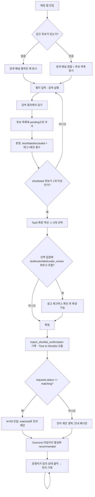

# `/admin/leads/[id]` 매칭 탭 화면 정의서

| 항목 | 내용 |
|---|---|
| 문서 종류 | UI Screen Spec (화면 흐름 / 개념 데이터 모델 / 상태 / 엣지케이스) |
| 작성자 | service-planner |
| 입력 문서 | [seepn-unified-platform-v1.0.prd.md](../../01-plan/features/seepn-unified-platform-v1.0.prd.md) §3.0, §3.4, §3.4.2, §4.4(P4 DoD), §6(OQ-9) · `supabase/migrations/20260824120000_phase1_requests_pipeline.sql` · `supabase/migrations/20260829140000_partner_schema.sql` · `supabase/migrations/20260829150000_standard_category_schema.sql` · `app/admin/(protected)/leads/[id]/*` · `app/admin/(protected)/partners/[id]/PartnerDetailTabs.tsx` |
| 그라운드 트루스 원칙 | 본 문서의 모든 화면 동작은 위 마이그레이션에 **실제로 존재하는** 테이블/컬럼/RPC를 근거로 한다. 존재하지 않는 컬럼·테이블·RPC는 "필요하지만 없음(⚠ Gap)"으로 명시하고 상상으로 채우지 않는다 |
| 스코프 | Must 항목 M-R1~M-R8, M-R11 (§2~§9). Should 항목 M-R9는 UX까지 확정(§7), M-R10은 후속 단계로 분리(§8). Won't(M-R12/M-R13)는 화면에 없음 |
| 후속 담당 | **ui-ux-designer**(시안) → **privacy-security-officer**(PII 노출 경로·감사로그 사전검토) → **backend-developer**(§2 개념 모델 → 실제 DDL/RPC, §0 Gap 해소) → **frontend-developer**(구현) → **qa-reviewer** |

---

## 0. 요약 — 화면 설계보다 먼저 봐야 할 것

이 문서는 `/admin/leads/[id]`에 추가되는 "매칭" 탭을 정의하지만, 실제 스키마를 Read한 결과 **PRD §3.4가 전제하는 일부 동작이 지금 스키마만으로는 구현 불가능한 지점**이 발견됐다. 화면 설계 자체는 막지 않되(각 절에서 "Gap이 해소되면 이렇게 동작한다"를 먼저 정의), backend-developer 착수 전 반드시 확인해야 한다.

| Gap | 내용 | 심각도 |
|---|---|:---:|
| **G-1** | **`match` 테이블 자체가 아직 없다.** M-R1~M-R8 전체가 신규 스키마 필요 (§2가 그 개념 초안) | 당연 — 이 문서의 존재 이유 |
| **G-2** | `requests` 테이블에 **국가(country) 필드가 없다** (B-6, Must였으나 미구현). M-R1의 "Requirement의 국가를 기본 필터로 적용"이 자동으로는 불가능 | 치명적 — M-R1 |
| **G-3** | `requests` 테이블에 **Vertical(product/service) 필드가 없다** (B-7, Must였으나 미구현). `partner.vertical`과 자동 매칭 불가 | 치명적 — M-R1 |
| **G-4** | `requests.category`(FKP 5종, `content_category`)와 `partner_standard_category`(374+ 노드, `standard_category`) 사이에 **매핑 테이블이 없다** (PRD §3.5 C안이 전제하는 핵심 연결고리가 미구현). 카테고리 기본 필터를 자동 적용할 근거가 없다 | 치명적 — M-R1 |
| **G-5** | `requests`에 "필요 언어"를 나타내는 명시적 필드가 없다(`locale`은 바이어의 UI 언어, `english_speaking`은 영어 여부 3단계뿐). `partner.supported_languages`와의 자동 매칭은 근사치만 가능 | 주요 — M-R1 |
| **G-6** | **`requests`의 30일 하드삭제 정책(`closed` 상태)과 Match/Outcome 데이터의 장기 보존 요구(§3.4.2 "데이터가 Moat")가 충돌한다.** `match.requirement_id`가 `requests.id`를 FK 참조하면, 매칭이 상당히 진행된 뒤 리드가 `closed` 처리되어 30일 뒤 하드삭제될 때 Match 이력이 함께 사라지거나(cascade) 삭제 배치가 막힌다(restrict). backend-developer가 스키마 설계 시 반드시 해결해야 함(예: 상태 전이 규칙에 "Match가 1건이라도 있으면 closed 대신 on_hold까지만 허용" 추가, 또는 match에 Requirement 핵심 필드 스냅샷 비정규화) | 치명적 — 데이터 보존 정책 충돌 |
| **G-7** | Match 활동(M-R11) 감사로그는 `private.log_audit()`을 그대로 재사용하면 되지만, **PII 열람(파트너 연락처)은 `get_partner_contact()`가 `partner_management` 메뉴 권한을 요구**한다. `lead_management`만 가진 운영자는 매칭 탭에서 연락처를 못 본다 — RBAC 설계 시 두 메뉴 권한 번들링 여부를 privacy-security-officer/backend-developer가 확인해야 함(Gap이라기보다 **정책 확인 필요 항목**) | 확인 필요 |
| **G-8** | Match/Outcome 데이터의 **보관/파기 기준이 없다**(OQ-8이 파트너 데이터에는 있으나 Match에는 없음) | 주요 — privacy-security-officer 판단 필요(§11) |

> **참고**: G-2/G-3(국가·버티컬 필드)은 PRD B-6/B-7이 이미 Must로 확정한 항목이라 P4 착수 전 P1/폼 단(SP-7)에서 먼저 해소되는 것이 정상 순서다. G-4(카테고리 매핑)는 P2 산출물이다. 즉 **P4가 "선행 P1/P2"로 명시한 의존성(§4.1)이 실제로는 이 3개 필드/테이블 부재로 구체화된다** — 일정상 P1/P2가 이 Gap들을 먼저 닫지 못하면 P4의 M-R1은 "완전 자동 필터"가 아니라 "운영자 수동 필터 + 검색"으로 시작해야 한다(§4 참조).

---

## 1. 배경 — 이 탭이 왜 이렇게 생겼는가

- **위치**: 새 메뉴가 아니다. `/admin/leads/[id]`의 기존 화면(요청 내용 / 연락처 / 내부 메모)에 **탭 하나가 추가**된다. 현재 리드 상세 화면(`app/admin/(protected)/leads/[id]/page.tsx`)은 탭이 없는 단일 스크롤 화면이므로, 이 문서는 **화면 구조 자체를 탭 구조로 전환하는 것까지 포함**한다(§4.1).
- **메뉴 권한**: 신규 메뉴 불필요(D-5, INV-2 준수). `lead_management` 메뉴의 `read`/`create`/`update` 액션을 그대로 사용한다. 후보 담기=create, 판정/태그/Top3 확정/Outcome 전이=update. CSV 등 내보내기는 이번 스코프에 없음(export 미사용).
- **북극성 연결**: 이 탭이 기록하는 두 시각(Top 3 확정 시각, Outcome 전이 시각)이 각각 **Time to Shortlist**와 **Match-to-Meeting Rate**의 유일한 데이터 소스다(§1.3). 화면에서 이 두 값이 "어쩌다 남는 부산물"이 아니라 "이 화면의 존재 이유"라는 점을 모든 컴포넌트 설계에 반영한다.

---

## 2. 개념 데이터 모델 초안 (backend-developer 참고용 — DDL 아님)

> **원칙**: 아래는 화면이 요구하는 데이터 구조의 스케치다. 실제 컬럼 타입/제약/RLS/RPC 시그니처는 backend-developer가 기존 패턴(`private` 스키마 분리, `force row level security`, SECURITY DEFINER RPC 경유 write, `private.log_audit()`)을 따라 확정한다.

### 2.1 `match` — Requirement × Partner 연결 (M-R2~M-R8 핵심)

| 필드(개념) | 타입(개념) | 설명 |
|---|---|---|
| `id` | uuid | PK |
| `requirement_id` | uuid → `requests.id` | ⚠ G-6 참조 — FK 정책 확정 필요 |
| `partner_id` | uuid → `partner.id` | |
| `judge_status` | text: `pending`\|`shortlisted`\|`excluded` | M-R3. 후보 담을 때 기본값 `pending` |
| `selection_tags` | text[] | M-R4. §3의 고정 태그 목록에서만 선택 |
| `selection_memo` | text | M-R4. 자유 메모 (태그와 병행, 태그 없이 메모만은 불허 — §3) |
| `exclusion_tags` | text[] | M-R5 |
| `exclusion_memo` | text | M-R5 |
| `judged_by_admin_id` / `judged_at` | uuid / timestamptz | 마지막으로 판정을 바꾼 사람/시각 |
| `added_by_admin_id` / `added_at`(=`created_at`) | uuid / timestamptz | M-R2 "누가 담았는지" |
| `is_confirmed_top3` | boolean | M-R6. 현재 확정된 Top3 집합에 속하는지 |
| `confirmed_rank` | smallint(1~3), nullable | Top3 내 순위(선택 표시용, 강제 아님) |
| `current_outcome_state` | text, nullable | M-R7. `match_outcome_event`의 최신 상태를 트리거로 동기화(캐시) |
| `meeting_date` / `meeting_note` | date / text | M-R8 |
| `quote_amount` / `quote_currency` | numeric / text, nullable | M-R8, OQ-9 결정대로 선택 입력 |
| `deal_flag` / `deal_amount` / `deal_currency` | boolean / numeric / text | M-R8, 선택 입력 |
| `created_at` / `updated_at` | timestamptz | |

**제약(개념)**: `unique (requirement_id, partner_id)` — 같은 Requirement에 같은 파트너를 두 번 담는 것만 막는다. **같은 파트너가 서로 다른 Requirement의 후보로 동시에 존재하는 것은 정상**이므로 partner_id 단독 유니크는 절대 걸지 않는다(§9 엣지케이스 1).

### 2.2 `match_shortlist_confirmation` — Top3 확정 이벤트 로그 (M-R6)

Top3 확정은 "즉시값 UPDATE"가 아니라 **이벤트 로그**로 설계한다(append-only 권장). 이유: 확정 후 수정이 정상 시나리오(§9 엣지케이스 2)이고, **Time to Shortlist는 반드시 "최초 확정 시각"을 써야 하는데, UPDATE 방식이면 재확정 시 최초 시각이 사라진다.**

| 필드(개념) | 설명 |
|---|---|
| `id`, `requirement_id` | |
| `confirmed_match_ids` | uuid[] — 이 이벤트 시점의 확정 Top3 partner-match 목록(스냅샷) |
| `confirmed_by_admin_id` / `confirmed_at` | |
| `is_initial` | boolean — 이 Requirement의 첫 확정 이벤트인지(=Time to Shortlist 산출 기준) |

`requirement`(=`requests`) 단위로 "Time to Shortlist" = `min(confirmed_at) − requests.created_at` (즉 `is_initial=true`인 행의 `confirmed_at`).

### 2.3 `match_outcome_event` — Outcome 전이 이력 (M-R7/M-R8)

"단조 진행 강제 금지"는 **현재 상태 컬럼 하나로는 표현이 안 된다** — 되돌아가거나 재방문한 이력까지 보존해야 감사(M-R11)와 향후 Outcome Learning(§3.4.2)이 성립한다. 그래서 `match.current_outcome_state`(캐시, 최신 값)와 별개로 **append-only 이벤트 테이블**을 둔다.

| 필드(개념) | 설명 |
|---|---|
| `id`, `match_id` | |
| `outcome_state` | text: 9종 (아래 §2.4) |
| `transitioned_at` | timestamptz — **운영자가 직접 입력/수정 가능**(실제 미팅/견적 일자가 기록 시점보다 과거인 경우가 흔함) |
| `note` | text, 선택 |
| `recorded_by_admin_id` / `recorded_at`(=`created_at`) | 실제 기록 시각(감사용, 수정 불가) |

### 2.4 Outcome 상태값 (M-R7, 9단계 — PRD 문구 그대로)

```
recommended → viewed → responded → meeting → quote → sample → negotiation → deal → repeat
```

화살표는 **일반적인 진행 순서를 보여줄 뿐 강제 순서가 아니다.** 임의의 상태로 직접 진입/재진입 가능(§6.4).

### 2.5 `match_contact_log` — 컨택 기록 (M-R10, Should — 이번 스코프 아님, 구조만 예비)

| 필드(개념) | 설명 |
|---|---|
| `id`, `match_id` | |
| `channel` | text: `email`\|`phone`\|`messenger`\|`other` |
| `contacted_at` / `contacted_by_admin_id` | |
| `responded` (boolean, nullable) / `responded_at` | Partner Response Rate(§1.3)의 소스 |
| `note` | |

> §8에서 이 테이블을 이번 스코프에 포함하지 않는 이유를 설명한다.

---

## 3. 구조화 태그 (M-R4/M-R5) — 고정 vocabulary로 채택, 자유 태그 추가는 금지

### 3.1 채택 태그 (PRD 예시 그대로)

| 판정 | 태그 |
|---|---|
| **추천(shortlisted) 이유** | 카테고리 적합 · MOQ 충족 · 언어 대응 · 해외경험 · 인증 보유 · 가격대 적합 · 납기 적합 · 응답 이력 양호 |
| **제외(excluded) 이유** | MOQ 미달 · 카테고리 불일치 · 언어 미대응 · 응답 없음 · 가격 불일치 · 납기 불가 · 파트너 거절 · 중복 |

### 3.2 자유 태그(운영자가 새 태그를 만드는 것) 허용 여부 — **불허, 근거**

- §3.4.2가 명시한 이 데이터의 존재 이유는 "집계 가능한 라벨"이다. 운영자가 임의로 태그를 만들면 오탈자·동의어 분기(`가격불일치` vs `가격 안맞음`)로 vocabulary가 즉시 오염되고, Match 10~50건 규모의 MVP에서는 그 오염을 정리할 여유가 없다.
- Vertical B(서비스, MVP 주력)에 "MOQ 미달"처럼 어색한 태그가 섞여 있지만, **적용되지 않는 태그는 그냥 선택 안 하면 된다** — 존재 자체가 문제는 아니다.
- 태그로 표현이 안 되는 예외적 사유는 **각 판정에 이미 병행 필수인 자유 메모(`selection_memo`/`exclusion_memo`)로 흡수**한다. 즉 "기타" 상황을 위한 새 태그가 아니라, 기존 자유 메모가 이미 그 역할이다.
- **화면 규칙**: 태그 선택 UI는 체크박스/칩 다중선택이며 "직접 입력" 인풋을 두지 않는다. 태그 없이 메모만 입력하는 것은 판정 저장 시 막는다(둘 다 필수 — §6.2).
- 태그 vocabulary 확장이 실제로 필요해지면(예: Vertical A 전용 태그 추가) **product-manager가 PRD를 개정해 버전 있는 목록으로 추가**한다. 화면/RPC는 이 목록을 하드코딩하지 않고 상수 파일(예: `lib/admin/matchTags.ts`)로 관리해 추가 자체는 코드 배포로 처리한다(운영자 자율 입력과는 다름).

---

## 4. 화면 정보구조

### 4.1 리드 상세 화면을 탭 구조로 전환

현재 `/admin/leads/[id]`는 탭이 없다. `PartnerDetailTabs.tsx`(`app/admin/(protected)/partners/[id]/`)가 이미 이 프로젝트의 탭 패턴(로컬 `useState`, 딥링크 없음, 클릭 시 컴포넌트 스위칭)이므로 **동일 패턴을 그대로 복제**한다.

| 탭 | 내용 | 비고 |
|---|---|---|
| **개요**(기본 선택) | 기존 요청 내용 / 연락처 / 내부 메모 3개 섹션(현행 그대로) | 기존 `page.tsx` 내용을 이 탭으로 이동, 로직 변경 없음 |
| **매칭**(신규) | §4.2~§6 | 이 문서의 대상 |

> 딥링크(`?tab=matching`)는 두지 않는다 — `PartnerDetailTabs`가 이미 이 정책을 선례로 만들었고(주석: "딥링크 요구사항 없음"), 매칭 탭도 동일한 이유(운영자가 상세 화면에 들어와 직접 클릭하는 흐름만 존재, 외부에서 매칭 탭으로 바로 링크할 시나리오 없음)로 따른다.

### 4.2 매칭 탭 내부 레이아웃 (4개 영역, 세로 배치)

```
┌─────────────────────────────────────────────┐
│ (a) 후보 검색/필터 패널                        │
│     [필터 바] → [검색 결과 리스트 + 담기 버튼]  │
├─────────────────────────────────────────────┤
│ (b) 담은 후보 목록 (테이블)                     │
│     회사명 | 검증상태 | 판정 | 태그/메모 | 연락처│
├─────────────────────────────────────────────┤
│ (c) Top 3 확정 영역                            │
│     [현재 확정 상태 배너] [Top3 확정/수정 버튼] │
├─────────────────────────────────────────────┤
│ (d) Outcome 타임라인 (확정된 Top3 각각)         │
│     파트너 A: [진행 트래커] [이력 리스트]        │
│     파트너 B: ...                             │
└─────────────────────────────────────────────┘
```

세로 배치인 이유: 운영자가 (a)에서 검색 → (b)로 담고 → (c)에서 확정 → (d)에서 추적하는 **선형 작업 흐름**이며, 좌우 분할(검색 패널을 사이드바로)은 화면 폭이 좁은 운영 환경(노트북)에서 (b)의 태그 편집 UI와 공간을 다툰다. 다만 (a)는 기본 접힌 상태(Top3가 이미 확정된 경우)로 시작해 스크롤 부담을 줄인다(§6.1 상태표).

---

## 5. 전체 플로우



---

## 6. 화면 정의서

### 6.1 (a) 후보 검색/필터 패널

| 구성요소 | 동작 | 상태별 표시 |
|---|---|---|
| 필터 바 — 카테고리 | `standard_category` 트리에서 다중 선택(콤보박스). ⚠ **G-4**로 인해 Requirement의 `category`(5종)에서 자동 프리필 불가 — **기본값은 빈 값**, 운영자가 "개요" 탭의 요청 내용을 보고 수동 선택 | 로딩: 스켈레톤 / 빈 트리: "카테고리 데이터 없음" |
| 필터 바 — 버티컬 | product/service 라디오. ⚠ **G-3**로 자동 프리필 불가, 기본값 없음(전체) | — |
| 필터 바 — 국가(해외경험) | `partner.overseas_experience_countries` 배열 contains 검색. ⚠ **G-2**로 Requirement에서 자동 추출 불가, 자유 텍스트/콤보 입력 | — |
| 필터 바 — 언어 | `partner.supported_languages` 배열 contains. `requests.locale`+`english_speaking`으로 **근사 프리필**(예: locale=ja → "ja" 사전 선택, 운영자가 수정 가능) | 프리필된 경우 "요청 locale 기준 추정값" 안내 텍스트 |
| 필터 바 — 지역(시/도) | `partner.location_region` | 선택 |
| 필터 바 — 검증상태 | 다중 체크(`draft`/`submitted`/`under_review`/`verified`), 기본 전체 선택. `rejected`/`suspended`는 기본 제외, 별도 토글 "제외된 파트너도 보기"로만 노출 | §9 엣지케이스 3과 연결 |
| 검색어 | 회사명(ko/en), 사업자번호 부분일치 | 빈 검색어 허용(필터만으로 조회) |
| 검색 결과 리스트 | 각 행: `company_name_ko`(+en 서브텍스트), `vertical`/`business_entity_type` 배지, `verification_state` 배지(`StatusBadge` 재사용), `location_region`, `supported_languages`, `capability_completeness_pct`(`ProgressBar` 재사용), "담기" 버튼 | 이미 이 Requirement의 후보인 경우 버튼이 "담김"(비활성)으로 표시 — 중복 담기 방지(§9 엣지케이스 4) |
| — | 다른 Requirement에도 후보로 담긴 파트너 | 행에 작은 배지 "다른 요청에서도 후보 중(N)" — 정보 제공용, 비차단(§9 엣지케이스 1) |
| 빈 결과 | 필터에 맞는 파트너 없음 | "조건에 맞는 파트너가 없습니다. 필터를 조정해보세요" + 필터 초기화 버튼 |
| 로딩/에러 | 검색 API 호출 중 / 실패 | 스켈레톤 리스트 / "검색에 실패했습니다. 다시 시도" 인라인 에러 + 재시도 버튼 |
| 패널 접힘 상태 | 후보가 1개 이상 담긴 뒤 재진입 시 기본 접힘 | 헤더에 "+ 후보 더 찾기" 버튼으로 펼침 |

### 6.2 (b) 담은 후보 목록

| 구성요소 | 동작 | 상태별 표시 |
|---|---|---|
| 행 헤더 | `company_name_ko`, `verification_state` 배지, `added_at`/`added_by` 툴팁 | draft/submitted/under_review인 경우 노란 경고 아이콘 + 툴팁 "검증 전 파트너"(§9 엣지케이스 3) |
| 판정(judge_status) | 세그먼트 버튼: 보류(pending) / 추천(shortlisted) / 제외(excluded) | 추천/제외 선택 시 아래 태그·메모 영역이 펼쳐지며 **저장 전까지 "미저장" 표시** |
| 태그 선택 | §3의 고정 목록에서 다중 체크(칩 UI) — 판정이 `shortlisted`면 추천 태그 목록, `excluded`면 제외 태그 목록만 노출 | 태그 0개 + 메모 입력 시도 시 저장 버튼 비활성 + "태그를 최소 1개 선택하세요" |
| 메모 | textarea, 필수(위와 동일 검증) | 500자 제한 카운터 |
| 저장 | 판정+태그+메모를 한 번에 저장(RPC 1회) | 저장 중 버튼 비활성+스피너 / 실패 시 "저장 실패, 다시 시도" 토스트, 입력값 보존(재입력 불필요) |
| 연락처 | `contact_name_masked`/`contact_email_masked`/`contact_phone_masked` 기본 표시 + "원문 보기" 버튼(`RevealContact.tsx` 패턴 재사용 → `get_partner_contact(partner_id)`) | PII 접근 권한 없는 역할: "viewer 역할은 원문 열람 불가"(기존 문구 재사용). ⚠ G-7: `partner_management` 메뉴 read 권한도 필요 |
| 후보 제거 | "후보에서 제거" (판정과 별개 — 완전히 목록에서 빼는 것) | 확정된 Top3에 포함된 후보는 제거 전 경고: "Top3에서도 제외됩니다. 계속하시겠습니까?"(§9 엣지케이스 6) |
| 정렬 | 기본: `added_at` 내림차순. `judge_status`별 그룹(추천 먼저) 토글 제공 | — |

### 6.3 (c) Top 3 확정

| 구성요소 | 동작 | 상태별 표시 |
|---|---|---|
| 현재 상태 배너 | 미확정: "아직 Top3가 확정되지 않았습니다" / 확정됨: "확정됨 · {confirmed_at} · {admin명} · Time to Shortlist: {경과시간}" | 경과시간은 `confirmed_at(is_initial=true) − requests.created_at` |
| 확정 액션 버튼 | "Top3 확정"(최초) / "Top3 수정"(이미 확정된 경우) — 클릭 시 모달 오픈 | `judge_status='shortlisted'`가 0건이면 버튼 비활성 + 툴팁 "추천으로 판정된 후보가 없습니다" |
| 확정 모달 | `shortlisted` 후보만 체크박스로 노출, **최대 3개까지 선택 가능**(4개째 체크 시도 시 "최대 3개까지 확정할 수 있습니다" 인라인 경고) | `pending`/`excluded` 후보는 목록에 아예 노출 안 함(§9 엣지케이스 5) |
| 검증 전 파트너 경고 | 선택 집합에 `verified`가 아닌 파트너가 있으면 모달 하단에 필수 체크박스 "검증 전 파트너가 포함되어 있음을 확인했습니다" 노출, 체크 전까지 확정 버튼 비활성 | §9 엣지케이스 3 |
| 확정 완료 | `match_shortlist_confirmation` 신규 행 기록, 해당 match들 `is_confirmed_top3=true`/`confirmed_rank` 세팅, 기존에 확정됐다가 빠진 match는 `is_confirmed_top3=false`로 갱신 | 완료 즉시 §7의 M-R9 모달로 이어짐(조건부) |
| 재확정(수정) 시 최초 시각 | `is_initial` 플래그로 최초 확정 시각은 절대 갱신하지 않음 | 배너에 "최초 확정 이후 N회 수정됨" 보조 텍스트 |

### 6.4 (d) Outcome 타임라인

확정된 Top3 각 파트너마다 독립된 트래커를 표시한다(확정 전에는 이 영역 전체가 숨김 — "Top3 확정 후 이용 가능합니다" 안내로 대체).

| 구성요소 | 동작 | 상태별 표시 |
|---|---|---|
| 진행 트래커 | 9개 노드(§2.4)를 가로로 나열, 현재 상태 노드 강조. **모든 노드가 항상 클릭 가능**("단조 진행 강제 금지"를 UI로 구현하는 핵심 장치 — 다음 노드만 활성화하는 방식 채택 안 함) | 아직 한 번도 도달 안 한 노드: 회색 / 도달한 적 있는 노드: 초록 테두리(현재 상태는 채움) |
| 노드 클릭 | 인라인 폼 오픈: `transitioned_at`(datetime, 기본값 now, 과거 일자 입력 가능), `note`(선택) | `meeting` 클릭 시 `meeting_date`+`meeting_note` 추가 입력, `quote` 클릭 시 `quote_amount`+`quote_currency`(둘 다 선택, OQ-9), `deal` 클릭 시 `deal_flag`+`deal_amount`+`deal_currency`(선택) |
| 재방문 | 이미 지나간 노드를 다시 클릭 → 새 이벤트로 추가(기존 이력 삭제 안 함) | 히스토리 리스트에 동일 상태가 여러 번 나타날 수 있음 — 시간순 정렬로 자연스럽게 구분 |
| 이력 리스트 | 트래커 아래에 모든 `match_outcome_event`를 시간 역순 나열: 상태/시각/기록자/메모 | 이벤트 0건(방금 확정된 직후): "아직 기록된 진행 상황이 없습니다" |
| 저장 실패 | RPC 에러 | 모달 유지 + 인라인 에러, 입력값 보존 |

---

## 7. M-R9 — Requirement 상태 연동 UX (Should)

**정확한 트리거**: Top3 "최초 확정"뿐 아니라 "수정 확정"에도 동일하게 적용(재확정도 확정 행위이므로).

1. Top3 확정 완료 → **즉시(같은 트랜잭션 이후 클라이언트에서) `requests.status`를 조회**.
2. `status === 'matching'`인 경우에만: **확인 모달**을 띄운다(배너 X — 배너는 놓치기 쉽고, PRD가 "운영자 확인"을 명시했으므로 명시적 동의 액션이 필요).
   - 문구: "Top 3가 확정되었습니다. 이 요청 상태를 '파트너매칭중' → '매칭완료'로 변경할까요?"
   - 버튼: [나중에] [지금 변경]
   - [지금 변경] 선택 시 기존 `StatusAssigneeForm.tsx`가 쓰는 상태변경 RPC를 그대로 호출(신규 RPC 불필요).
3. `status`가 `matching`이 아닌 경우(`new`/`reviewing`/`on_hold`/`matched`/`closed`) 모달을 띄우지 않는다 — 대신 "개요" 탭으로 이동하지 않아도 보이도록 매칭 탭 상단에 **작은 인라인 배너**(닫기 가능)로 "현재 요청 상태가 '파트너매칭중'이 아닙니다. 필요하면 '개요' 탭에서 상태를 확인하세요"만 표시. 자동 전이는 어떤 경우에도 하지 않는다(PRD 원칙).
4. [나중에] 선택 시 이후 Outcome 타임라인 영역 상단에 동일 제안을 접힌 배너로 유지(다시 열람 가능), 매번 모달을 띄우지는 않는다(방해 최소화).

---

## 8. M-R10(컨택 기록) — 이번 스코프 제외 판단

**결론: 이번 P4 1차 스코프에서 제외하고 후속 단계로 분리한다.**

근거:
- P4 DoD(§4.4)의 필수 체크리스트(후보→이유→Top3→Outcome, Time to Shortlist, 감사로그)에 컨택 기록이 없다 — M-R10은 PRD 자체가 Should로 낮춰뒀다.
- M-R10의 값(Partner Response Rate)은 §1.3 지표표에서도 "베이스라인 측정"일 뿐 v1.0 목표치가 없다 — 지금 없어도 P4 DoD를 막지 않는다.
- Outcome 타임라인의 `responded` 상태(§2.4)가 이미 "응답 여부"의 대략적 신호를 제공한다 — 컨택 로그 없이도 완전한 공백은 아니다.
- §2.5에 개념 스키마(`match_contact_log`)를 미리 스케치해뒀으므로, 후속 단계에서 화면만 추가하면 된다(구조 변경 리스크 낮음).

**후속 단계 정의(별도 문서 없이 이 절로 갈음, 착수 시 본 문서 개정)**: (d) Outcome 타임라인 하단에 "컨택 로그" 서브섹션 추가, 채널/일시/응답여부 입력 폼. 착수 조건: M-R1~M-R8 화면이 실제 데이터로 1회 이상 운영된 뒤.

---

## 9. 엣지케이스

| # | 상황 | 처리 |
|---|---|---|
| 1 | 같은 파트너를 여러 Requirement에 동시에 후보로 담음 | **정상 동작**(§2.1 유니크 제약이 파트너 단독이 아니라 Requirement+파트너 조합에 걸림). 검색 결과에 "다른 요청에서도 후보 중(N)" 정보 배지만 표시, 차단 없음 |
| 2 | 확정된 Top3를 이후 수정(제외했던 후보를 다시 추천으로) | 언제든 판정 변경 가능. 판정 변경 자체는 `is_confirmed_top3`에 영향 없음 — 별도로 "Top3 수정" 액션을 통해서만 확정 집합이 바뀐다. 최초 확정 시각(Time to Shortlist 기준)은 절대 갱신 안 됨 |
| 3 | 파트너가 검증 전(`draft`/`submitted`/`under_review`)인데 후보로 담김 | 검색·담기·판정까지는 제한 없음(초기엔 verified 파트너가 거의 없어 차단하면 매칭 자체가 불가능 — D-9/4주 MVP 현실 반영). 후보 목록에 경고 아이콘 상시 표시, **Top3 확정 시에만** 명시적 확인 체크박스로 게이트(§6.3) |
| 4 | 같은 Requirement에 같은 파트너를 중복으로 담으려 함 | "담기" 버튼이 이미 "담김"(비활성)으로 표시되어 애초에 재요청 자체가 발생하지 않음. API 레벨에서도 유니크 제약으로 방어(2중 방어) |
| 5 | `pending`/`excluded` 후보를 Top3로 확정하려 함 | 확정 모달에 `shortlisted`만 노출되므로 UI상 불가능. 직접 API 호출 등 우회 시도는 RPC에서 `judge_status <> 'shortlisted'`면 거부 |
| 6 | 이미 Top3로 확정된 후보를 나중에 `excluded`로 판정 변경 | 저장 시 경고 모달: "이 파트너는 확정된 Top3에 포함되어 있습니다. 계속하면 Top3에서도 제외됩니다 — 계속하시겠습니까?" 확인 시 `judge_status=excluded` + `is_confirmed_top3=false`/`confirmed_rank=null`로 동시 갱신. 이미 기록된 Outcome 이력은 삭제하지 않고 그대로 보존(감사 목적) |
| 7 | 판정/태그/Outcome 저장 중 네트워크 실패 | 낙관적 UI 업데이트 없이 저장 확정 후 반영(중요 데이터이므로). 실패 시 입력값 보존 + 인라인 에러 + 재시도 버튼. 부분 저장 없음(RPC 트랜잭션 1개) |
| 8 | 두 운영자가 동시에 같은 Requirement를 편집(둘 다 Top3 확정 시도) | `match_shortlist_confirmation`이 append-only이므로 데이터 유실은 없음(둘 다 각자의 이벤트로 기록됨) — 다만 두 번째 확정자가 첫 번째 결과를 못 본 채 겹쳐 쓸 수 있음. MVP 규모(동시 편집자 사실상 1명)에서는 허용하되, 화면 재진입/새로고침 시 최신 확정 상태를 항상 다시 불러오도록 해 불일치를 빠르게 드러냄. 실시간 동시편집 잠금은 이번 스코프 아님 |
| 9 | Requirement가 `closed`(종료/스팸 포함) 상태인 경우 매칭 탭 | 열람은 항상 가능(과거 기록 확인). 신규 후보 추가/판정 변경/Top3 재확정은 비활성 + 배너 "이 요청은 종료(closed) 상태입니다"로 안내. **단 이미 확정된 Top3의 Outcome 전이 기록은 계속 허용**(딜 성사 등 사후 보고가 늦게 들어오는 경우가 실무에서 흔함) — ⚠ G-6과 연계: closed 30일 하드삭제 정책이 실제 적용되면 이 예외 자체가 무의미해지므로 backend-developer 확인 필수 |
| 10 | 파트너가 이후 `rejected`/`suspended`로 전환됨(이미 후보/Top3인 상태에서) | 후보 목록·Outcome 화면에서는 계속 노출(과거 판단의 기록이므로 소급 삭제 안 함), `verification_state` 배지만 최신값으로 갱신되어 표시. 신규로 이 파트너를 다른 Requirement에 또 담으려 하면 검색 결과 기본 필터에서 제외(§6.1) |

---

## 10. 권한 / 감사로그 설계 (M-R11)

기존 인프라를 그대로 재사용한다(신규 감사 테이블 없음).

| 액션 | `private.log_audit()` action 코드(신규, 기존 컨벤션 따름) | 근거/비고 |
|---|---|---|
| 후보 담기 | `match.candidate_add` | `p_target_table='match'`, `p_subject_ids=[partner_id]`, `p_after_summary={requirement_id}` |
| 후보 제거 | `match.candidate_remove` | 동일 |
| 판정 저장(추천/제외/보류) | `match.judge` | `p_after_summary={judge_status, selection_tags, exclusion_tags}` — **메모 본문은 audit에 넣지 않는다**(기존 `partner.profile_update`/`set_own_partner_contact` 컨벤션: "fact-of-change only, never the content itself". 메모는 `match` 테이블 자체가 원본 저장소) |
| Top3 확정/수정 | `match.shortlist_confirm` | `p_subject_ids=`확정된 partner_id 배열, `p_after_summary={confirmed_rank들, is_initial}` |
| Outcome 전이 | `match.outcome_transition` | `p_subject_ids=[partner_id]`, `p_after_summary={outcome_state, transitioned_at}` |
| 파트너 연락처 열람 | **신규 액션 불필요** — 기존 `admin_partner.contact_reveal`(20260829140000 §6 `get_partner_contact`)을 그대로 호출. 이미 성공/실패 모두 감사됨 | ⚠ G-7: 이 RPC는 `partner_management` 메뉴 read 권한을 요구 — 매칭 탭에서 호출해도 권한 판정 기준은 바뀌지 않음. 매칭 담당 운영자 역할에 `partner_management:read`가 함께 부여돼 있는지 role 설계 시 확인 필요 |

**권한 게이트**: 모든 신규 RPC는 `private.is_active_admin()` + `private.has_menu_permission('lead_management', <action>)` 체크를 진입점에서 수행(기존 `lead.contact_reveal`/`lead.note_write` 패턴과 동일). 별도 메뉴 코드를 만들지 않는다(D-5, INV-2).

---

## 11. Open Questions (확인 필요 정책 — 임의로 정하지 않음)

| ID | 질문 | 담당 | 비고 |
|---|---|---|---|
| **SP-M1** | ⚠ G-6(closed 30일 하드삭제 vs Match 장기보존) — Requirement가 `closed`로 전이될 때 이미 Match가 존재하면 전이 자체를 막을지, 아니면 Match 데이터를 스냅샷으로 분리 보존할지 | privacy-security-officer + backend-developer | 차단성 — P4 스키마 설계 착수 전 결론 필요 |
| **SP-M2** | ⚠ G-8 — Match/Outcome 데이터의 보관·파기 기준(OQ-8이 파트너 데이터엔 있으나 Match엔 없음) | privacy-security-officer | P4 사전검토 항목으로 편입 권고 |
| **SP-M3** | ⚠ G-7 — 매칭 업무를 하는 운영자 role에 `partner_management:read`를 기본 번들링할지, 아니면 매칭 탭 전용으로 파트너 연락처만 열람 가능한 축소 권한을 새로 만들지 | privacy-security-officer | P4 착수 전 role 설계 확인 |
| **SP-M4** | `judge_status`를 다시 `pending`으로 되돌리는 것을 허용할지(추천/제외를 판정했다가 "보류"로 리셋) | product-manager | 화면은 세그먼트 버튼으로 기술적으로는 허용해뒀으나(§6.2), 정책적으로 "판정 취소" 이력을 어떻게 남길지는 PM 확인 필요 |
| **SP-M5** | G-2/G-3/G-4(국가·버티컬·카테고리 매핑) 해소 전에 P4를 먼저 출시할지, 세 Gap 해소를 P4의 선행조건으로 못박을지 | project-manager | §0 마지막 문단 참조 — 일정 영향 있음 |

---

## Version History

| Version | Date | Changes | Author |
|---------|------|---------|--------|
| 1.0 | 2026-09-06 | 초안 작성 — `/admin/leads/[id]` 매칭 탭 화면정의서. Gap 8건(G-1~G-8) 발견 및 명시(특히 requests 국가/버티컬 필드 부재, 카테고리 매핑 테이블 부재, closed 하드삭제와 Match 보존 충돌). 개념 데이터 모델(`match`/`match_shortlist_confirmation`/`match_outcome_event`/`match_contact_log`) 스케치, M-R4/M-R5 태그를 고정 vocabulary로 채택(자유 태그 불허 근거 포함), M-R9 UX(확인 모달) 구체화, M-R10 후속 분리 판단, 엣지케이스 10건, 감사로그 설계(M-R11, 기존 `get_partner_contact` 재사용) | service-planner |
