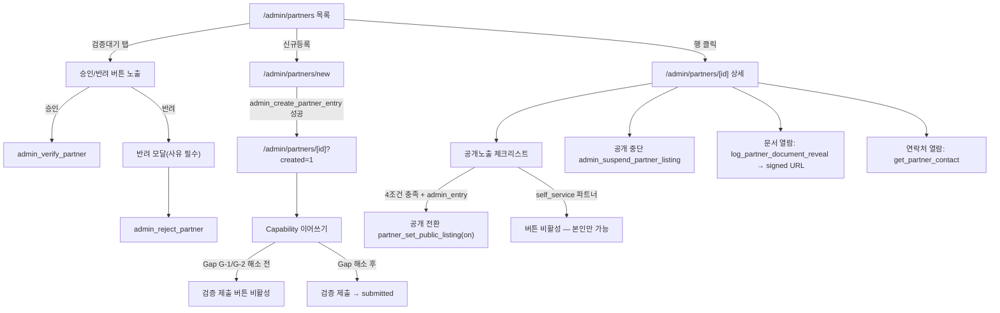

# `/admin/partners` · `/admin/categories` 화면 정의서

| 항목 | 내용 |
|---|---|
| 문서 종류 | UI Screen Spec (화면 흐름 / 상태 / 엣지케이스) |
| 작성자 | service-planner |
| 입력 문서 | [seepn-unified-platform-v1.0.prd.md](../../01-plan/features/seepn-unified-platform-v1.0.prd.md) §3.3.3, §3.3.4, §3.5.5, §7.2 · [seepn-admin-ui-design-system.spec.md](./seepn-admin-ui-design-system.spec.md) §4, §5.3, §6 · [partner-signup-privacy-review.md](../../03-security/partner-signup-privacy-review.md) · `supabase/migrations/20260829140000_partner_schema.sql`, `20260829150000_standard_category_schema.sql` |
| 그라운드 트루스 원칙 | 본 문서의 모든 화면 동작은 위 두 마이그레이션에 **실제로 존재하는** 테이블 컬럼·RPC 시그니처·CHECK 제약을 근거로 한다. RPC가 없는 동작은 "필요하지만 없음(Gap)"으로 명시하고 상상으로 채우지 않는다 |
| 후속 담당 | ui-ux-designer(시안) → backend-developer(§7 Gap 해소, API 계약 확정) → frontend-developer(구현) → qa-reviewer |

---

## 0. 요약 — 화면 설계보다 먼저 봐야 할 것

이 문서는 두 화면(`/admin/partners`, `/admin/categories`)을 정의하지만, 스키마를 실제로 Read한 결과 **PRD/디자인스펙이 전제하는 일부 동작을 지금 스키마의 RPC만으로는 구현할 수 없는 지점**이 발견되었다. §7에 상세 근거와 함께 정리했고, 화면 정의 각 절에서도 해당 지점마다 `⚠ Gap G-n` 표기로 다시 짚는다. 요약:

| Gap | 영향 | 심각도 |
|---|---|:---:|
| **G-1** | `admin_entry` 파트너의 담당자 연락처(PII)를 **관리자가 기록할 RPC가 없다** | 치명적 — A1-R2가 요구하는 "필수 최소 세트" 저장이 실제로 완결 안 됨 |
| **G-2** | `admin_entry` 파트너를 `draft → submitted`로 전환할 RPC가 없다 (검증 큐 진입 불가) | 치명적 — A1-R5 검증 큐가 `admin_entry` 건에 대해서는 작동 불가 |
| **G-3** | `admin_entry` 파트너에 대해 사후에 `public_listing` 동의를 기록할 RPC가 없다 | 주요 — A1-R9의 "관리자가 전화/대면 증빙으로 대신 켜는" 경로가 봉쇄됨 |
| **G-4** | Capability 필드(회사소개, 서비스유형 등)의 컬럼단위 UPDATE는 RPC를 경유하지 않아 **감사로그가 안 남는다** | 주요 — A1-R3 "변경 이력" 요구사항 미충족 |
| **G-5** | `verification_state` CHECK가 `'suspended'`를 허용하지만 이 값을 세팅하는 RPC가 없다 | 경미 — UI에 노출하지 않으면 무해 |
| **G-6** | `submitted → under_review` 전환 RPC가 없다 (검증 시작 시점을 구분할 수단 없음) | 경미 — 화면 정책으로 흡수 가능 |
| **G-7** | `private.partner_profile_submission_gaps()`(제출 가능 여부 판정)를 관리자 화면이 읽을 공개 RPC가 없다 | 경미 — 클라이언트가 동일 로직을 복제해 임시 대응 가능 |

**본 문서의 입장**: 위 Gap들은 화면 설계를 막지 않는다(각 절에서 "Gap이 해소되면 이렇게 동작한다"를 먼저 정의하고, 해소 전 임시 UI 상태도 함께 정의한다). 단 **G-1/G-2는 `/admin/partners` 신규등록·검증 플로우의 핵심 경로이므로, frontend-developer 착수 전 backend-developer가 반드시 해소해야 하는 차단 항목**으로 표시한다.

---

## 1. 공통 규칙

### 1.1 재사용 컴포넌트 (신규 제작 없음)

| 컴포넌트 | 위치 | 이 문서에서의 용도 |
|---|---|---|
| `StatusBadge` | `components/admin/StatusBadge.tsx` | `verification_state`/`public_listing_state`/`intake_source` 배지. `tone`(neutral/info/warning/success/error) + `label` prop 그대로 사용 |
| `ProgressBar` | `components/admin/ProgressBar.tsx` | Capability Completeness 표시 (`value=completeness_pct, total=100`) |
| `Avatar` | `components/admin/Avatar.tsx` | 목록의 회사명 셀 (`name={company_name_ko}`) |
| `adminInputClass`/`adminButton*Class` | `components/admin/styles.ts` | 모든 입력/버튼 |
| `RevealContact.tsx` 패턴 | `app/admin/(protected)/leads/[id]/RevealContact.tsx` | PII 원문 열람 버튼 — **그대로 복제**, `get_partner_contact` 호출로 교체 |
| `MenuRowEditor.tsx`의 인라인편집/▲▼/dirty-state 패턴 | `app/admin/(protected)/permissions/menus/` | `/admin/categories` 트리 행 편집 |
| `CategoryRow.tsx`의 로케일별 `TranslationEditor` 패턴 | `app/admin/(protected)/content/CategoryRow.tsx` | `standard_category_translation` ko/en/ja 편집 — `computeTranslationBadge`(제네릭, `lib/admin/translationStatus.ts`) 그대로 재사용 가능 (인터페이스가 `{status, source_synced_at, updated_at}`만 요구해 `standard_category_translation` 행 타입과 호환) |
| `buildMenuTree` | `lib/admin/menuTree.ts` | `standard_category` 트리 빌드 — 마이그레이션 주석이 명시하듯 `id`/`parent_id` 컬럼명이 이 함수의 제네릭 제약에 맞춰 설계됨. **단 `flattenMenuTree`는 재사용하지 않는다**(§3.2 참조 — 접힘 상태 표현 불가) |
| `DeleteClosedLeadButton.tsx`의 confirm-then-call 패턴 | `app/admin/(protected)/leads/` | 카테고리/문서 삭제 확인 모달 |

### 1.2 권한 게이트 (menu code = `partner_management` / `standard_category_management`)

RLS가 이미 `has_menu_permission(code, action)`으로 `read`/`create`/`update`/`delete`를 구분한다. 화면은 이 4개 액션 단위로 버튼을 노출/비노출해야 하며, **버튼을 숨기는 것과 서버가 거부하는 것은 둘 다 필요하다** (RLS가 최종 방어선, 버튼 숨김은 UX):

| 화면 동작 | 필요 권한 | 비고 |
|---|---|---|
| 목록/상세 조회 | `partner_management:read` | |
| PII 원문 열람(`get_partner_contact`), 문서 열람(`log_partner_document_reveal`) | `partner_management:read` **+** `has_pii_access()` | `viewer` 역할(`can_access_pii=false`)은 마스킹만 보고 "원문 보기" 버튼 자체가 없어야 함 — `RevealContact.tsx`의 `canAccessPii` prop 패턴 그대로 |
| 예외 등록(`admin_create_partner_entry`), 문서 업로드 | `partner_management:create` | **`update`가 아니라 `create`다** — `partner_document_admin_insert` 정책이 명시적으로 `create`를 요구함. `update` 권한만 있는 역할은 상세 화면 편집은 되지만 "문서 업로드" 버튼은 비활성이어야 함 |
| Capability 편집, 승인/반려, 공개상태 제어 | `partner_management:update` | |
| 카테고리 트리 CRUD | `standard_category_management:{read,create,update,delete}` | 동일 패턴 |

### 1.3 서버 컴포넌트 기본 골격

`leads/page.tsx`와 동일하게: (1) `getSupabaseAuthServerClient()` 세션 확인 → 없으면 `/admin/login` redirect, (2) `get_my_admin_context()`로 `is_active_admin` 확인, (3) 이번엔 추가로 **`has_pii_access` 여부와 `partner_management`/`standard_category_management`에 대한 `create`/`update` 보유 여부까지 함께 받아와야** 버튼 조건부 렌더링이 가능하다 — 이 컨텍스트 RPC가 이 값들을 이미 포함하는지 backend-developer 확인 필요(§7.4).

---

## 2. `/admin/partners`

### 2.1 정보구조 (플로우)

```
/admin/partners                     (목록 — 상태 탭 + 필터 + intake_source 모니터링)
├─ /admin/partners/new              (admin_entry 예외 등록 — 1단계 최소입력)
│    └─ 성공 시 → /admin/partners/[id]?created=1  (Capability 이어쓰기로 즉시 진입)
└─ /admin/partners/[id]             (상세 — 조회/편집/검증/공개제어/문서/연락처/이력)
     ├─ 승인 액션 → admin_verify_partner
     ├─ 반려 액션 → 모달(사유 필수) → admin_reject_partner
     ├─ 공개 전환/중단 → partner_set_public_listing / admin_suspend_partner_listing
     ├─ 문서 열람 → log_partner_document_reveal (선행) → signed URL 발급
     └─ 연락처 원문 열람 → get_partner_contact
```

검증 큐(A1-R5)는 **별도 경로가 아니라 목록 화면의 상태 탭 중 하나**로 노출한다 — 근거는 §2.3.

### 2.2 목록 화면 (`/admin/partners`)

#### 2.2.1 상단 모니터링 바 (A1-R12)

목록 최상단, 탭 위에 고정 텍스트 줄:

```
전체 42곳 · 자가등록 31곳(74%) · 예외입력 11곳(26%) ⚠ 임계치(20%) 초과
```

- `intake_source='admin_entry'` 비율이 **20%를 넘으면 경고 톤(주황)**으로 표시한다. 임계치 20%는 privacy-security-officer 사전검토 §7.3의 ceo-advisor 에스컬레이션 권고값을 그대로 채택한 기본값이다 — **최종 수치는 대표 확인 필요(Open Question, §8)**.
- 클릭 시 `intake_source=admin_entry` 필터가 걸린 목록으로 이동(A1-R12 "필터 및 비율 모니터링").

#### 2.2.2 상태 탭 (LeadStatusTabs 패턴 재사용)

`LeadStatusTabs.tsx`를 그대로 복제하되 상태 집합만 `verification_state` 6종 중 **UI에 노출 가능한 5종**으로 교체한다(`suspended`는 Gap G-5로 도달 불가능한 값이므로 탭에서 제외):

| 탭 | 쿼리 조건 | 비고 |
|---|---|---|
| 전체 | 없음 | |
| **검증대기** | `verification_state in ('submitted','under_review')` | **이것이 A1-R5 검증 큐다.** 별도 URL을 만들지 않고 `?state=pending_review`로 묶어서 필터 — `submitted`와 `under_review`를 화면상 구분하지 않는 이유는 §7 G-6(두 상태를 가르는 RPC가 없어 실질적으로 동일 큐로 취급할 수밖에 없음) |
| 승인완료 | `verification_state='verified'` | |
| 반려 | `verification_state='rejected'` | |
| 임시저장 | `verification_state='draft'` | `admin_entry`로 막 생성되었거나 자가등록 후 미제출인 건. **이 탭에 있는 `admin_entry` 건은 G-2가 해소되기 전까지 "검증대기"로 넘어갈 수단이 없다** — 탭 옆에 카운트 배지로 눈에 띄게 표시 권장 |

"검증대기" 탭이 활성일 때만 테이블 우측 "관리" 열에 **[승인] [반려]** 버튼이 나타난다(§2.2.4). 이는 design spec §5.3이 확인한 Figma "공급사 승인 관리" 화면의 승인/반려 버튼 패턴을 그대로 이식하는 지점이며, `/admin/leads`에는 이식하지 않기로 이미 결정된 것과 대비된다.

#### 2.2.3 필터바

| 필터 | 구현 | 비고 |
|---|---|---|
| 검색(회사명/사업자번호) | `company_name_ko.ilike, company_name_en.ilike, business_registration_number.ilike` OR 검색 (leads의 `.or()` 패턴) | |
| 카테고리 | **일반 `<select>` 불가** — `partner_standard_category` 다중 선택 대상이 ~380노드이므로, 목록 필터는 "카테고리 선택" 모달(트리에서 L1/L2 체크 → 필터 적용, `/admin/categories`의 트리 컴포넌트를 읽기 전용 모드로 재사용) | 프론트 구현 시 CategoryTree 컴포넌트를 필터 위젯으로도 재사용할 것을 권장(§3의 컴포넌트를 `mode="filter"`로 확장) |
| verification_state | 탭이 이미 처리(§2.2.2). 필터바에 중복 select 두지 않음 | |
| vertical | `<select>`: 전체/제품(product)/서비스(service) | |
| 지역 | `<select>`: 시/도 17개 (자유입력 컬럼이므로 옵션 목록은 프론트 상수) | |
| 대응언어 | 다중 체크 칩: ko/en/ja/zh — `supported_languages && [선택값]` (Postgres 배열 overlap) | |
| 해외경험 | `<select>`: 전체/있음/없음 | |
| intake_source | `<select>`: 전체/자가등록/예외입력 | 상단 모니터링 바 클릭 시 이 필터가 세팅됨 |

정렬: 등록일 최신순(기본) / Completeness 낮은순(품질 낮은 건 우선 검토) / 회사명 가나다순.

#### 2.2.4 테이블 컬럼

| 열 | 표시 | 상태별 분기 |
|---|---|---|
| 회사명 | `Avatar(name=company_name_ko)` + 2줄(`company_name_ko` bold / `company_name_en` · `vertical` 라벨 · `business_entity_type` 라벨, 회색) | `company_name_ko`가 `null`인 극초기 draft 행은 "(회사명 미입력)" 플레이스홀더 |
| 카테고리 | `partner_standard_category` 조인 후 대표 1~2개 칩 + `+N` | 0개면 "(미분류)" 회색 텍스트 — A2-R5의 반대편(카테고리 미선택 파트너) 가시화 |
| Completeness | `ProgressBar(value=capability_completeness_pct, total=100, tone= pct>=80 ? 'complete' : 'in-progress')` | **⚠ 이 값은 연락처/사업자등록증/카테고리 선택 여부를 반영하지 않는다**(§7 스키마 갭 아님, 알고리즘의 설계상 특성 — `private.partner_compute_completeness`는 `public.partner` 컬럼만 본다). 100%여도 제출 불가능할 수 있으므로 상세 화면에는 별도 "제출 체크리스트"를 둔다(§2.5.3) |
| 상태 | `StatusBadge` — `draft`=neutral/`submitted`=info/`under_review`=warning/`verified`=success/`rejected`=error | |
| 공개상태 | 작은 보조 배지 — `off`=neutral"비공개"/`on`=success"공개중"/`suspended`=warning"중단됨" | |
| 유입경로 | 텍스트 태그 "자가등록"/"예외입력" | `admin_entry`이면서 `consent_deadline_at`이 14일 이내로 임박하면 옅은 경고 아이콘(§7.5 자동파기 예고, privacy review §3.5) |
| 등록일 | `created_at` | |
| 관리 | 항상: `상세보기` 링크. "검증대기" 탭 + `update` 권한 보유 시 추가: `[승인]`(1클릭, 확인 모달 없음 — 되돌리기는 반려로 가능하므로 경미) `[반려]`(모달 오픈) | |

빈 상태: "조건에 맞는 파트너가 없습니다." (leads 패턴 그대로). 에러 상태: "목록을 불러오지 못했습니다: {message}".

### 2.3 검증 큐 UX 상세 (A1-R5)

- "승인" 클릭 → 확인 없이 즉시 `admin_verify_partner(partner_id)` 호출 → 성공 시 `router.refresh()`. 실패(`invalid_state_for_verification`) 시 "이미 처리되었거나 상태가 바뀌었습니다. 새로고침 후 다시 시도하세요" — 두 관리자가 동시에 같은 건을 처리하는 경합을 이 메시지로 흡수한다(§4.2 동시성 참조).
- "반려" 클릭 → 모달:
  - **사유 유형** 빠른선택 칩(자유 텍스트 UX 개선, DB 제약 아님): `중복 등록` / `정보 부족` / `자격 미달` / `증빙 서류 문제` / `기타`
  - **상세 사유**(필수, textarea) — 칩 선택 시 텍스트 프리필("중복 등록 — 사업자번호 000-00-00000와 일치")
  - 확인 → `admin_reject_partner(partner_id, reason)` 호출. `reason`이 비어 있으면 버튼 비활성(클라이언트 가드) + 서버도 `rejection_reason_required`로 재확인
  - 성공 시 `verification_state='rejected'`, `public_listing_state`는 RPC가 자동으로 `off`로 되돌림(스키마 확인됨) — 화면에 "공개 노출도 자동으로 중단되었습니다" 안내 토스트
- **중복 후보 반려 재사용(PC-4 해소 경로)**: PC-4는 "자동 병합 금지, 사람이 판단"만 요구하고 실제 병합 RPC는 스키마에 없다. 이 문서는 **병합 기능을 만들지 않고, 중복으로 판단된 한쪽을 위 반려 사유("중복 등록")로 처리하는 것으로 v1.0 정책을 확정**한다 — 신규 개발 없이 기존 `admin_reject_partner`로 해결됨.

### 2.4 신규 등록 — `admin_entry` (A1-R2, SP-1)

**"통화 중 입력" 제약**을 반영해 1개의 짧은 페이지로 구성한다(마법사 아님). `admin_create_partner_entry` RPC가 받는 10개 파라미터가 정확히 이 폼의 전체 필드다 — 그 이상을 이 화면에서 받지 않는다(나머지 Capability는 상세 화면에서 이어쓴다, SS-6 부분저장 철학을 예외경로에도 동일 적용).

**레이아웃 (2개 그룹)**

```
[그룹 1] 회사 기본정보
  - 법인/개인사업자*        라디오 (business_entity_type)
  - 회사명(한글)*           텍스트 (company_name_ko)
  - 버티컬*                 라디오: 제품 / 서비스 (vertical)
  - 사업자등록번호*         텍스트, blur 시 중복 후보 조회(§2.4.1)

[그룹 2] 동의 확보 근거 (PC-7 — 전부 필수)
  - 확인 방법*              라디오: 전화 / 대면  (method — online_self/email/paper 불가, RPC가 거부)
  - 확인 일시*              datetime picker, "최근 30일 이내만 가능" 헬퍼 텍스트 (collected_at)
  - 동의자 성명*             텍스트 (consenter_name)
  - 동의자 직함*             텍스트 (consenter_title) — 헬퍼: "대표자/담당임원 등 권한 있는 담당자인지 확인하세요"
  - 수집 경로 상세*          텍스트 (collection_source_detail) — 헬퍼: "전시회 명함교환, 지인 소개 등"
  - 증빙 유형                셀렉트: 없음/통화기록/서명양식/이메일스레드/녹취 (evidence_kind, 기본값 call_log)

[등록] 버튼
```

*표시 필드는 RPC가 `not null`/명시적 검증으로 요구하는 필수 항목이며, 클라이언트도 동일하게 막는다.

#### 2.4.1 중복 후보 경고 (A1-R6)

관리자는 이미 `partner` 테이블에 대한 `SELECT` 권한이 있으므로(`partner_admin_select`), **`check_business_registration_duplicate`(불리언만 반환하는 anon-보호용 RPC)를 쓸 필요가 없다.** 사업자등록번호 입력란 blur 시 직접 조회:

```
select id, company_name_ko, verification_state, intake_source
from partner where business_registration_number = :input
```

- 결과가 있으면 폼 상단에 경고 배너: "이미 등록된 사업자번호입니다 — {회사명} ({상태}, {유입경로}) [상세보기]". **저장을 막지 않는다**(PC-4: 병합 금지, 사람이 판단) — "그래도 계속 등록" 체크 후 [등록] 활성화.
- DB에는 `business_registration_number`에 UNIQUE 제약이 **의도적으로 없음**(마이그레이션 주석 확인) — 두 관리자가 동시에 같은 번호로 등록해도 둘 다 성공할 수 있다. 이 경합은 사후에 목록 검색으로만 발견되며, 발견 시 처리는 §2.3의 반려("중복 등록") 경로로 흡수한다.

#### 2.4.2 저장 후 흐름

`admin_create_partner_entry` 성공 → `partner_id` 반환 → `/admin/partners/{id}?created=1`로 이동. 상세 화면은 `created=1` 쿼리 시 상단에 안내 배너: "기본정보가 저장되었습니다. 검증 제출을 위해 나머지 항목을 입력해주세요." + 아래 §2.5.3 체크리스트를 펼친 상태로 스크롤.

> **⚠ Gap G-1 영향**: 이 시점에 담당자 연락처(이름/직함/이메일/전화)를 저장할 방법이 없다. 상세 화면의 "담당자 연락처" 섹션은 admin_entry 건에 한해 **입력 폼 자체가 비활성 상태로 렌더링**되고 안내 문구 "담당자 연락처 입력 기능은 준비 중입니다"가 표시된다(§2.5.4). backend-developer가 `admin_set_partner_contact` 류의 RPC를 추가하기 전까지는 이 필드가 항상 비어 있으므로 **admin_entry로 생성된 파트너는 현재 스키마로는 검증대기 상태로 절대 전환될 수 없다**(G-2와 결합, `partner_profile_submission_gaps`가 `contact` 누락을 항상 gap으로 판정하기 때문).

### 2.5 상세 화면 (`/admin/partners/[id]`)

#### 2.5.1 헤더

- `company_name_ko` (+ `company_name_en` 서브타이틀), `StatusBadge`(verification_state), 공개상태 배지, intake_source 태그
- `admin_entry`인 경우: "{referred_by 관리자명}이(가) {referred_at} 등록" 서브텍스트
- `rejected`인 경우: 빨간 배너 — "반려 사유: {rejection_reason}" (컬럼이 `public.partner`에 직접 있어 별도 RPC 없이 SELECT로 노출 가능, 2026-08-30 수정사항)
- `verified`인 경우, `updated_at`이 마지막 `admin_partner.verify` 감사기록 시각보다 이후면: 노란 정보 배지 "검증 이후 정보가 수정됨" — §4.1(재검증 정책) 참조. 클릭 시 감사 이력 패널로 스크롤.

#### 2.5.2 탭 구성

```
[기본정보] [Capability] [문서] [연락처] [동의/공개노출] [변경이력]
```

#### 2.5.3 기본정보 + "제출 체크리스트"

Completeness ProgressBar 아래, **별도 카드**로 제출 가능 여부 체크리스트를 둔다(SS-7/A1-R4의 실질적 구현). `private.partner_profile_submission_gaps()`가 검사하는 항목과 정확히 동일한 목록을 한국어 라벨로 나열:

```
제출 가능 여부
☑ 법인/개인사업자 구분        ☑ 회사명(한글)         ☑ 사업자등록번호
☑ 대응 가능 언어              ☑ 해외거래 경험 응답    ☐ 회사소개
☐ 대표 제품/서비스(1개 이상)  ☑ 버티컬 구분
☐ [버티컬별 필수 항목 — vertical 선택 후 표시]
☐ 사업자등록증 파일           ☐ 담당자 연락처
```

- 체크되지 않은 항목을 클릭하면 해당 입력 위치로 스크롤/포커스 이동.
- **표준 카테고리 선택은 이 체크리스트에 없다** — PRD §3.2.2는 "필수"라 하지만 `partner_profile_submission_gaps()`는 카테고리를 검사하지 않는다(스키마 사실 확인됨). 이 불일치는 Open Question(§8)으로 남기고, 기본값으로 **카테고리 미선택을 제출 차단 사유로 만들지 않되, 카드 하단에 별도 주황 경고 문구**("카테고리가 선택되지 않았습니다 — 매칭 정확도에 영향을 줍니다")로 검증 큐 담당자가 육안으로 판단하게 한다.
- ⚠ **Gap G-7**: 이 체크리스트를 서버가 아니라 **프론트엔드가 `partner_profile_submission_gaps()`와 동일한 조건을 TS로 복제**해서 계산해야 한다(현재 그 함수를 감싼 공개 RPC가 없음). 로직 drift 위험이 있으므로, backend-developer가 `admin_get_partner_submission_gaps(p_partner_id)` 같은 얇은 wrapper RPC를 추가해주는 쪽을 권장(우선순위는 낮음 — 이 문서는 임시로 TS 복제를 허용).
- 상태 전이 액션 버튼(체크리스트 하단):
  - `draft`/`rejected` + `intake_source=self_service`: 버튼 없음(제출은 파트너 본인 액션, `partner_submit_for_review`는 `authenticated`+`is_active_partner`만 호출 가능해 관리자 세션으로는 애초에 실행되지 않는다 — 관리자는 이 상태에서 **읽기 전용 지원**만 한다)
  - `draft`/`rejected` + `intake_source=admin_entry`: **[검증 제출]** 버튼 — ⚠ **Gap G-2 미해소 시 항상 비활성 + 툴팁 "백엔드 준비 중"**. 해소 후에는 신규 RPC(가칭 `admin_submit_partner_for_review`, `private.partner_profile_submission_gaps`를 그대로 재사용 가능하도록 설계 권장)를 호출.

Capability 필드 편집(Common Core)은 이 탭에 있고, "저장" 클릭 시 `supabase.from('partner').update({...}).eq('id', id)`(컬럼 단위 GRANT, RPC 아님)로 직접 저장된다. **⚠ Gap G-4**: 이 저장은 감사로그에 남지 않는다 — "변경이력" 탭(§2.5.6)에는 이 편집이 나타나지 않는다는 점을 화면에 작은 안내로 명시("이 섹션의 수정은 활동 이력에 별도로 기록되지 않습니다").

#### 2.5.4 Capability 탭 — Common Core + Vertical A/B

필드는 스키마 컬럼과 1:1 대응한다(★=제출 필수 — `partner_profile_submission_gaps` 기준):

**공통 코어**

| 필드 | 위젯 | 필수 |
|---|---|:---:|
| `company_name_ko` | 텍스트 | ★ |
| `company_name_en` | 텍스트 | |
| `business_registration_number` | 텍스트(중복 조회 재사용, §2.4.1) | ★ |
| `business_entity_type` | 라디오(법인/개인사업자) | ★ |
| `founded_year` | 숫자 | |
| `employee_band` | 셀렉트(5구간) | |
| `location_region` | 셀렉트(시/도 17개) | |
| `website_url` | 텍스트(URL) | |
| `supported_languages` | 다중 체크칩(ko/en/ja/zh) | ★ |
| `overseas_experience` | 예/아니오 토글 | ★ |
| `overseas_experience_countries` | 다중 태그(overseas_experience=예일 때만 노출) | |
| `company_intro_text` + `company_intro_locale` | textarea + 로케일 셀렉트(원문 언어 명시, TR-1) | ★(text만) |
| `representative_offerings` | 반복형 미니폼(명칭+설명), **최대 3개**(DB CHECK) | ★(1개 이상) |
| `certifications` | 자유 태그 입력 | |
| `vertical` | 라디오(제품/서비스) — 선택에 따라 아래 확장 탭 활성화 | ★ |
| 표준 카테고리 | `partner_standard_category` 다중 선택 — `/admin/categories`의 트리 컴포넌트를 선택 모드로 재사용(§2.2.3과 동일 위젯) | (PRD상 필수, DB gate는 아님 — §2.5.3 참조) |

**Vertical A(제품) — `vertical='product'`일 때만 편집 가능**

| 필드 | 위젯 | 필수 |
|---|---|:---:|
| `moq` | 텍스트(자유형식) | ★ |
| `price_band` | 텍스트 | |
| `lead_time_days` | 숫자(일) | ★ |
| `sample_available` | 토글 | |
| `sample_terms` | 텍스트(available=true일 때만 노출) | |
| `oem_odm_type` | 셀렉트(OEM/ODM/자사브랜드) | ★ |
| `export_record` | 텍스트 | |

**Vertical B(서비스) — `vertical='service'`일 때만 편집 가능 (D-9 MVP 우선순위)**

| 필드 | 위젯 | 필수 |
|---|---|:---:|
| `service_types` | 다중 체크칩(마케팅/PR, IT·웹앱개발, AI자동화, 콘텐츠, 번역·로컬라이제이션 + "직접입력") | ★(1개 이상) |
| `project_min_size` | 텍스트 | ★ |
| `pricing_model` | 셀렉트(프로젝트/월정액/시간) | ★ |
| `standard_lead_time` | 텍스트 | ★ |
| `reference_projects` | 반복형 미니폼(클라이언트산업/산출물/익명화여부), UI 권장 상한 5개(DB는 개수 제한 없음 — UI 관례일 뿐) | ★(1개 이상) |
| `team_size_band` | 텍스트 | |
| `remote_onsite` | 셀렉트(원격/온사이트/모두) | |

> `service_types`는 DB상 자유 `text[]`로, CHECK 제약이 없다. UI는 큐레이션된 칩 + "직접입력"을 함께 제공해 값의 일관성을 프론트에서만 유도한다(서버가 강제하지 않음 — 향후 오염 가능성 있으니 qa-reviewer가 시딩 데이터 값 일관성 정기 점검 권장).

#### 2.5.4 연락처 탭 (PR-1, A1-R7)

- 항상 표시: `contact_name_masked`, `contact_email_masked`, `contact_phone_masked`(일반 `SELECT`로 이미 노출됨, 추가 권한 불필요)
- `has_pii_access()`=true인 경우에만 "원문 보기" 버튼 → `get_partner_contact(partner_id)` 호출(=`RevealContact.tsx` 패턴 그대로 복제) → 실패 시 "열람 권한이 없거나 실패했습니다"
- `has_pii_access()`=false(`viewer` 역할)인 경우: 마스킹 값만 표시, "viewer 역할은 원문 열람 불가" 안내(leads와 동일 문구)
- **`private.partner_contact` 행이 없는 경우** (모든 신규 `admin_entry` 건, 또는 `self_service`인데 아직 `set_own_partner_contact`를 한 번도 호출 안 한 초기 draft): "담당자 연락처가 아직 입력되지 않았습니다."
  - `intake_source=self_service`: 안내만("파트너 본인이 입력하는 항목입니다")
  - `intake_source=admin_entry`: ⚠ **Gap G-1** — "담당자 연락처 입력 기능은 준비 중입니다" (해소 후에는 이 자리에 이름/직함/이메일/전화 입력폼 + 저장 버튼 노출)

#### 2.5.5 문서 탭 (PR-2, A1-R8)

**주민등록번호 금지 경고**를 업로드 위젯 바로 위에 고정 배너로 항상 노출: "사업자등록증 등 서류에 주민등록번호가 포함되어 있지 않은지 확인하세요. 확인되면 반려 처리됩니다."

목록: `partner_document` 행별로 `doc_type`(뱃지) / `original_filename` / 업로더(`uploaded_by_kind`) / 업로드일 / 보관기한(`purge_after`가 있으면 "자동삭제 예정: {date}", 없으면 "-") / [열람] [삭제]

**열람 버튼 — 2단계 흐름을 화면에 그대로 반영해야 한다** (SQL이 Storage API를 호출할 수 없어 원자적 감사가 불가능하므로, RPC가 호출 "전에" 반드시 성공해야 함):

```
[열람] 클릭
  → 버튼을 "확인 중..."으로 비활성화
  → 서버 액션: log_partner_document_reveal(document_id) 호출
      실패(access_denied / pii_access_denied / audit_log_write_failed)
        → 에러 메시지 표시, 여기서 흐름 종료(서명 URL을 절대 요청하지 않음)
      성공
        → 서버가 Storage createSignedUrl(TTL 120초) 호출
        → 클라이언트에 signed URL 반환
  → "다운로드 준비 완료" + 새 탭에서 열기(Content-Disposition: attachment이므로 다운로드로 처리됨)
  → 120초 후 링크 만료 안내(재열람 시 위 과정을 처음부터 반복)
```

업로드: `doc_type` 셀렉트 + 파일 선택(클라이언트에서 pdf/jpg/png, ≤10MB로 1차 필터링 — 서버 CHECK와 동일 값을 미러링해 빠른 피드백) — `partner_management:create` 권한 없으면 업로드 위젯 자체를 숨김(§1.2).

삭제: `DeleteClosedLeadButton.tsx` 패턴의 confirm 모달 → `partner_delete_document(document_id)` 호출(DB 행 삭제) → 성공 시 서버가 이어서 Storage 객체 삭제(순서 중요 — DB 먼저, Storage 나중. 마이그레이션 주석의 명시적 지시).

`verified` 전이 후 사업자등록증에 `purge_after`가 자동 세팅되므로(90일), 검증 완료 직후 해당 문서 행에 "자동삭제 예정: {date}" 안내가 즉시 나타나야 한다.

#### 2.5.6 동의/공개노출 탭 (PC-6, A1-R9 — 3층 게이트를 화면으로 정확히 반영)

**동의 현황**: `partner_consent` 최신 행(타입별)을 나열 — `terms`/`privacy`(필수, 보통 가입/등록 시 자동 기록됨) / `public_listing`(선택) / `marketing`(선택). 각 행: `granted` 여부, `method`, `collected_at`.

**공개 전환 준비 체크리스트** — `partner_set_public_listing(p_on=true)`가 검사하는 4개 조건을 켜기 버튼 클릭 **전에** 미리 계산해 보여준다(실패를 겪고 나서 이유를 알려주지 않는다):

```
공개 노출 요건
☑/☐ 검증 완료(verification_state = verified)
☑/☐ 공개노출 동의 확보(public_listing 동의 granted=true, 최신 행 기준)
☑/☐ 사업자등록증 첨부(partner_document에 business_registration_cert 존재)
☑/☐ [admin_entry만] 동의 증빙이 전화/대면(method in phone,in_person)
```

**버튼 노출 규칙 — RPC의 실제 권한 분기를 그대로 반영(중요, 잘못 구현하기 쉬운 지점)**:

| 케이스 | `[공개 전환]` 버튼 |
|---|---|
| `intake_source=self_service` (관리자가 보는 화면) | **항상 비활성 + 안내**: "공개 전환은 파트너 본인만 가능합니다(자가등록 동의는 본인 전용 경로입니다)." — `partner_set_public_listing`의 `v_is_owner` 조건은 실제 소유자(파트너 세션)에게만 참이 되고, 자가등록 파트너의 `public_listing` 동의는 항상 `method='online_self'`로 기록되므로 관리자 세션은 **절대로** 이 조건을 통과할 수 없다(RPC 로직상 원천 차단, 화면 버그가 아님) |
| `intake_source=admin_entry` + 위 체크리스트 4항목 모두 충족 | 활성 — 클릭 시 `partner_set_public_listing(id, true)` |
| `intake_source=admin_entry` + 일부 미충족 | 비활성 + 미충족 항목 툴팁 |

**공개 중단**: 상태가 `on`이면 항상 **[공개 중단]** 버튼 표시(권한만 있으면 상태·유입경로 무관). 이 버튼은 반드시 **`admin_suspend_partner_listing`을 호출한다** (`partner_set_public_listing(id,false)`가 아니다) — "운영자가 사유로 내렸다"는 의미를 명확히 감사기록(`admin_partner.suspend_listing`)에 남기기 위한 의도적 선택이다. 중단 후 상태는 `suspended`이며, 이후 다시 켜려면 위 체크리스트를 다시 만족해야 한다(재검증 불필요 — RPC는 현재 `public_listing_state` 값과 무관하게 4조건만 재확인함).

> ⚠ **Gap G-3**: `admin_entry` 건에 대해 애초에 `public_listing` 동의 행 자체를 만들 방법이 없다(`admin_create_partner_entry`는 의도적으로 `public_listing` 동의를 생성하지 않음, `partner_grant_consent`는 self-service 전용). 즉 위 체크리스트의 "공개노출 동의 확보" 항목은 **admin_entry 건에서는 영원히 미충족 상태**다. 해소 전까지 UI에 "이 동의를 기록하는 기능은 준비 중입니다" 안내를 체크리스트 옆에 고정 노출한다. backend-developer에게 권장하는 해결 형태: `admin_record_partner_consent(p_partner_id, p_consent_type, p_method, p_collected_at, p_consenter_name, p_consenter_title, p_evidence_kind)` 범용 RPC 1개 추가(§2.4의 동의확보 근거 입력과 동일한 필드셋 재사용 가능).

#### 2.5.7 변경이력 탭 (A1-R3)

`audit_log where target_table='partner' and target_id=:id order by created_at desc`를 시간순 타임라인으로 렌더링. 표시되는 이벤트(=RPC를 경유한 것만, §7 G-4 한계 명시):

```
2026-08-30 14:02  admin_partner.verify        운영자 홍길동
2026-08-29 10:11  admin_partner.contact_reveal  운영자 홍길동 (연락처 원문 열람)
2026-08-28 09:00  admin_partner.admin_entry_create  운영자 홍길동
```

- 자가등록 파트너 본인의 활동(`partner.profile_update`, `partner.submit_for_review` 등)도 같은 `target_id`로 남으므로 **자동으로 같은 타임라인에 섞여 나온다** — A1-R3의 "파트너 본인이 소유한 레코드를 운영자가 수정하면 파트너에게 보이는 변경 이력에도 남아야 함" 요건은, 반대로 "파트너 콘솔(P6 이후)에서도 같은 `audit_log` 조회를 파트너 본인 권한으로 노출하면" 만족된다 — 이 문서 범위(Admin) 밖이지만 데이터 구조상 이미 가능함을 명시해 둔다.
- 안내 문구(고정): "Capability 항목(회사소개·서비스유형 등)의 직접 수정은 이 이력에 기록되지 않습니다(§7 Gap G-4)."

### 2.6 엣지케이스 표 (`/admin/partners`)

| # | 상황 | 처리 |
|---|---|---|
| E1 | 이미 `verified`인 파트너의 Capability를 수정 | **자동 재검증 없음**(스키마에 트리거 없음). 헤더에 "검증 이후 정보가 수정됨" 배지만 표시(§2.5.1). 자동 상태 되돌림이 필요한지는 **Open Question**(§8) — 기본값은 "안 되돌림 + 육안 플래그" |
| E2 | 파트너 본인이 프로필 수정 중 관리자가 동시에 상세화면을 열람 | **읽기는 항상 안전**(트랜잭션 격리, 둘 다 각자 시점의 스냅샷을 봄). 위험은 **동시 저장**뿐 — DB에 버전 컬럼이 없어 서버가 충돌을 감지하지 못한다(last-write-wins). 완화책: 저장 버튼 클릭 시 서버 액션이 저장 직전 `updated_at`을 재조회해 화면 로드 시점 값과 다르면 "다른 사용자가 방금 이 정보를 수정했습니다. 새로고침 후 다시 시도하세요"로 저장을 막는다(낙관적 잠금, DB 제약 아닌 애플리케이션 레벨 완화 — 완전한 경합 방지는 아님) |
| E3 | 두 관리자가 동일 사업자번호로 동시에 `admin_entry` 등록 | DB에 UNIQUE 제약 없어 둘 다 성공 가능. 사후에 목록/중복경고(§2.4.1)로만 발견 → 한쪽을 "중복 등록" 사유로 반려(§2.3) |
| E4 | 승인 버튼 클릭 시점에 이미 다른 관리자가 반려 처리함 | `admin_verify_partner`가 `verification_state in ('submitted','under_review')` 조건에서 벗어났으므로 `invalid_state_for_verification` 발생 → "이미 처리되었거나 상태가 바뀌었습니다" 표시 후 목록 새로고침 |
| E5 | `admin_entry` 파트너가 `consent_deadline_at`(90일) 경과, 필수 동의 미확보 | 배치(`purge_unconsented_partner_pii`)가 담당자 PII·서류를 하드 삭제하고 회사정보도 익명화(개인사업자) 처리. **화면은 이 삭제를 되돌릴 수단을 제공하지 않는다** — D-14 임박 경고(§2.2.2 유입경로 열)만 사전 대응 수단 |
| E6 | `rejected` 90일 경과 | 배치가 담당자 PII를 삭제. 상세화면 재방문 시 연락처 탭이 "담당자 연락처가 삭제되었습니다(반려 90일 경과)"로 바뀌어야 함 — 프론트가 `private.partner_contact` not found와 "원래 없었음"을 구분할 필요는 없음(둘 다 동일 UI, 문구만 상태에 따라 분기: `rejected` + `rejected_at` < now-90d 이면 "삭제됨" 문구, 그 외엔 "미입력" 문구) |
| E7 | 카테고리 미선택 상태로 검증 승인 | RPC가 막지 않음(스키마 gate 아님) — 승인 자체는 가능. §2.5.3의 육안 경고에 의존 |
| E8 | `viewer` 역할이 "검증대기" 탭에서 승인/반려 버튼을 보려 함 | `has_menu_permission('partner_management','update')`가 false이므로 버튼 자체가 렌더링되지 않음(§1.2). 서버도 RLS/RPC 권한체크로 재차 거부 |

---

## 3. `/admin/categories`

### 3.1 레이아웃 — Master-Detail 2-pane (design spec §6.3 채택)

```
┌─ 표준 카테고리 관리 ─────────────────────────────────────────────┐
│ [검색: 명칭/코드]     [출처: 전체▾] [활성: 전체▾]   FKP노출 9/15 │
│ ┌─ 트리(좌, 60%) ────────────┐ ┌─ 상세 패널(우, 40%) ──────────┐ │
│ │ ▾ ☐ 마케팅/홍보 (L1) [표준] │ │ 마케팅/홍보 > 광고대행 > ...   │ │
│ │   ▾ ☐ 광고대행 (L2)         │ │ 출처: 나라장터 표준 (읽기전용)│ │
│ │     ☑FKP 온라인광고·12곳    │ │ 코드: 12345678               │ │
│ │   ▸ ☐ PR (L2, 접힘)         │ │ 명칭 ko/en/ja (인라인편집)    │ │
│ │ ▾ ☐ 번역·로컬라이제이션 [신설]│ │ 활성 ☑  FKP노출 ☐          │ │
│ │     (자식 없음, 0곳)         │ │ 등록 파트너: 0곳             │ │
│ └──────────────────────────┘ │ 하위 노드: 0개                │ │
│                                │ [삭제] (참조 있으면 비활성화로) │ │
│                                └───────────────────────────────┘ │
│ [+ 신설 카테고리 추가]                                            │
└──────────────────────────────────────────────────────────────────┘
```

### 3.2 트리 패널 동작

- **재사용 범위 정정**: `buildMenuTree`(중첩 구조 생성)는 그대로 재사용하지만, **`flattenMenuTree`는 재사용하지 않는다.** 이유: `flattenMenuTree`는 모든 깊이를 무조건 평탄화해 접힘 상태를 표현할 방법이 없다(메뉴관리는 애초에 전부 펼쳐 보여줘도 문제없는 규모였다). 대신 `standard_category`는 자체 재귀 컴포넌트 `CategoryTreeNode`가 `expanded: Set<uuid>` 클라이언트 상태를 들고, `depth`/`isFirst`/`isLast`는 재귀 호출 시 형제 배열의 `index`로 그때그때 계산한다.
- **기본 펼침**: L1 노드는 전부 펼쳐진 상태로 시작(`expanded` 초기값 = 모든 L1 id 집합). L2/L3는 접힘.
- **검색**: 입력 시 (1) 이름이 일치하는 노드를 하이라이트, (2) 매치된 노드의 **조상 전체를 자동으로 `expanded`에 추가**, (3) 매치도 아니고 매치의 조상도 아닌 노드는 화면에서 숨김(별도 플랫 리스트로 전환하지 않고 같은 트리 안에서 필터링). "지우기" 버튼으로 검색 해제 시 펼침 상태를 검색 이전으로 복원할 필요는 없음(다시 기본 펼침으로 리셋해도 무방 — 자주 있는 일이 아니므로 단순화).
- **정렬 이동(▲▼)**: `move_menu`류의 전용 RPC가 `standard_category`에는 없다 — 스키마에 `sort_order` 유니크 제약이 없어 **형제 두 행의 `sort_order`를 swap하는 일반 UPDATE 2건**으로 구현 가능(원자성은 트랜잭션이 없는 PostgREST 개별 호출 특성상 완벽하지 않지만, 리스크가 낮아 v1.0에서는 수용 — 두 관리자가 밀리초 단위로 동시에 같은 형제 그룹을 재정렬하는 경우만 문제이며 발생 빈도가 극히 낮음).
- **체크박스는 2종류, 시각적으로 명확히 분리**(design spec §6.3의 지시):
  - **활성 체크박스**: `MenuRowEditor`와 동일한 좌측 위치, 무채색 체크박스
  - **FKP 노출 체크박스**: 파란색 강조 + 작은 "FKP" 라벨 배지를 체크박스 옆에 항상 병기(아이콘만으로 구분하지 않음 — 색맹 접근성 고려). depth>1(L2/L3) 노드를 체크하려 하면 확인 툴팁: "L1 레벨 노출을 권장합니다(PRD 권고: 8~15개 이내) — 계속하시겠습니까?" (막지는 않음, 경고만)
  - 둘 다 **즉시저장이 아니라 dirty-state + "저장" 버튼**(`MenuRowEditor` 컨벤션 그대로) — FKP 노출 변경은 라이브 FKP 요청폼에 영향을 주므로 실수로 즉시 반영되지 않게 하는 의도적 선택
- **출처 배지**: `source='narajangter_standard'`→"표준" 뉴트럴 배지, `'seepn_custom'`→"신설" info 배지. 노드 라벨 옆 인라인.
- **등록 파트너 수**: `partner_standard_category` 카운트를 노드 라벨 우측에 `· N곳`(회색 소문자)로 표시, **0곳이면 노드 전체 텍스트를 `opacity-50` 처리**(design spec 지시 그대로).
- **FKP 노출 카운터**: 트리 패널 상단에 `FKP 노출: {count}/{권장상한 15}` — 권장 상한 초과 시 주황 텍스트로 전환(강제 차단 아님, PRD §3.5.5 "8~15개" 권고를 UI 넛지로 구현).

### 3.3 상세 패널 (선택된 노드 1개)

| 필드 | 편집 가능 여부 | 비고 |
|---|:---:|---|
| 경로(breadcrumb) | 읽기전용 | L1 > L2 > L3 |
| 출처(`source`) | **읽기전용(정책)** | DB는 `authenticated`에게 이 컬럼 UPDATE 권한을 막지 않지만, 생성 이후 출처 라벨이 바뀌는 것은 "나라장터 표준" 신뢰도 표시의 의미를 훼손하므로 **UI에서 편집 불가로 고정** — Open Question(§8)으로 정책 확인 |
| `code` | 읽기전용(표준 노드만 값 존재) | |
| 명칭 ko/en/ja | 인라인 편집, `CategoryRow.tsx`의 `TranslationEditor` 그대로 재사용 — **`ko`를 소스 로케일로 지정**(content_category는 `en`이 소스였던 것과 다름 — 표준카테고리는 국내 나라장터 기준 한글이 원본이므로) | `computeTranslationBadge`는 이미 제네릭이라 수정 없이 재사용 가능 |
| 활성(`is_active`) | 체크박스, dirty-state 저장 | §3.4 비활성화 전파 정책 참조 |
| FKP 노출(`exposed_to_fkp`) | 체크박스, dirty-state 저장 | §3.2 |
| 정렬순서 | ▲▼ | |
| 등록 파트너 수 | 읽기전용 카운트 | 삭제 가능 여부 사전 판단에 사용(§3.5) |
| 하위 노드 수 | 읽기전용 카운트 | 〃 |

### 3.4 신설 카테고리 추가 (A2-R8)

트리 패널 하단 **[+ 신설 카테고리 추가]** → 인라인 폼(모달 대신 트리 하단에 슬라이드 다운):

```
상위 카테고리*   [트리에서 선택 — 검색 가능한 콤보박스, 미선택 시 L1으로 생성]
명칭(ko)*        [텍스트]
정렬순서         [숫자, 기본값 = 형제 중 최댓값+1]
```

- `source`는 사용자가 선택하지 않음 — **항상 `'seepn_custom'`으로 고정 생성**(이 폼 자체가 "표준에 없는 것을 추가"하는 경로이므로).
- `code`는 비워둠(NULL — `seepn_custom` 노드는 나라장터 코드가 없음).
- `exposed_to_fkp` 기본값 `false`(D-11 정책 그대로 — 명시적 opt-in만 노출).
- 저장 시 카테고리 INSERT + ko 번역 INSERT를 서버 액션에서 순차 실행(원자적 트랜잭션은 아님 — RPC가 아닌 PostgREST 2회 호출이므로, 두번째(번역) 실패 시 첫번째로 만든 노드는 이름 없이 남는다. 실패 시 사용자에게 "이름 저장에 실패했습니다. 트리에서 방금 추가된 항목을 다시 열어 이름을 입력해주세요" 안내로 복구 경로 제공 — 신규 RPC 없이 v1.0에서 수용 가능한 수준의 리스크로 판단).

### 3.5 삭제 / 비활성화 (A2-R7)

상세 패널에 이미 "등록 파트너 수"와 "하위 노드 수"가 로드되어 있으므로, **삭제 버튼을 선제적으로 활성/비활성화**한다(메뉴관리처럼 시도 후 실패 메시지를 보여주는 방식이 아니라, 실패할 걸 미리 알고 있으므로 버튼 자체를 막는다):

| 조건 | 삭제 버튼 | 안내 |
|---|---|---|
| 등록 파트너 0곳 AND 하위 노드 0개 | 활성 | 클릭 시 confirm 모달("이 카테고리를 삭제할까요?") → DELETE |
| 등록 파트너 > 0 또는 하위 노드 > 0 | **비활성(회색)** | 버튼 아래 문구: "{N}개 파트너 또는 {M}개 하위 카테고리가 참조 중입니다. 대신 '활성' 체크를 해제하세요." + 활성 체크박스로 시선 유도 |

만에 하나 위 선제 차단을 우회해 DELETE가 시도되어도, `private.protect_standard_category_referenced` 트리거가 서버에서 최종 방어한다(방어 심층화, §1.2 원칙과 동일 철학).

### 3.6 엣지케이스 표 (`/admin/categories`)

| # | 상황 | 처리 |
|---|---|---|
| E9 | 하위 노드가 있는 L1을 비활성화 | **DB는 하위로 전파하지 않는다**(트리거 없음 확인됨) — L1을 비활성화해도 그 아래 L2/L3는 `is_active=true`로 남아, `standard_category_public_select`(공개 읽기 정책)상 개별적으로 여전히 노출 대상이 될 수 있다. 체크 해제 시 확인 모달: "하위 카테고리가 {N}개 있습니다. 함께 비활성화할까요?" [예/아니오]. "예" 선택 시 프론트가 해당 서브트리 전체에 대해 순차 UPDATE(트랜잭션 아님, 부분 실패 가능 — 실패한 노드는 다음 로드 시 눈에 띄게 "상위는 비활성인데 이 노드는 활성" 상태로 보이도록 트리 렌더링에서 "부모 비활성" 힌트를 추가하는 것을 권장) |
| E10 | FKP 노출 중인 카테고리를 비활성화 | 비활성화해도 `exposed_to_fkp`는 자동으로 꺼지지 않는다(별개 컬럼, 트리거 없음) — 프론트가 활성 체크 해제 시 "FKP 노출도 함께 해제할까요?"를 함께 물어 실수로 죽은 카테고리가 FKP 폼에 계속 노출되는 사고를 막는다 |
| E11 | 검증 큐/카테고리 선택 화면에서 방금 비활성화된 노드를 이미 선택 중이던 파트너 | `partner_standard_category` 참조는 그대로 유지된다(삭제되지 않음, 비활성화는 신규 선택만 막는 성격) — 상세화면의 카테고리 선택 위젯은 "비활성" 노드도 **이미 선택된 경우엔 회색으로 계속 표시**(선택 해제는 가능, 신규 선택은 불가) |
| E12 | 신설 카테고리 추가 중 상위 카테고리 검색에서 아무것도 선택하지 않음 | 신규 노드는 `parent_id=null`인 L1으로 생성됨 — 의도한 동작인지 확인 문구 필요: "상위를 선택하지 않으면 최상위(L1) 카테고리로 생성됩니다" |

---

## 4. 교차 정책 — 두 화면 공통

### 4.1 재검증 정책 (Open Question, 기본값 제안)

스키마에 "verified 이후 수정 시 자동으로 상태를 되돌리는" 트리거가 없다. 이 문서의 기본값: **자동 되돌림 없음 + 시각적 플래그만**(§2.5.1). 근거: 사소한 오탈자 수정까지 매번 재검증 큐로 되돌리면 A1-R5 검증 큐가 즉시 병목이 된다(파트너 30~50곳 규모에서도 운영 부하 급증, PRD §3.2.1 L-1과 동일한 딜레마). 단, **중대 필드**(사업자등록번호, 회사명, business_entity_type)가 바뀐 경우는 재검증이 실제로 필요할 수 있어 별도 취급 여지가 있음 — 최종 정책은 product-manager 확인 필요(§8).

### 4.2 동시성

두 화면 모두 버전 컬럼이 없어 완전한 낙관적 잠금은 불가능하다. §2.6 E2에서 제안한 "저장 직전 `updated_at` 재확인" 패턴을 `/admin/categories`의 인라인 편집(명칭/정렬순서)에도 동일 적용 권장.

---

## 5. 화면 정의서 요약 표

| 화면 | 핵심 구성요소 | 주요 동작 | 예외처리 |
|---|---|---|---|
| `/admin/partners` | 모니터링 바, 상태 탭, 필터바, 테이블(Avatar/카테고리칩/ProgressBar/StatusBadge/관리버튼) | 검색·필터·정렬·페이지네이션, 승인/반려(검증대기 탭) | 빈 목록, 로드 실패, intake_source 비율 경고 |
| `/admin/partners/new` | 회사기본정보 폼, 동의확보근거 폼 | `admin_create_partner_entry` 호출, 중복 후보 조회 | 필수값 누락, RPC 검증 실패(method/collected_at 등), 중복 경고 후 계속 진행 |
| `/admin/partners/[id]` | 헤더(상태/공개상태 배지), 6개 탭(기본정보/Capability/문서/연락처/동의·공개노출/변경이력) | 승인/반려, 공개전환/중단, 문서 열람(2단계)/업로드/삭제, 연락처 원문열람, Capability 저장 | 상태 경합(E4), Gap G-1/G-2/G-3로 인한 admin_entry 건 기능 제한 배너, 삭제된 PII 표시 분기(E6) |
| `/admin/categories` | 검색+필터바, 트리(활성/FKP노출 체크박스, 출처배지, 참조수), 상세패널(ko/en/ja 편집), 신설 폼 | 검색/펼침, 정렬 이동, 활성/FKP노출 토글(dirty-state 저장), 신설 카테고리 추가, 삭제/비활성화 | 참조 무결성으로 삭제 차단(선제 비활성화), 비활성화 하위 전파 확인모달(E9), FKP노출-활성 연동 확인(E10) |

---

## 6. Screen Flow (mermaid)



---

## 7. Open Questions (product-manager / backend-developer 확인 필요)

| # | 질문 | 이 문서의 기본값 |
|---|---|---|
| OQ-S1 | Gap G-1(`admin_entry` 연락처 기록 RPC), G-2(`admin_entry` 제출 RPC), G-3(`admin_entry` 공개노출 동의 기록 RPC) — 언제, 어떤 시그니처로 추가할 것인가 | 본 문서 §2.4.2/§2.5.4/§2.5.6에 각각 권장 RPC 형태 제안. **P1 프론트 착수 전 반드시 해소되어야 함(차단)** |
| OQ-S2 | Gap G-4(Capability 필드 편집 감사로그 부재)를 트리거로 보강할 것인가, v1.0에서는 수용할 것인가 | 기본값: v1.0 수용 + 화면에 "기록 안 됨" 명시. A1-R3 요구사항의 완전 충족은 P1 이후로 이연 |
| OQ-S3 | 표준카테고리 미선택 파트너를 검증 승인 차단 사유로 만들 것인가(PRD "필수" vs 실제 DB gate 없음의 불일치) | 기본값: 차단하지 않음, 육안 경고만(§2.5.3) |
| OQ-S4 | `intake_source=admin_entry` 비율 경고 임계치 20%가 최종 값인가 | privacy-security-officer 권고값을 기본 채택. 대표 확인 필요 |
| OQ-S5 | `verified` 이후 Capability 수정 시 재검증 필요 여부(특히 사업자번호/회사명/법인구분 변경) | 기본값: 자동 재검증 없음 + 플래그만(§4.1). 중대 필드 변경 시 강제 재검증이 필요하면 별도 트리거/RPC 설계 필요 |
| OQ-S6 | `standard_category.source`를 생성 후에도 관리자가 수정 가능하게 둘 것인가 | 기본값: UI에서 읽기전용 고정(§3.3) |
| OQ-S7 | 카테고리 비활성화의 하위 전파를 v1.0에서 자동화(전용 RPC)할 것인가, 프론트 순차 UPDATE로 충분한가 | 기본값: 프론트 순차 UPDATE 수용(§3.6 E9) |
| OQ-S8 | A1-R10(CSV 일괄등록/내보내기)을 이번 라운드에 포함할 것인가 — 목록 화면에 체크박스 열을 미리 넣어둘지 | 기본값: 이번 문서는 체크박스 열을 넣지 않음(Could 우선순위, 별도 라운드) — PM 확인 필요 |

---

## 8. Handoff

### ui-ux-designer
- `/admin/partners` 목록·상세, `/admin/categories`는 §5 요약표의 구성요소를 그대로 시안화. `StatusBadge`/`ProgressBar`/`Avatar`는 이미 구현되어 있으므로 신규 톤 추가 없이 기존 컴포넌트를 채워 넣는 수준으로 충분하다.
- FKP 노출 체크박스의 "일반 활성 체크박스와 시각적 구분"(§3.2)은 색상+배지 조합을 시안에서 확정해달라(현재는 "파란 강조 + FKP 라벨 배지"만 잠정 제안).

### backend-developer
- §0/§7의 Gap G-1~G-7을 확인하고, 최소 G-1/G-2는 P1 프론트 착수 전 RPC로 해소할 것을 요청한다.
- `get_my_admin_context()`가 `has_pii_access`, `partner_management`/`standard_category_management`의 `create`/`update` 보유 여부까지 반환하는지 확인 필요(§1.3) — 안 하면 화면마다 개별 쿼리가 늘어난다.

### frontend-developer
- 재사용 컴포넌트 목록(§1.1)을 그대로 import해서 사용할 것 — 신규 스타일 정의 금지(design system spec §7.3 원칙 승계).
- 문서 열람(§2.5.5)의 2단계 흐름, 공개노출 버튼 분기(§2.5.6)는 실수하기 쉬운 지점이므로 이 문서의 표/의사코드를 그대로 구현 기준으로 삼을 것.

### qa-reviewer
- §2.6/§3.6 엣지케이스 표 전체를 테스트 케이스로 전환.
- 특히 E2(동시 저장 경합), Gap G-1~G-3 해소 여부에 따른 admin_entry 플로우 완결성, `viewer` 역할의 버튼 비노출(§1.2)을 필수 점검 항목으로 포함.

---

## Version History

| Version | Date | Changes | Author |
|---|---|---|---|
| 1.0 | 2026-08-30 | 초안 작성 — PRD §3.3.3/§3.3.4/§7.2, 디자인시스템 스펙 §4~§6, 실제 적용된 partner/standard_category 스키마·RPC를 대조해 `/admin/partners`(목록/검증큐/신규등록/상세 6탭)·`/admin/categories`(master-detail 트리) 화면 흐름·상태·엣지케이스 정의. 스키마 그라운드 트루스 대조 과정에서 신규 스키마 갭 7건(G-1~G-7) 발견 및 권장 해소안 제시, Open Question 8건 정리 | service-planner |
