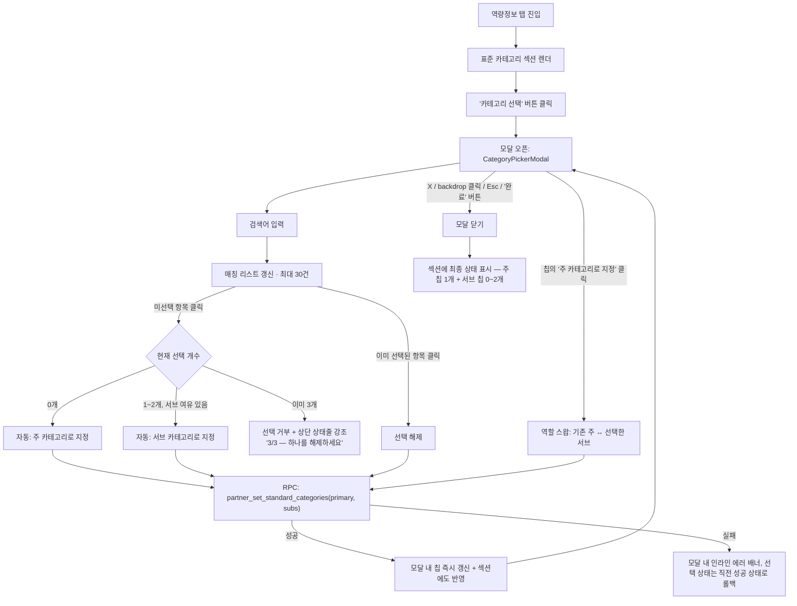

# 파트너 표준 카테고리 선택 UX 개선 (모달 전환 + 주1·서브2 제한) — 화면 정의서

> 대상: 파트너(공급사) 프로필 — 역량정보(Capability) 탭의 표준 카테고리 선택 위젯 재설계 (`/supplier/profile/capability`)
> 근거: 대표 직접 요청(스크린샷 2장, 2026-09-12) — "카테고리 검색 결과가 좁은 스크롤 목록으로 나와서 선택하기 불편하다" + "레이어 팝업으로 바꾸고 주1+서브2, 최대 3개로 제한하라"
> 관련 PRD: `docs/01-plan/features/seepn-unified-platform-v1.0.prd.md` §3.2.2 A("표준 카테고리, 다중선택, L2 또는 L3") — **단, "레이어팝업 전환"과 "주/서브 구분·최대 3개 제한"은 이 PRD에 없던 신규 정책이다.** PRD 갱신은 이 문서가 대신하지 않으며, product-manager가 PRD에 소급 반영할지는 별도 판단(§11 OQ 참고)
> 작성자: service-planner · 작성일: 2026-09-12
> **이 문서가 하지 않는 것**: 표준 카테고리 트리 데이터 자체(374노드 나라장터 표준 임포트)의 재구성, `/admin/categories` 카테고리 마스터 관리 화면의 변경, 바이어 목록(`/seepn/partners`)의 카테고리 필터 **UI**(트리 위젯 자체는 그대로 — 이 문서가 결정하는 것은 그 필터가 읽는 **데이터 범위**뿐, §8), 정확한 마이그레이션 SQL 최종본 작성(§5·§9는 backend-developer 착수용 계약 초안), ux-writer 카피 확정

---

## 0. 요약 — 화면 설계보다 먼저 봐야 할 것

### 0.1 무엇이 바뀌는가

이미 배포된 화면(`CapabilityForm.tsx` + `CategoryPicker.tsx`)의 표준 카테고리 선택 위젯을 (1) `absolute` 스크롤 드롭다운 → **레이어 팝업(모달)**로 바꾸고, (2) 개수 무제한 다중선택 → **주 카테고리 1개(필수) + 서브 카테고리 최대 2개(선택), 총 3개 상한**으로 바꾼다. 화면 1개(+ 그 로컬 복제본인 Admin 화면 1개) UX 개선과 조인 테이블 컬럼 1개 추가 수준의 변경이다 — **새 Phase가 아니다.**

### 0.2 핵심 설계 결정

| # | 결정 | 근거 |
|---|---|---|
| **D-1** | 컨테이너만 `absolute` 드롭다운 → 모달로 교체하고, 검색+매칭 리스트 로직(경로 breadcrumb 검색, 30건 슬라이스)은 **그대로 재사용**한다. 트리 드릴다운 UI로 새로 만들지 않는다 | 대표 피드백의 원인은 "좁은 스크롤 박스"이지 검색 방식이 아니다. 이미 검증된 검색 로직을 갈아엎으면 규모가 커진다(작업 지시 "규모를 필요 이상으로 키우지 마라") |
| **D-2** | 선택 로직: **처음 고르는 항목이 자동으로 주 카테고리**, 이후 최대 2개는 자동으로 서브 카테고리가 된다. 명시적 라디오 버튼으로 "이건 주 카테고리" 지정하게 하지 않는다 | 3개 중 1개가 항상 주 카테고리인 구조에서, 선택 순서가 곧 자연스러운 기본값이다. 라디오 UI는 선택 폭(3개)에 비해 과한 조작 단계를 추가한다. 주 카테고리를 바꾸고 싶으면 각 칩에 있는 "주 카테고리로 지정" 버튼으로 **명시적 스왑**(§4)이 가능하므로 자동 배정이 최종 결정을 막지 않는다 |
| **D-3** | 저장 방식을 클라이언트 diff(insert/delete 개별 호출) → **단일 RPC(`partner_set_standard_categories`)로 원자적 전체 교체**로 바꾼다(§5) | 모달 안에서 주+서브 2개를 빠르게 연속 클릭하면 기존 diff 방식은 `categoryIds` 클로저 값이 stale한 상태로 겹쳐 호출될 레이스 컨디션이 있다(§10 EDGE-5). 서버 RPC 하나가 "최종 상태"를 통째로 받아 트랜잭션으로 반영하면 이 문제가 구조적으로 사라지고, "최대 3개·주 1개 필수·중복 금지" 제약도 한 곳(서버)에서만 검증하면 된다 |
| **D-4** | `partner_standard_category`에 `role text` 컬럼 추가(`null` 허용, `check (role is null or role in ('primary','sub'))`) | `role is null`은 **마이그레이션 백필 시 3개 초과분(레거시 오버플로우)에만** 쓰인다(§9). RPC를 통한 신규 쓰기는 항상 `'primary'`/`'sub'`만 쓰므로 배포 이후 `null` 행이 새로 생기지 않는다 |
| **D-5** | 기존 데이터는 **강제 삭제하지 않는다.** 파트너별 `created_at` 오름차순으로 1번째=`primary`, 2~3번째=`sub`, 4번째 이후는 `role=null`로 보존한다(§9) | 이 프로젝트에서 이미 합의된 원칙("더 지우는 실수는 되돌릴 수 없다")을 그대로 적용. 대신 관리자 화면에 레거시 잔존 건수를 노출해 정리 여부는 운영 판단에 맡긴다 |
| **D-6** | "제출 준비" 체크리스트(`computeSubmissionGaps` / `private.partner_profile_submission_gaps`)에 **"주 카테고리 선택" 항목을 신규 추가**한다. 단 이미 `verified` 상태인 기존 파트너는 소급 무효화하지 않고, 다음 `draft`/`rejected` → 제출 시점부터만 게이트가 걸린다 | 대표 요구사항 "주 카테고리 1개 필수"가 실제로 강제되려면 지금처럼 소프트 경고 문구만으로는 안 된다(§6). 소급 무효화를 안 하는 이유는 D-5와 동일한 "기존 데이터/상태를 임의로 깨지 않는다" 원칙 |
| **D-7** | Admin 대행입력(`CapabilityTab.tsx`)에도 **동일한 role/최대3/RPC 계약을 반드시 함께 적용**한다(데이터가 같은 테이블이라 안 하면 깨짐). 단 **모달 UI 전환과 "제3의 소비자" 프롭 리팩터링은 이번 범위에서 하지 않는다** — Admin 쪽엔 새 파일 `CategoryPickerModal.tsx`를 **로컬 복제본으로 하나 더** 추가한다(§7) | 대표 요구사항은 파트너 화면에 대한 것이었지만, 스키마 제약(주 1개만 허용하는 partial unique index 등)은 테이블 전체에 걸리므로 Admin의 기존 "무제한 diff insert" 방식은 배포 즉시 깨진다. 반면 모달 UI 자체는 대표가 요청한 범위 밖이라 확대하지 않는다 |
| **D-8** | 바이어 공개 목록의 카테고리 필터(`partner_category_public` 뷰, `PartnerFilters.tsx`, `get_standard_category_rollup_counts()`)는 **role과 무관하게 기존 그대로 전체(주+서브) 노출**한다 — 이번 변경으로 축소하지 않는다 | 이미 배포된 공개 기능의 검색 범위를 UX 개선 작업 도중 임의로 좁히는 것은 범위 밖 회귀 위험이다. "주력분야만 필터"같은 기능이 필요하면 별도 PM 판단 대상(§11 OQ) |

---

## 1. 공통 규칙

### 1.1 재사용 자산 / 변경 대상 파일

| 자산 | 위치 | 이 문서에서의 용도 |
|---|---|---|
| `CategoryPicker.tsx`의 검색·매칭 로직(`useMemo` 필터, 경로 breadcrumb 표시) | `components/supplier/CategoryPicker.tsx` | **그대로 재사용** — 컨테이너만 모달로 교체(§3) |
| `ConfirmActionModal.tsx`의 접근성 패턴(role=dialog, Esc/backdrop 닫기, 포커스 이동) | `components/supplier/ConfirmActionModal.tsx` | **패턴만 재사용, 컴포넌트 자체는 재사용하지 않음** — 이 컴포넌트는 확인/취소 2버튼 흐름 전용이고, 카테고리 모달은 "선택 시 즉시 반영, 확인 버튼 없음" 구조라 그대로 끼워 넣을 수 없다. 새 컴포넌트 `CategoryPickerModal.tsx`가 동일한 dialog 접근성 골격만 복제한다(`ConfirmActionModal.tsx` 자신이 `ConfirmSubmitModal.tsx`에서 그렇게 만들어진 선례와 동일 논리) |
| `DirtyGuardProvider` / `useDirtyGuard` | `components/supplier/DirtyGuard.tsx` | **트리거하지 않음** — 카테고리 선택은 지금도, 개선 후에도 "즉시 저장"이라 탭 이동 시 미저장 경고 대상이 아니다(§10 EDGE-6) |
| `fetchCategoryOptions()` | `app/admin/(protected)/partners/categoryOptions.ts` | 변경 없음 — 옵션 목록 조회는 그대로 |
| `computeSubmissionGaps()` | `lib/admin/partnerSubmissionGaps.ts` | **수정 대상**(§6) — 주 카테고리 유무를 새 필수 항목으로 추가 |
| `private.partner_profile_submission_gaps()` | `supabase/migrations/20260829140000_partner_schema.sql` §9 | **수정 대상**(§6) — TS 미러와 동일 로직 추가 |
| `GAP_KEY_TO_TAB` | `lib/supplier/tabGaps.ts` | **수정 대상** — 신규 gap key(`standard_category_primary`) → `'capability'` 매핑 추가 |

### 1.2 URL / 컴포넌트 구조

URL 변경 없음(`/supplier/profile/capability`). 컴포넌트 트리:

```
CapabilityForm.tsx (변경: 트리거 UI + role 상태 관리)
└─ CategoryPickerModal.tsx (신규, components/supplier/)
     └─ (검색 input + 매칭 리스트는 기존 CategoryPicker.tsx 로직 이식)
```

기존 `components/supplier/CategoryPicker.tsx`는 파일을 유지한 채 내부를 모달 기반으로 교체하거나(단일 소비자이므로 이름 변경 없이 내부만 갈아끼워도 무방), 신규 파일명 `CategoryPickerModal.tsx`로 분리하고 옛 파일은 삭제해도 무방 — **frontend-developer 재량**(이 판단이 다른 화면에 영향을 주지 않는 순수 리네이밍 수준이므로 서비스기획자 결정 불필요).

### 1.3 용어

"표준 카테고리"(상위 개념), "주 카테고리"(필수 1개), "서브 카테고리"(선택, 최대 2개). 화면 라벨 최종 문구는 ux-writer 대상, 이 문서는 위 3개 용어를 가안으로 사용한다.

---

## 2. 전체 정보구조 (플로우)



**단계 요약**

1. 파트너가 역량정보 탭에서 "표준 카테고리" 섹션을 본다(항상 노출, 접혀있지 않음).
2. "카테고리 선택" 버튼(신규 — 기존엔 검색 input 자체가 트리거였으나, 모달 트리거는 명확한 버튼으로 바꾼다)을 클릭하면 모달이 열린다.
3. 모달 안에서 검색 → 클릭으로 선택/해제. **선택은 클릭 즉시 RPC로 저장된다**(대표 요구사항 1 "선택 시 바로 반영"). 확인/취소 버튼이 없다 — 모달은 "여러 개를 연속으로 고르는 작업 공간"이지 "임시 상태를 확정하는 폼"이 아니다.
4. 3개(주1+서브2)가 다 차면 나머지 미선택 항목은 클릭해도 추가되지 않고, 상단 상태줄이 "3/3 — 하나를 해제하세요"로 바뀐다.
5. 모달은 여러 번의 클릭 동안 계속 열려 있다 — 한 번 고를 때마다 자동으로 닫히지 않는다. 사용자가 X/배경 클릭/Esc/"완료" 버튼 중 하나로 명시적으로 닫는다.
6. 닫으면 섹션에 최종 상태(주 칩 1개 + 서브 칩 0~2개)가 반영돼 있다.

---

## 3. 화면 정의서

### 3.1 역량정보 탭 — "표준 카테고리" 섹션 (트리거, 상시 노출)

| 구성요소 | 동작 | 상태별 표시 | 예외처리 |
|---|---|---|---|
| 섹션 제목 + 안내문구 | 정적 텍스트 "표준 카테고리" / "선택은 즉시 저장됩니다" | 변경 없음(기존과 동일) | — |
| 현재 선택 요약(칩 영역) | 주 카테고리 칩 1개(강조 스타일, "주" 배지) + 서브 카테고리 칩 0~2개(보조 스타일, "서브" 배지). 각 칩에 ×(선택 해제) 버튼 | 0개 선택 시: 칩 영역 대신 "아직 선택된 카테고리가 없습니다" 플레이스홀더 텍스트 | 비활성화된(`is_active=false`) 카테고리가 선택돼 있으면 "(비활성)" 보조 라벨을 붙여 그대로 표시(기존 `unresolvedIds` 처리 승계) — role 슬롯은 그대로 점유하므로 3개 카운트에 포함됨 |
| "카테고리 선택" 버튼 | 클릭 시 모달 오픈(§3.2) | 이미 3개 선택된 상태에서도 버튼은 항상 활성 — 모달을 열어야 스왑/해제가 가능하므로 비활성화하지 않는다 | — |
| 저장 상태 표시줄 | `저장 중...` / 에러 문구 | 모달 밖에서도 보이도록 섹션 레벨에 유지(기존 `categorySaving`/`categoryError` 상태 구조 그대로) | 모달이 닫힌 뒤에도 마지막 RPC 호출이 실패했다면 이 줄에 에러가 남아있어야 한다(§10 EDGE-7) |
| 필수 경고 카드 | 주 카테고리가 없을 때만 노출 | 기존 문구 "카테고리가 선택되지 않았습니다 — 매칭 정확도에 영향을 줍니다."를 **"주 카테고리를 선택해주세요 — 프로필 제출을 위해 필수입니다."**로 교체(D-6과 연동, accent-700 톤 유지) | 조건이 `categoryIds.length === 0`에서 `!hasPrimary`로 바뀐다 — 서브만 있고 주가 없는 상태(정상 흐름에서는 발생하지 않지만, §6 참고)도 이 경고를 띄운다 |

### 3.2 카테고리 선택 모달 (`CategoryPickerModal`)

| 구성요소 | 동작 | 상태별 표시 | 예외처리 |
|---|---|---|---|
| 헤더 | 제목 "표준 카테고리 선택" + 보조문구 "주 카테고리 1개(필수) + 서브 카테고리 최대 2개" + 진행 상태 "n/3 선택됨" + 닫기(×) 아이콘 | n/3이 3/3이면 강조 톤(예: accent) | — |
| 선택된 항목 영역(모달 상단, 검색창 위 고정) | 주 슬롯 1칸(비어있으면 "주 카테고리를 선택하세요" 점선 placeholder) + 서브 슬롯 최대 2칸(비어있으면 "서브 카테고리 선택 가능" placeholder). 각 칩: 이름 + role 배지 + ×(해제) + (서브 칩에만) "주로 지정" 버튼 | §4 참고 | 비활성 카테고리 칩은 "(비활성)" 라벨 + × 만 가능(재검색으로 다시 찾아 선택할 수 없음, 목록에 안 뜨므로) |
| 검색 input | 기존 로직 그대로: 입력 시 `path.toLowerCase().includes(term)` 필터, 포커스 시 결과 노출. **모달 오픈 시 자동 포커스** | — | — |
| 결과 리스트 | 매칭 항목(최대 30건) 클릭 → 선택/해제 토글 | 이미 선택된 항목: 체크 표시 + 강조 배경. **3/3이고 미선택인 항목**: 흐림(opacity) + `cursor-not-allowed`, 클릭 시 상단 상태줄만 강조되고 추가되지 않음(토스트 없음, §10 EDGE-1) | 검색 결과 0건: "일치하는 카테고리가 없습니다" 안내 문구(기존 문구 유지, 모달이라 공간 여유가 있으므로 "다른 검색어를 시도해보세요" 보조문구 추가 가능 — ux-writer 재량) |
| 인라인 에러 배너 | 직전 클릭의 RPC 호출이 실패하면 모달 내부에도 에러 문구 노출(모달을 안 닫고도 바로 알 수 있도록) | "저장에 실패했습니다. 다시 시도해주세요." | 실패 시 클릭 직전 상태로 화면을 롤백(낙관적 업데이트 금지 — RPC 성공 응답을 받은 뒤에만 칩을 갱신, §10 EDGE-7) |
| 푸터 "완료" 버튼 | 모달 닫기(저장 동작 없음 — 이미 각 클릭마다 저장 완료된 상태) | — | — |

---

## 4. 주/서브 선택 인터랙션 규칙 (상세)

1. **자동 배정**: 0개 선택 상태에서 첫 클릭 → 주 카테고리. 1~2개 선택 상태에서 미선택 항목 클릭 → 서브 카테고리(서브 슬롯에 여유가 있을 때만).
2. **주 카테고리 변경(스왑)**: 서브 칩에 있는 "주로 지정" 버튼 클릭 → 그 서브가 주가 되고, **기존 주는 서브로 강등**된다(둘의 role만 교환, 선택 개수는 그대로 유지). 처음부터 다시 고를 필요 없음 — 대표 요구사항 "주 카테고리를 나중에 바꾸는 흐름"에 대한 답.
3. **주 카테고리 해제**: 주 칩의 ×를 누르면 주 슬롯이 비워진다. 이때 **서브가 1개 이상 남아있으면 그중 가장 먼저 선택된(선택 순서상 앞선) 서브를 자동으로 주로 승격**한다 — "주 없음, 서브만 있음" 상태가 정상 플로우에서 발생하지 않도록 하는 기본 동작(서비스기획자 판단, PM 확인 불필요 수준의 순수 인터랙션 일관성 규칙). 서브가 0개면 주 슬롯은 빈 채로 남는다(0개 선택 상태로 복귀).
4. **최대 3개 초과 시도**: 3개가 다 찬 상태에서 새 항목 클릭 → 무시 + 상단 상태줄 강조(§3.2, §10 EDGE-1). 팝업/토스트를 띄우지 않는다(모달 안에서 이미 상태줄이 상시 보이므로 중복 알림 불필요).
5. **동일 카테고리를 주+서브에 중복 선택**: UI 구조상 발생할 수 없다 — 이미 선택된 항목을 다시 클릭하면 "추가"가 아니라 "해제"로 처리되기 때문(§3.2 결과 리스트 토글 규칙). 서버에서도 `partner_standard_category`의 기존 PK(`partner_id, standard_category_id`)가 동일 카테고리의 중복 행 자체를 막는다(§5) — UI와 DB 양쪽에서 이중 방어.

---

## 5. 데이터 모델 변경 설계 (backend-developer용)

### 5.1 `partner_standard_category` 컬럼 추가

```sql
alter table public.partner_standard_category
  add column if not exists role text check (role is null or role in ('primary', 'sub'));

comment on column public.partner_standard_category.role is
  '파트너 표준 카테고리 UX 개선(2026-09-12, 대표 요청). null은 마이그레이션 백필 시
  3개 초과분(레거시 오버플로우)에만 존재 — RPC를 통한 신규 쓰기는 항상 primary/sub만
  쓰므로 배포 이후 null 행이 새로 생기지 않는다. 파트너용 UI는 role이 null인 행을
  조회/표시하지 않는다(관리자 전용 정리 대상, §9 참고).';

-- 파트너당 주 카테고리 1개만 허용 (부분 유니크 인덱스)
create unique index if not exists idx_partner_standard_category_one_primary
  on public.partner_standard_category (partner_id) where role = 'primary';

-- 서브 카테고리 최대 2개 — 유니크 인덱스로 표현 불가하므로 트리거로 방어
-- (기존 protect_standard_category_referenced와 동일한 "친절한 사전 체크" 패턴)
create or replace function private.protect_partner_category_role_limits()
returns trigger
language plpgsql
security definer
set search_path = ''
as $$
declare
  v_sub_count integer;
begin
  if new.role = 'sub' then
    select count(*) into v_sub_count
    from public.partner_standard_category
    where partner_id = new.partner_id and role = 'sub';
    if v_sub_count >= 2 then
      raise exception 'sub_category_limit_exceeded: partner % already has 2 sub categories', new.partner_id
        using errcode = 'P0001';
    end if;
  end if;
  return new;
end;
$$;

drop trigger if exists trg_partner_category_role_limits on public.partner_standard_category;
create trigger trg_partner_category_role_limits
  before insert on public.partner_standard_category
  for each row execute function private.protect_partner_category_role_limits();
```

이 트리거는 RPC(§5.2)가 이미 애플리케이션 레벨에서 검증하므로 정상 경로에서는 절대 걸리지 않는다 — 혹시 모를 직접 insert 경로(예: 어드민 서버 액션이 RPC로 전환되지 않은 채 남아있는 실수)에 대한 **2차 방어선**이다.

### 5.2 신규 RPC — `partner_set_standard_categories(p_primary_id, p_sub_ids)`

기존 클라이언트 diff(insert/delete 개별 호출) 패턴을 폐기하고, "최종 상태 전체"를 한 번에 원자적으로 반영하는 RPC로 교체한다(D-3의 레이스 컨디션 방지 근거).

```sql
create or replace function public.partner_set_standard_categories(
  p_primary_id uuid,
  p_sub_ids uuid[] default '{}'
)
returns void
language plpgsql
security definer
set search_path = ''
as $$
declare
  v_auth_uid uuid := auth.uid();
  v_partner_id uuid;
  v_sub_ids uuid[] := coalesce(p_sub_ids, '{}');
begin
  if not private.is_active_partner(v_auth_uid) then
    raise exception 'access_denied' using errcode = '42501';
  end if;

  select id into v_partner_id from public.partner where owner_account_id = private.current_partner_id(v_auth_uid);
  if v_partner_id is null then
    raise exception 'partner_not_found' using errcode = 'P0002';
  end if;

  if array_length(v_sub_ids, 1) > 2 then
    raise exception 'too_many_sub_categories' using errcode = 'P0001';
  end if;

  if p_primary_id is null and array_length(v_sub_ids, 1) > 0 then
    raise exception 'sub_category_requires_primary' using errcode = 'P0001';
  end if;

  if p_primary_id is not null and p_primary_id = any(v_sub_ids) then
    raise exception 'duplicate_category_role' using errcode = 'P0001';
  end if;

  -- 전체 교체(role이 null인 레거시 오버플로우 행은 건드리지 않는다, §9)
  delete from public.partner_standard_category
  where partner_id = v_partner_id and role is not null;

  if p_primary_id is not null then
    insert into public.partner_standard_category (partner_id, standard_category_id, role)
    values (v_partner_id, p_primary_id, 'primary');
  end if;

  if array_length(v_sub_ids, 1) > 0 then
    insert into public.partner_standard_category (partner_id, standard_category_id, role)
    select v_partner_id, sub_id, 'sub' from unnest(v_sub_ids) as sub_id;
  end if;
end;
$$;

revoke all on function public.partner_set_standard_categories(uuid, uuid[]) from public;
grant execute on function public.partner_set_standard_categories(uuid, uuid[]) to authenticated;
```

**참고 구현 스케치**(`partner_submit_for_review()`와 동일한 `owner_account_id` 조회 패턴 재사용, §2 flowchart의 각 클릭이 이 RPC 1회 호출과 1:1 대응) — backend-developer 최종 결정 대상.

### 5.3 Admin 대행입력용 RPC (§7과 연결)

동일한 검증 로직(최대 2 서브, 주 없이 서브만 불가, 중복 금지)을 Admin 경로에서도 강제해야 하므로, 검증 로직을 `private.validate_partner_category_selection(p_primary_id, p_sub_ids)` 같은 공용 private 함수로 뽑아 `partner_set_standard_categories`와 신규 `admin_set_partner_standard_categories(p_partner_id, p_primary_id, p_sub_ids)`(권한 체크는 `has_menu_permission('partner_management', 'update')`) 양쪽에서 재사용할 것을 권장한다 — 로직 이중 구현 방지.

### 5.4 정책/권한 변경 사항

- 기존 `partner_standard_category_self_insert`/`self_delete` RLS 정책은 **변경 불필요**(RPC가 `security definer`로 실행되므로 RLS를 우회하지만, 직접 테이블 접근 경로에 대한 방어로서는 그대로 유효 — 컬럼 추가가 `owns_partner(partner_id)` 조건에 영향 없음).
- "No UPDATE grant"였던 기존 설계 원칙(§3 코멘트, "changing a category selection is delete-old-row + insert-new-row")은 **그대로 유지** — role 스왑도 내부적으로 delete+insert이지 UPDATE가 아니다.

---

## 6. 검증 규칙

| 규칙 | 처리 |
|---|---|
| 주 카테고리 0개 상태로 "제출하기" 가능한가 | **불가.** `computeSubmissionGaps()`에 신규 항목 `{ key: 'standard_category_primary', label: '표준 카테고리(주 1개)', satisfied: hasPrimaryCategory }` 추가, `private.partner_profile_submission_gaps()`에도 동일 조건(`exists(select 1 from partner_standard_category where partner_id = p_partner.id and role = 'primary')`) 추가. **서버 함수가 이미 `p_partner.id`를 갖고 있으므로 함수 시그니처 변경 없이 내부 서브쿼리만 추가하면 된다** |
| 이미 `verified`인 기존 파트너가 소급으로 막히는가 | **아니오**(D-6). `verification_state`가 이미 `verified`인 행은 재제출 절차를 다시 타지 않는 한 영향 없음. `draft`/`rejected` 상태에서 `partner_submit_for_review()`를 호출하는 시점부터만 새 게이트가 적용된다 |
| 서브만 있고 주가 없는 상태를 허용하는가 | **저장 시점(§4 규칙 3)에서 UI가 이 상태를 만들지 않도록 설계**했지만, 방어적으로 RPC도 `p_primary_id is null and array_length(p_sub_ids) > 0`이면 거부한다(§5.2) — UI 버그로 이런 요청이 가더라도 서버가 최종 방어선 |
| 같은 카테고리를 주+서브에 중복 선택 시도 | UI 구조상 불가(§4 규칙 5) + `partner_standard_category` PK(`partner_id, standard_category_id`)가 물리적으로 차단 + RPC가 `p_primary_id = any(p_sub_ids)`를 명시적으로 재검증(3중 방어) |
| Admin 대행입력에서도 동일 규칙 적용되는가 | **예**(§7) — 같은 테이블·같은 제약이므로 예외를 둘 수 없다 |

---

## 7. Admin 대행입력 화면 처리 방침

**결론(D-7): 데이터 계약(role/최대3/RPC)은 Admin도 반드시 함께 바뀐다. 모달 UI 전환은 이번 범위에서 하지 않는다.**

근거를 코드 사실관계로 정리하면:

- `app/admin/(protected)/partners/CategoryPicker.tsx`는 **두 곳**에서 쓰인다 — ① `PartnerFilters.tsx`(목록 검색 **필터**, 무제한 다중선택 유지되어야 함), ② `CapabilityTab.tsx`(카테고리 **할당**, 이번 변경의 실제 영향 대상).
- 즉 이 파일은 이미 "필터 모드"와 "할당 모드"라는 서로 다른 두 용도를 하나의 무제한-다중선택 컴포넌트로 겸용하고 있었다. 이번에 할당 모드에만 role/3개 제한을 걸어야 하므로, **기존 파일을 고치면 필터(①)가 망가진다.**
- 따라서: `app/admin/(protected)/partners/CategoryPicker.tsx`는 **그대로 두고 `PartnerFilters.tsx` 전용으로 남긴다.** `CapabilityTab.tsx`는 새 파일 `app/admin/(protected)/partners/CategoryPickerModal.tsx`(파트너 쪽 신규 컴포넌트의 로컬 복제본)로 교체한다. `updatePartnerCategoriesAction()`(현재 diff 기반 insert/delete)은 폐기하고 `admin_set_partner_standard_categories` RPC(§5.3)를 호출하도록 바꾼다.
- **"제3의 소비자가 생기면 프롭 기반 리팩터링을 하라"는 기존 파일 헤더의 조건은 이번에 발동시키지 않는다** — 새로 생기는 것은 "완전히 다른 로직(role/3개 제한/RPC)을 가진 새 컴포넌트"이지, 기존 무제한-다중선택 컴포넌트의 세 번째 소비자가 아니다. 로컬 복제본을 하나 더 두는 이번 선택은 기존 설계 원칙과 일관된다.
- 모달 UI 자체를 Admin에도 적용할지는 순수 UX 취향 문제이자 대표가 요청한 범위 밖이므로, 이번엔 **적용하지 않고 기존 드롭다운 컨테이너를 유지**한 채 role 태깅 UI(칩에 "주"/"서브" 배지 + "주로 지정" 버튼)만 추가한다. Admin 화면은 사용 빈도가 낮아(대행입력은 예외 케이스) 모달 전환의 이득이 파트너 화면보다 작다는 점도 근거. Admin에도 모달을 적용할지는 §11 OQ-1로 남긴다.

---

## 8. 공개 목록 필터 처리 방침

**결론(D-8): `partner_category_public` 뷰·바이어 필터·rollup count 함수는 role과 무관하게 기존 그대로 전체 노출한다. 스키마/쿼리 변경 없음.**

- `partner_category_public` 뷰(`supabase/migrations/20260910100000_seepn_buyer_web_p5a.sql` §9)는 `partner_standard_category`에서 `partner_id, standard_category_id` 2개 컬럼만 select한다 — **`role` 컬럼을 추가해도 이 뷰의 SELECT 목록에 넣지 않으면 뷰 정의 자체는 변경할 필요가 없다.**
- `PartnerFilters.tsx`의 카테고리 트리 필터, `get_standard_category_rollup_counts()`(L1 뱃지 카운트)도 role을 구분하지 않고 계속 "이 파트너가 이 카테고리를 하나라도 갖고 있으면 매칭"으로 동작한다.
- 이렇게 하는 이유: 이미 배포된 공개 검색 기능의 매칭 범위를 이번 UX 개선 작업 도중 축소하면, 서브 카테고리로만 연결되던 파트너가 바이어 검색 결과에서 사라지는 **회귀**가 생긴다. 이번 티켓의 목적(선택 UX 개선)과 무관한 변경이므로 하지 않는다.
- 향후 "주력분야만 보기" 같은 필터 고도화가 필요하면 `partner_category_public` 뷰에 `role` 컬럼을 추가로 노출하고 `PartnerFilters.tsx`에 토글을 추가하는 별도 작업으로 진행한다(§11 OQ-2, 이번 범위 아님).

---

## 9. 기존 데이터 마이그레이션 정책

**원칙: 강제 삭제 없음. 자동 백필로 대부분의 파트너는 무변화 체감, 초과분은 보존하되 파트너 화면에서만 숨긴다.**

| 케이스 | 처리 |
|---|---|
| 카테고리 0개 선택 | 처리할 데이터 없음. `role` 개념 자체가 해당 없음 — 배포 후에도 계속 "0개 선택" 상태로 보이고, §6 신규 게이트에 따라 재제출 시 주 카테고리 입력을 요구받는다(정상 동작, 데이터 손실 아님) |
| 1~3개 선택 | `created_at` 오름차순으로 1번째=`primary`, 나머지=`sub`로 백필. **이 파트너들은 배포 후 파트너 화면에서 기존 선택이 그대로(역할만 부여되어) 보인다 — 사용자가 아무것도 다시 할 필요 없음** |
| 4개 이상 선택(초과) | `created_at` 오름차순 1번째=`primary`, 2~3번째=`sub`, **4번째 이후는 `role=null`로 테이블에 그대로 보존**(삭제하지 않음). 파트너 화면(신규 3-슬롯 UI)은 `role is not null`인 행만 조회하므로 이 파트너는 배포 직후 "3개 선택됨"으로 보이고, 초과분은 화면에 안 보일 뿐 DB에는 남아있다 |
| 관리자 가시성 | 레거시 초과분(`role is null`)이 있는 파트너는 Admin `/admin/partners/[id]` 상세 화면에 "레거시 카테고리 N개(3개 제한 적용 전 데이터, 정리 필요)" 같은 안내 문구를 추가하는 것을 권장 — 신규 RPC 없이 `count(*) where partner_id = ? and role is null` 단순 쿼리로 충분하다. **강제 정리 액션(일괄 삭제 버튼 등)은 이번 범위에 만들지 않는다** — 필요 여부는 운영 판단(§11 OQ-4) |
| 왜 `created_at` 오름차순을 "주 카테고리" 기준으로 쓰는가 | 이 프로젝트엔 "파트너가 어떤 걸 먼저/더 중요하게 생각했는지"를 나타내는 기존 신호가 전혀 없다(순수 N:M, 순서 없음). 가장 먼저 선택해 저장된 것이 그나마 "처음에 등록한 것"이라는 약한 신호이므로 임의 기준 중 가장 방어 가능한 기본값으로 채택했다. 이 기준에 대한 이의는 §11 OQ-3 |

---

## 10. 엣지케이스 종합표

| # | 상황 | 처리 |
|---|---|---|
| EDGE-1 | 이미 3개(주1+서브2) 다 찬 상태에서 4번째 항목 클릭 | 추가되지 않음. 상단 상태줄 "3/3" 강조 표시로만 알림, 별도 토스트/모달 없음(§3.2) |
| EDGE-2 | 검색 결과 0건 | "일치하는 카테고리가 없습니다" 안내(기존 문구 유지) |
| EDGE-3 | 모달이 열린 채로 프로필의 다른 탭(기본정보 등)으로 이동 시도 | 카테고리 선택은 `DirtyGuard` 대상이 아니므로(즉시 저장) 확인 없이 즉시 이동 허용, 모달은 언마운트되어 자동으로 닫힌다 |
| EDGE-4 | 모달이 열린 채로 브라우저 탭을 닫거나 새로고침 | 각 클릭이 이미 RPC로 저장 완료된 상태이므로 데이터 손실 없음. `beforeunload` 경고도 뜨지 않음(dirty 상태 아님) |
| EDGE-5 | 모달 안에서 주+서브 2개를 빠르게 연속 클릭(더블클릭 수준) | RPC가 "최종 상태 전체"를 매번 원자적으로 반영하는 방식(§5.2)이라 마지막 호출이 최종 상태를 결정하며 부분 반영/레이스 컨디션이 생기지 않는다 |
| EDGE-6 | 카테고리 선택 중 다른 필드(MOQ 등)가 저장되지 않은 상태에서 모달을 여닫는 경우 | 카테고리 저장과 나머지 Capability 필드 저장은 완전히 분리된 상태 머신이다(기존과 동일) — 모달을 여닫아도 `saveState`(dirty/saved 등)에는 영향 없음 |
| EDGE-7 | 클릭에 대한 RPC 호출이 네트워크 오류로 실패 | 모달 내부에 인라인 에러 배너 표시 + 클릭 직전 상태로 롤백(낙관적 업데이트 금지, §3.2). 모달을 닫아도 섹션 레벨 에러 문구(§3.1)가 남아 사용자가 알아챌 수 있다 |
| EDGE-8 | 이미 선택된 카테고리가 이후 `is_active=false`로 바뀜(관리자가 카테고리 마스터에서 비활성화) | 기존 `unresolvedIds` 처리 승계 — 검색 결과에는 안 뜨지만 선택된 칩 영역엔 "(비활성)" 라벨과 함께 계속 표시, ×로 해제만 가능. role 슬롯은 계속 점유하므로 3개 카운트에 포함된다(§3.2) |
| EDGE-9 | 주 카테고리를 해제했는데 서브가 남아있는 경우 | §4 규칙 3에 따라 남은 서브 중 가장 먼저 선택된 것이 자동으로 주로 승격 — "주 없음, 서브만 있음" 상태가 정상 플로우에서 발생하지 않는다 |
| EDGE-10 | 두 브라우저 탭에서 동시에 같은 파트너 세션으로 모달을 열고 서로 다른 선택을 함 | RPC가 매번 "전체 교체"이므로 나중에 도착한 호출이 최종 상태를 덮어쓴다(last-write-wins). 실시간 동기화는 없음 — 이 프로젝트의 다른 자가입력 폼과 동일한 수준의 기존 한계이며 이번 변경이 새로 만드는 리스크는 아니다 |

---

## 11. Open Questions (product-manager / 대표 확인 필요)

| ID | 질문 | 서비스기획자 권고(기본값) |
|---|---|---|
| **OQ-1** | Admin 대행입력(`CapabilityTab.tsx`)도 이번에 모달 UI로 전환할지 | **[2026-09-12 대표 확정] Admin도 모달로 함께 전환.** `CategoryPickerModal.tsx`를 Admin `CapabilityTab.tsx`에도 적용 — 새 로컬 복제본이 아니라 파트너용과 동일 컴포넌트를 재사용할지, 스타일 prop만 분기할지는 backend/frontend 구현 시 판단(§7 원 설계의 "제3의 소비자 아님" 전제가 이번 확정으로 바뀌었으므로, 이 시점에 prop 기반 공용 컴포넌트로 리팩터링하는 것을 권장) |
| **OQ-2** | 바이어 공개 목록 필터에 "주력분야만 보기" 같은 role 기반 토글을 추가할지 | **[2026-09-12 대표 확정] 지금 같이 추가.** `partner_category_public` 뷰에 `role` 컬럼 노출 + `components/seepn/PartnerFilters.tsx`에 토글 추가 (§8 설계를 그대로 확장 적용) |
| **OQ-3** | 마이그레이션 백필 기준 | **[2026-09-12 대표 확정] created_at 오름차순(가장 먼저 선택한 것) 채택.** 권고안 그대로 |
| **OQ-4** | 레거시 초과분(4개 이상) 처리 | **[2026-09-12 대표 확정] 일단 영구 보존, 정리는 운영 판단으로 나중에.** 권고안 그대로 — 강제 정리 액션 만들지 않음 |
| **OQ-5** | PRD §3.2.2 A 소급 반영 여부 | 구현 완료 후 Claude가 PRD에 반영(이번 기능 구현의 일부로 처리, 별도 논의 불필요) |

---

## 12. privacy-security-officer 핸드오프 체크리스트

CLAUDE.md 원칙("개인정보를 다루는 기능은 privacy-security-officer 점검 없이 배포하지 않는다")에 따라 확인이 필요한지 먼저 판단한다: **표준 카테고리 선택 값 자체는 개인정보가 아니다**(기존 `partner_category_public` 뷰 코멘트가 이미 "Not personal data"로 판정한 바 있음, §3.2 참고). 다만 새 RPC가 `security definer`로 동작하므로 아래는 패턴 일치 여부만 가볍게 확인 권장(신규 전면 검토 불필요 — `partner_submit_for_review()` 등 기존 선례와 동일한 패턴):

| # | 항목 | 왜 확인이 필요한가 |
|---|---|---|
| PSO-1 | `partner_set_standard_categories()`가 호출자 소유 파트너(`owner_account_id = private.current_partner_id(auth.uid())`)에게만 쓰기를 허용하는지 | 타 파트너의 카테고리를 조작할 수 있으면 무결성 문제(개인정보는 아니지만 데이터 침해) |
| PSO-2 | `admin_set_partner_standard_categories()`가 `partner_management:update` 권한 체크를 빠뜨리지 않았는지 | Admin RPC는 임의 `p_partner_id`를 받으므로 권한 체크 누락 시 권한 없는 관리자도 임의 파트너를 수정 가능 |
| PSO-3 | `role` 컬럼 추가가 `partner_category_public` 뷰의 SELECT 목록에 실수로 흘러들어가지 않는지(§8 결정과 배치되지 않도록) | 뷰가 select 목록을 명시적으로 나열하는 방식(`select psc.partner_id, psc.standard_category_id`)이라 컬럼 추가만으로는 자동 노출되지 않지만, 향후 누군가 `select *`로 바꾸면 의도치 않게 role이 새어나갈 수 있음 — 리뷰 시점에 확인 |

---

## Version History

| Version | Date | Changes | Author |
|---|---|---|---|
| 1.3 | 2026-09-13 | **프로덕션 반영 완료.** 대표가 Dashboard SQL Editor에서 직접 실행, 3가지 확인 완료: ① 파트너당 주 카테고리 중복 0건(백필 정합성), ② 신규 RPC 2종(`partner_set_standard_categories`, `admin_set_partner_standard_categories`) 존재 확인, ③ `partner_standard_category`에 대한 `authenticated` 권한이 `select`만 남고 `insert`/`delete`는 제거됨(쓰기 경로가 RPC로만 좁혀졌음을 확인). git `87e28ad` | 대표 확인, Claude(정리) |
| 1.2 | 2026-09-12 | **구현·검토·배포 전 수정 완료.** 백엔드(role 컬럼+제약+RPC 2종)·프론트(공용 모달, 파트너/Admin 화면, 공개 필터 토글) 구현 후 qa-reviewer·privacy-security-officer 검토를 거쳤다. **배포 전 수정 3건**: ① qa-reviewer 지적 — self-service RLS가 새 "주1+서브2" 규칙을 강제하지 못해 RPC 우회 시 무제한 삽입 가능 → `partner_standard_category`의 `authenticated` INSERT/DELETE grant와 self/admin insert/delete 정책을 전부 제거, 쓰기를 RPC 전용으로 전환(`partner_featured_pick`/`seepn_inquiry_partner`와 동일 패턴), 회귀 테스트 k15a~c 추가. ② privacy-security-officer 지적(P-A, 실사용 버그) — 레거시 오버플로우(role=null) 카테고리를 재선택하면 PK 충돌로 저장이 영구 실패 → 두 RPC의 delete 조건에 재선택 대상 id도 포함하도록 수정, 회귀 테스트 k16 추가. ③ 같은 검토(P-E, 실사용 버그) — `app/supplier/profile/layout.tsx`가 존재하지 않는 `id` 컬럼을 select해서 "주 카테고리 미입력" 경고가 항상 거짓으로 표시되던 것을 `partner_id` select로 수정. **배포 후 후속 필요(비차단)**: P-B(레거시 카테고리를 파트너 본인이 볼 수도 해제할 수도 없음), P-C(처리방침 §7에 표준 카테고리 자체가 누락 — 이번 기능과 무관한 기존 결함, product-manager 확인 필요), P-H(백필된 primary가 파트너의 실제 의사가 아닌 추정값인데 바로 바이어 필터에 쓰임 — product-manager 판단). privacy-security-officer가 `seepn-buyer-web-p5a-privacy-review.md`(v1.4)를 직접 갱신해 신규 노출 컬럼(`role`)을 반영했다 | backend-developer / frontend-developer / qa-reviewer / privacy-security-officer, Claude(정리+P-A/P-E 수정+회귀테스트 추가) |
| 1.1 | 2026-09-12 | **OQ-1~OQ-4 대표 확정 — 범위 확대.** Admin `CapabilityTab.tsx`도 모달로 함께 전환(OQ-1, D-7 "Admin은 드롭다운 유지" 원 설계를 뒤집음 — prop 기반 공용 컴포넌트 리팩터링 권장), 공개 목록 필터에 role 토글 추가(OQ-2, D-8 "미변경" 원 설계를 뒤집음), 백필 기준(created_at 오름차순)·레거시 초과분 처리(영구 보존)는 권고안 그대로 채택(OQ-3/OQ-4). 구현 착수 가능 | 대표 확정, Claude(정리) |
| 1.0 | 2026-09-12 | 최초 작성 — 대표 직접 요청(스크린샷 2장) 기반, 표준 카테고리 선택을 드롭다운→모달, 무제한→주1+서브2(최대3) 제한으로 재설계. `partner_standard_category.role` 컬럼 추가 + 원자적 교체 RPC(`partner_set_standard_categories`) 설계, 제출 체크리스트 게이트 추가(D-6), Admin 대행입력 데이터 계약 동기화(D-7, UI는 유지), 공개 목록 필터 미변경 확정(D-8), 강제 삭제 없는 마이그레이션 백필 정책(§9) 확정. 엣지케이스 10건, Open Question 5건 | service-planner |
