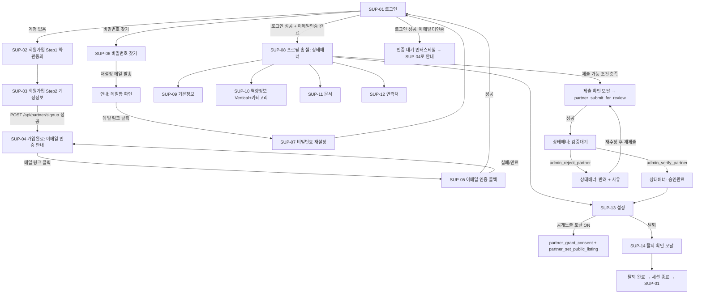

# `/supplier` — Korean Partner 자가등록/프로필관리 화면 정의서

| 항목 | 내용 |
|---|---|
| 문서 종류 | UI Screen Spec (화면 흐름 / 상태 / 엣지케이스) |
| 작성자 | service-planner |
| 대상 화면 | 파트너 본인이 로그인해서 쓰는 화면 전체 (Admin `/admin/partners`, `/admin/categories`는 별도 문서: `partner-category-management.screen-spec.md`) |
| 입력 문서 | [seepn-unified-platform-v1.0.prd.md](../../01-plan/features/seepn-unified-platform-v1.0.prd.md) §3.0, §3.2.1~§3.2.6 · [partner-signup-privacy-review.md](../../03-security/partner-signup-privacy-review.md) 전체 · `partner-category-management.screen-spec.md` (Admin 쪽 화면정의서, 동일 스키마를 다루므로 상호 참조) |
| 그라운드 트루스 원칙 | 본 문서의 모든 화면 동작은 아래 마이그레이션에 **실제로 존재하는** 테이블 컬럼·RPC 시그니처·CHECK 제약·GRANT를 근거로 한다. PRD가 "필수"라고 적었어도 실제 판정 로직(`private.partner_profile_submission_gaps`)이 요구하지 않으면 그 사실을 그대로 밝히고 PM 확인 질문으로 남긴다(§8). RPC/읽기경로가 없는 동작은 상상으로 채우지 않고 "⚠ Gap"으로 표시한다 |
| 근거 코드 | `supabase/migrations/20260829130000_partner_auth_foundation.sql`, `20260829140000_partner_schema.sql`, `20260829150000_standard_category_schema.sql`, `20260829180000_fix_admin_entry_completion_gap.sql`, `lib/admin/partnerSubmissionGaps.ts`, `lib/admin/partnerLabels.ts`, `lib/legal/partnerConsentVersions.ts`, `app/admin/(protected)/partners/CategoryPicker.tsx`, `components/RequestForm/styles.ts` |
| 후속 담당 | ui-ux-designer(시안) → privacy-security-officer(§0.3 Gap 및 재검증 요청 최종 확인) → backend-developer(§0.3 Gap 해소 + API 계약 확정) → frontend-developer(구현) → qa-reviewer |

---

## 0. 요약 — 화면 설계보다 먼저 봐야 할 것

### 0.1 핵심 설계 결정 6가지

| # | 결정 | 근거 |
|---|------|------|
| D-S1 | 라우트 루트는 `app/supplier/`로 신설한다(`app/admin/`과 같은 독립 최상위 레이아웃 패턴). `suppliers.seepn.me` 서브도메인 분리는 P8 인프라 작업으로 미룬다 | 작업 지시 §12, ceo-advisor 실행순서 |
| D-S2 | 디자인 토큰은 `components/RequestForm/styles.ts`(buyer 계열)를 재사용/공유한다. Admin의 `admin-*` 토큰(다크 사이드바 등)은 쓰지 않는다 — 색상 팔레트 자체는 1:1 동일하므로 신규 토큰 정의는 불필요 | Figma 조사 결과, PRD 성격상 `/supplier`도 "일반 방문자가 쓰는 공개 화면" 계열 |
| D-S3 | 전용 대시보드(SS-14)는 만들지 않는다. 로그인 후 랜딩은 `/supplier/profile`이며, 화면 상단 "상태 배너"만으로 검증 진행 상황을 알린다 | PRD SS-14 Won't(v1.0) |
| D-S4 | 프로필 입력은 **탭 구조**(기본정보/역량정보/문서/연락처/설정)로 하고, 탭마다 독립적으로 저장한다 — 마법사(wizard)형 단계 진행을 쓰지 않는다 | SS-6 "부분 저장 후 이어쓰기"가 UX 선호가 아니라 **보안 설정(30분 세션 만료)의 필연적 요구사항**(privacy review §2.8)이므로, 탭 간 이동이 자유롭고 각 탭이 자체 저장 버튼을 가져야 세션 만료 중 입력 유실이 최소화된다 |
| D-S5 | 카테고리 선택 UI는 Admin의 `CategoryPicker.tsx`(검색+선택 위젯)를 **그대로 재사용**한다 — 새 컴포넌트를 만들지 않는다 | Figma 조사 결과 실제 목업 없음, Admin 위젯이 이미 이 정확한 문제("380여 개 트리에서 몇 개 선택")를 풀어놓았음 |
| D-S6 | SNS 로그인 버튼은 화면에 넣지 않는다(Figma S-01 목업엔 있으나 배제) | PRD SS-10 Won't(v1.0) |

### 0.2 화면 목록 한눈에 보기

| ID | 화면 | 경로 | 인증 요구 |
|---|---|---|---|
| SUP-01 | 로그인 | `/supplier/login` | 비로그인 |
| SUP-02 | 회원가입 Step 1(약관동의) | `/supplier/signup` | 비로그인 |
| SUP-03 | 회원가입 Step 2(계정정보) | `/supplier/signup` (Step 2 상태) | 비로그인 |
| SUP-04 | 가입완료(이메일 인증 안내) | `/supplier/signup/complete` | 비로그인(가입 직후, 세션 없음) |
| SUP-05 | 이메일 인증 콜백 | `/supplier/auth/confirm` | 인증 토큰 경유 |
| SUP-06 | 비밀번호 찾기 | `/supplier/forgot-password` | 비로그인 |
| SUP-07 | 비밀번호 재설정 | `/supplier/reset-password` | 재설정 토큰 경유 |
| SUP-08 | 프로필 홈 셸(상태배너 + 탭 네비게이션) | `/supplier/profile` | 로그인 + 이메일인증 |
| SUP-09 | 탭: 기본정보 | `/supplier/profile/basic` | 〃 |
| SUP-10 | 탭: 역량정보(Vertical + 카테고리) | `/supplier/profile/capability` | 〃 |
| SUP-11 | 탭: 문서 | `/supplier/profile/documents` | 〃 |
| SUP-12 | 탭: 연락처 | `/supplier/profile/contact` | 〃 |
| SUP-13 | 탭: 설정(공개노출/마케팅동의/비밀번호/탈퇴) | `/supplier/profile/settings` | 〃 |
| SUP-14 | 탈퇴 확인 모달 | (SUP-13 내 모달) | 〃 |

### 0.3 이 문서를 쓰며 발견한 Gap (frontend 착수 전 확인 필요)

Admin 화면정의서(`partner-category-management.screen-spec.md`)가 G-1~G-7을 발견한 것과 같은 방식으로, 파트너 자가등록 화면을 설계하며 실제 스키마에 **읽기/전이 경로가 없는 지점**을 발견했다. 이 지점들은 상상으로 채우지 않고 아래에 명시한다.

| Gap | 내용 | 영향 | 심각도 |
|---|---|---|:---:|
| **G-S1** | `public.partner_consent`에 **파트너 본인용 SELECT GRANT/RLS 정책이 전혀 없다**(§7 전체가 `revoke all ... from anon, authenticated, service_role` 후 SECURITY DEFINER RPC만 씀). 파트너가 "나는 지금 마케팅 수신에 동의했나? 공개노출 동의를 이미 했나?"를 조회할 방법이 없다 | 설정 탭(SUP-13)의 토글 현재값을 정확히 렌더링할 수 없음 — `partner.public_listing_state`(상태)로 근사할 수는 있으나 "동의 이력"과 "실제 활성 상태"는 다른 개념 | **주요** — backend-developer 확인 필요 |
| **G-S2** | **`verified` 상태에서 파트너가 스스로 재검토를 요청할 RPC가 없다.** `partner_submit_for_review()`는 `verification_state in ('draft','rejected')`일 때만 성공(`invalid_state_for_submission`) | 검증 완료 후 파트너가 정보를 크게 바꿔도(예: MOQ 변경) 재검증을 스스로 트리거할 길이 없음 — 값 자체는 자유롭게 수정 가능(RLS가 state로 쓰기를 막지 않음)하지만 "검증됨" 배지의 신뢰성이 깨질 수 있음 | **주요** — §8 OQ-S2 |
| **G-S3** | 문서 삭제(`partner_delete_document`)는 DB 행만 지운다 — Storage 객체 삭제는 "호출자(서버 라우트)가 service_role Storage 클라이언트로 별도 호출"해야 한다고 함수 주석에 명시. 파트너 세션(anon/authenticated 클라이언트)에는 `storage.objects` DELETE 정책 자체가 없음 | 문서 삭제 버튼은 **순수 클라이언트 호출로 끝낼 수 없다** — 반드시 Next.js Route Handler/Server Action(서비스롤)을 경유해야 함. frontend-developer가 이 사실을 모르면 "DB 행은 지워졌는데 Storage에 파일이 남는" 사고가 남 | 아키텍처 노트로 흡수(§4 SUP-11), Gap이라기보단 구현 시 주의사항 |
| **G-S4** | 문서 열람 감사(`log_partner_document_reveal`)는 **관리자 전용**(함수 본문이 `is_active_admin()`만 검사) — 파트너 본인이 자기 문서를 열람할 때 호출할 RPC가 아니다 | 설계상 정상(자기 접근은 비감사 대상, `get_own_partner_contact`와 동일 원칙) — Gap이 아니라 **frontend-developer가 착각하기 쉬운 지점**이라 §4 SUP-11에 명시 | 정보 제공용, 차단 아님 |

**본 문서의 입장**: G-S3/G-S4는 화면 설계를 막지 않는다(§4에서 "이렇게 구현한다"를 바로 정의). **G-S1은 SUP-13(설정 탭)의 정확한 렌더링을 막으므로 frontend-developer 착수 전 backend-developer가 해소해야 하는 차단 항목**이다(§8 OQ-S1에 해결 방안 제안). G-S2는 화면 자체는 만들 수 있으나(§4 SUP-15 "재검증 불가" 안내), 제품 정책 확인이 필요하다.

---

## 1. 공통 규칙

### 1.1 재사용 자산

| 자산 | 위치 | 이 문서에서의 용도 |
|---|---|---|
| `inputClass`/`primaryButtonClass`/`secondaryButtonClass`/`errorTextClass` | `components/RequestForm/styles.ts` | 모든 입력/버튼(D-S2) |
| `ConfirmSubmitModal.tsx`의 확인 모달 패턴(요약 섹션 + 확인/취소, Esc/backdrop 처리) | `components/RequestForm/` | 제출(SUP-08), 탈퇴(SUP-14) 확인 모달 |
| `CategoryPicker.tsx` + `categoryOptions.ts` | `app/admin/(protected)/partners/` | 역량정보 탭의 표준 카테고리 다중선택(D-S5) — import 시 admin 전용 스타일(`adminInputClass`) 의존을 buyer 토큰으로 바꾼 로컬 복제본을 두거나, 스타일 prop을 인자로 뺀 공용 버전으로 소폭 리팩터링 필요(현재는 `adminInputClass` 하드코딩) — **frontend-developer 구현 메모** |
| `computeSubmissionGaps()` | `lib/admin/partnerSubmissionGaps.ts` | 제출 가능 여부 체크리스트(SUP-08) — Admin과 동일 함수를 그대로 import해 쓴다(중복 구현 금지, "TS 복제 허용" 원칙은 이미 한 번 채택되어 있으므로 사본을 또 만들지 않는다) |
| `VERIFICATION_STATE_LABELS`, `PUBLIC_LISTING_LABELS`, `LANGUAGE_OPTIONS`, `SERVICE_TYPE_OPTIONS`, `REGION_OPTIONS`, `EMPLOYEE_BAND_LABELS`, `OEM_ODM_LABELS`, `PRICING_MODEL_LABELS`, `REMOTE_ONSITE_LABELS`, `DOC_TYPE_LABELS` | `lib/admin/partnerLabels.ts` | 값 집합·라벨을 그대로 재사용(파트너 화면 문구는 존댓말/2인칭 톤으로만 다르게) — 새 라벨 상수 파일을 만들지 않는다 |
| `StatusBadge`, `ProgressBar` | `components/admin/StatusBadge.tsx`, `components/admin/ProgressBar.tsx` | 상태 배너(SUP-08)의 배지/완성도 바 — admin 라우트에 종속되지 않는 순수 프레젠테이션 컴포넌트라 그대로 import 가능(색상 토큰 1:1 동일, D-S2) |
| Figma "FileUpload" 컴포넌트 패턴(드롭존 "파일을 드래그하거나 클릭" + "PDF/JPG/PNG 최대 10MB" + 업로드 완료 행) | Figma 조사 결과 | 문서 탭(SUP-11) |

### 1.2 클라이언트가 호출할 수 없는 것 — 아키텍처 함정

`private` 스키마는 PostgREST Exposed Schema가 아니다. 즉 `private.is_active_partner()`, `private.current_partner_id()`, `private.owns_partner()` 등은 **RLS 정책 안에서는 동작하지만, `supabase.rpc(...)`로 브라우저/서버 액션에서 직접 호출할 수 없다**(GRANT는 있어도 REST 경로 자체가 없음). frontend-developer가 이 함수들을 fetch하려다 404를 만나는 것을 막기 위해 데이터 조회 패턴을 명시한다:

| 알고 싶은 것 | 잘못된 접근(불가능) | 올바른 접근 |
|---|---|---|
| 내 이메일 인증 여부 | `rpc('is_active_partner')` | `supabase.auth.getUser()`가 반환하는 `user.email_confirmed_at` (Auth API 필드, PostgREST 아님) |
| 내 파트너 계정 정보 | `rpc('current_partner_id')` | `select * from partner_account`(RLS `auth_user_id = auth.uid()`로 자동 1행) |
| 내 Capability 프로필 | — | `select * from partner`(RLS `owns_partner(id)`로 자동 1행 — WHERE절 불필요, 항상 1건만 나옴. `finalize_partner_signup`이 계정 생성과 동시에 draft 파트너 행을 만들기 때문) |
| 내 담당자 연락처 | `private.partner_contact` 직접 select(GRANT 자체 없음) | `rpc('get_own_partner_contact')` |
| 내 표준 카테고리 선택값 | — | `select * from partner_standard_category where partner_id = eq.<내 파트너id>`(RLS 자체 필터, 위 partner_id는 위에서 읽은 값 사용) |
| 내 동의 이력 | — | **⚠ G-S1 — 현재 경로 없음** |

### 1.3 인증/세션 정책 상속 (privacy review §2.8 그대로 승계)

| 정책 | 값 | 화면에 미치는 영향 |
|---|---|---|
| Supabase Auth "Allow new users to sign up" | **OFF 유지** | 회원가입은 `supabase.auth.signUp()` 클라이언트 직접 호출이 아니라 **`POST /api/partner/signup`(service_role 서버 라우트)를 경유**해야 한다(§4 SUP-03) |
| 세션 만료 | 30분 무활동 | 탭 기반 부분저장이 필수(D-S4). 저장 없이 30분 방치하면 재로그인 필요 — 저장 버튼 근처에 "자동저장 아님, 탭을 벗어나기 전 저장하세요" 문구 권고 |
| 비밀번호 정책 | 최소 12자 + 유출 비밀번호 차단(프로젝트 전역) | 회원가입/비밀번호 재설정 폼에 최소 12자 안내 문구 필수, 완화 요청 절대 불가 |
| MFA(AAL2) | **파트너 경로엔 요구하지 않음** | 로그인 화면에 TOTP 입력 단계 없음(Admin과 다름) |
| 이메일 인증 토큰 유효기간 | 기본값(통상 24시간) | SUP-04 안내 문구에 "24시간 이내 인증하지 않으면 재발송 필요" 명시 |
| 비밀번호 재설정 토큰 유효기간 | 1시간 이하 권고 | SUP-06 안내 문구에 유효시간 명시 |
| 계정 존재 여부 비노출 | 가입/재설정 응답 모두 중립 메시지 | SUP-03, SUP-06의 성공 화면은 "이미 계정이 있어도 없어도" 동일한 문구를 보여준다(§4, §5) |

### 1.4 세션 쿠키 네임스페이스 (아키텍처 메모, 작업지시 §12)

`/supplier`와 `/admin`이 같은 Next.js 앱(같은 호스트) 안에 있으므로, Supabase 클라이언트의 `auth.storageKey`(및 필요 시 쿠키 `path`)를 **`/admin`과 다르게 지정**해야 한다(privacy review §2.7). 이는 코드 구현 사항이지만 화면 설계에 미치는 전제를 남긴다:

- **QA 전제**: 관리자가 같은 브라우저에서 `/admin`에 로그인한 채로 별도 탭/시크릿 창 없이 `/supplier`에 파트너로 로그인해도 두 세션이 서로 덮어쓰지 않아야 QA가 가능하다. `storageKey` 분리가 안 되면 "관리자로 로그인 확인 → 파트너 화면 테스트 → 다시 관리자 화면 보니 로그아웃됨" 같은 QA 사고가 반복된다.
- `/supplier` 레이아웃은 `/admin/(protected)/layout.tsx`가 `get_my_admin_context()`로 재검증하는 것과 동일하게, 세션이 있어도 **매 요청마다 `partner_account` 자기 행 조회로 재검증**해야 한다(관리자 세션이 실수로 `/supplier`에 들어왔을 때 `partner_account` 행이 없으므로 자연 차단됨 — Admin 라우트가 파트너 세션을 자연 차단하는 것과 대칭).

### 1.5 용어

화면 표시 문구는 PRD §3.0 OQ-6 권고에 따라 **"파트너"**를 쓴다. 다만 사업자등록번호/사업자 관련 안내 문맥에서는 자연스러운 경우에 한해 "귀사"/"사업자" 등 통상 어휘를 허용한다. "공급사"는 쓰지 않는다.

---

## 2. 전체 정보구조 (플로우)



### 2.1 단계 요약(번호 목록)

1. 방문자가 `/supplier/login`에 진입 → 계정이 없으면 "파트너 등록" 링크로 SUP-02 진입.
2. SUP-02(약관동의, 필수 2 + 선택 1) → SUP-03(표시명/이메일/비밀번호) → 제출.
3. 서버가 `POST /api/partner/signup`에서 `auth.admin.createUser` → `finalize_partner_signup` RPC를 한 트랜잭션으로 실행, 인증 메일 발송.
4. SUP-04(가입완료 화면)로 이동 — 이 시점엔 **세션이 없다**(로그인 안 된 상태). 메일함을 확인하라는 안내만 표시.
5. 메일의 링크 클릭 → SUP-05(콜백)에서 이메일 인증 처리 → 성공 시 SUP-01(로그인)로 안내.
6. 로그인 성공 + 이메일 인증 완료 확인되면 SUP-08(프로필 홈)로 랜딩. 이메일 미인증이면 로그인 자체는 되더라도(가정에 따라 다름, §5 엣지케이스 EDGE-3 참조) 프로필 데이터가 비어 보이므로 인증 안내 인터스티셜을 띄운다.
7. SUP-08에서 5개 탭을 자유 순서로 오가며 입력·부분저장.
8. 제출 가능 조건(§4 SUP-08 체크리스트)을 모두 만족하면 "제출" 버튼 활성화 → 확인 모달 → `partner_submit_for_review()`.
9. 상태가 `submitted`/`under_review`로 바뀌고, 운영자가 `admin_verify_partner`/`admin_reject_partner`를 호출하면 파트너 화면 상태배너가 바뀐다(파트너 쪽에는 실시간 알림 없음 — 재방문 시 반영, SS-14 Won't와 정합).
10. 반려되면 사유가 표시되고, 수정 후 다시 8번부터 반복 가능(`verification_state in ('draft','rejected')`일 때만 재제출 가능).
11. 승인되면 SUP-13에서 공개노출 토글을 켤 수 있게 된다(그 전엔 토글을 켜도 `not_verified` 에러).
12. 언제든 SUP-13에서 탈퇴 가능(SUP-14 확인 모달 경유).

---

## 3. 회원가입·인증 플로우 상세 (SS-1/SS-4/SS-5)

### 3.1 SUP-01 로그인

| 구성요소 | 동작 | 상태별 표시 |
|---|---|---|
| 이메일 입력 | `type=email`, `autoComplete=username` | 빈 값 제출 시 클라이언트 검증 에러 |
| 비밀번호 입력 (eye 토글) | `type=password`↔`text` 토글, `autoComplete=current-password` | — |
| 로그인 버튼 | `supabase.auth.signInWithPassword({email, password})` 클라이언트 직접 호출(가입과 달리 이건 service_role 불필요 — 표준 Auth 플로우) | 로딩 중 비활성화 + "로그인 중..." |
| "계정이 없으신가요? 파트너 등록" 링크 | `/supplier/signup`으로 이동 | 상단(Figma S-01 레이아웃과 동일 위치) |
| "비밀번호를 잊으셨나요?" 링크 | `/supplier/forgot-password` | 하단 |
| SNS 로그인 | **없음(D-S6)** | — |

**로그인 성공 후 분기**:
```
signInWithPassword 성공
  → supabase.auth.getUser()로 email_confirmed_at 확인
  → select * from partner_account (자기 행)
     ├─ 행 없음(이론상 불가 — finalize_partner_signup이 항상 생성) → 에러 화면 + 고객센터 안내
     ├─ status = 'withdrawn' → "탈퇴한 계정입니다" 안내 + 재가입 경로 없음(§6 EDGE-9)
     ├─ status = 'suspended' → "이용이 제한된 계정입니다. 고객센터 문의" 안내, 프로필 접근 차단
     └─ status = 'active'
          ├─ email_confirmed_at is null → 인증 대기 인터스티셜(SUP-04로 안내 링크)
          └─ email_confirmed_at 있음 → /supplier/profile로 이동
```

에러 메시지(중립화, admin login 패턴과 동일 테이블 구조 재사용):

| 내부 코드 | 화면 문구 |
|---|---|
| `INVALID_CREDENTIALS` | 이메일 또는 비밀번호가 올바르지 않습니다. |
| `EMAIL_NOT_CONFIRMED`(Supabase가 로그인 자체를 막는 경우) | 이메일 인증이 필요합니다. 가입 시 발송된 메일을 확인해주세요. [인증 메일 재발송] |
| `ACCOUNT_LOCKED` | 로그인 시도가 너무 많아 일시적으로 잠겼습니다. 잠시 후 다시 시도해주세요. |
| 기타 | 로그인에 실패했습니다. 잠시 후 다시 시도해주세요. |

> **확인 필요(§8 OQ-S3)**: Supabase Auth 프로젝트의 "Confirm email" 설정이 ON인지에 따라 `EMAIL_NOT_CONFIRMED`가 로그인 자체를 막을지(GoTrue 레벨), 아니면 로그인은 되고 데이터만 비어 보일지가 갈린다. 화면은 **두 경우 모두 방어적으로 처리**하도록 설계했다(위 분기도, 아래 SUP-08의 "0행 방어" 둘 다).

### 3.2 SUP-02 회원가입 Step 1 — 약관동의 (SS-4, PR-3)

| 구성요소 | 동작 | 예외처리 |
|---|---|---|
| 전체 동의 체크박스 | 필수 2개 + 선택 1개를 한번에 토글하는 UI 편의 기능. 법적 효력은 개별 항목에 있음(전체동의가 필수/선택 구분을 없애지 않음) | — |
| [필수] 파트너 이용약관 동의 | 링크 클릭 시 새 탭으로 `docs/legal/partner-terms-<PARTNER_TERMS_CONSENT_VERSION>-ko.md` 렌더 | **문서 본문 미작성 상태(플레이스홀더)** — §7.1 참조. 링크는 "준비 중" placeholder 페이지로 연결, 실서비스 오픈 전 반드시 교체 |
| [필수] 개인정보 수집·이용 동의 | 상동 | 상동 |
| [선택] 마케팅 정보 수신 동의 | 미체크로 다음 단계 진행 가능 | 법 제22조: 선택 항목 미동의가 가입을 막으면 안 됨 — "다음" 버튼은 필수 2개만 체크되면 활성화 |
| "다음" 버튼 | 클라이언트 상태에 동의 내역 저장(아직 서버 호출 없음) 후 SUP-03으로 | 필수 미체크 시 비활성화 + "이용약관과 개인정보 수집·이용에 동의해주세요" |

**공개노출(`public_listing`) 동의는 이 화면에 없다** — SS-9는 "본인이 직접 언제든 on/off"이므로 검증 완료 후에나 의미가 생기는 SUP-13(설정)에 배치한다. 서명 시점에 물으면 "동의는 했는데 검증 전이라 아무 효과 없음"이라는 혼란만 유발한다는 것이 이 문서의 판단 — **product-manager 확인 대상(§8 OQ-S4)**으로 남긴다.

### 3.3 SUP-03 회원가입 Step 2 — 계정정보 (SS-1)

| 구성요소 | 동작 | 예외처리 |
|---|---|---|
| 표시명(`display_name`) | 1~100자, "회사명 또는 별칭 — 담당자 실명이 아닙니다. 다른 곳에 표시되지 않습니다" 안내 | 빈 값/100자 초과 시 인라인 에러 |
| 이메일 | `type=email`, 로그인 ID로 쓰임 | 형식 오류 인라인 에러. **중복 여부는 이 화면에서 확인해주지 않는다**(중복이면 서버가 계정 생성을 실패시키지만, 응답은 중립 메시지 — §6 EDGE-1) |
| 비밀번호 / 비밀번호 확인 | 최소 12자 안내, 두 값 일치 검증 | 12자 미만 또는 불일치 시 인라인 에러. 서버가 유출 비밀번호로 재차 거부할 수 있음(전역 정책) → "이 비밀번호는 이미 유출된 적이 있어 사용할 수 없습니다" |
| 허니팟 필드(숨김) | 봇 방지, admin 로그인 화면의 `website_url` 패턴 그대로 재사용 | 값이 채워져 있으면 서버가 조용히 성공한 것처럼 응답하고 실제로는 아무것도 만들지 않음(스팸 대응 표준 패턴, `submitAccessRequestAction` 선례) |
| "가입하기" 버튼 | `POST /api/partner/signup` 호출(§3.4) | 로딩 중 비활성화. 실패 시 §6 엣지케이스 표의 메시지로 분기 |
| "이전" 버튼 | SUP-02로 복귀(입력값 유지) | — |

### 3.4 `POST /api/partner/signup` 계약 (서버 라우트, 화면 뒤에서 일어나는 일)

```
Request  { display_name, email, password, consents: [
             { consent_type: 'terms',    granted: true, document_version: PARTNER_TERMS_CONSENT_VERSION,   consent_locale: 'ko' },
             { consent_type: 'privacy',  granted: true, document_version: PARTNER_PRIVACY_CONSENT_VERSION, consent_locale: 'ko' },
             { consent_type: 'marketing', granted: <bool>, consent_locale: 'ko' }  // 체크 안 했으면 이 항목 자체를 생략하거나 granted:false로 보냄
           ], honeypot }

서버 처리 순서 (privacy review §2.8 그대로):
  1. 입력 검증 + 허니팟 + IP 레이트리밋
  2. 필수 동의(terms/privacy) 존재 확인 — 없으면 400
  3. supabase.auth.admin.createUser({ email, password, email_confirm: false })
     └─ 실패(이메일 이미 사용 중 등) → §6 EDGE-1로 분기, 클라이언트에는 중립 메시지만
  4. public.finalize_partner_signup(p_auth_user_id, p_display_name, p_consents, 'ko') 호출
     └─ 실패(auth_principal_conflict 등) → 방금 만든 auth 사용자 정리(admin.deleteUser) 또는 고아 계정 로그, 클라이언트엔 일반 오류
  5. 인증 메일 발송(구현 방식은 backend-developer 결정 — §7 OQ-S5)

Response (성공) { success: true }  // 이메일 존재 여부와 무관하게 "메일함을 확인하세요"로 항상 동일하게 보임
```

### 3.5 SUP-04 가입완료 — 이메일 인증 안내

| 구성요소 | 동작 | 상태 |
|---|---|---|
| 안내 문구 | "가입 신청이 접수되었습니다. `{email}`로 발송된 인증 메일의 링크를 클릭해주세요. (24시간 이내)" | 세션 없음(비로그인 화면) — 이메일 주소는 방금 입력한 값을 프론트 상태로만 들고 있다가 표시(서버 재조회 없음) |
| "인증 메일 재발송" 버튼 | 클릭 시 재발송 API 호출, 60초 쿨다운 | 연속 클릭 방지(버튼 비활성화 + 카운트다운). §7 OQ-S5의 구현 방식에 종속 |
| "이미 인증했다면 로그인" 링크 | `/supplier/login` | — |

### 3.6 SUP-05 이메일 인증 콜백

Admin의 `set-password` 페이지가 초대 링크의 `token_hash`/`type=invite`를 받는 것과 동일한 패턴으로, 가입 확인 링크는 `token_hash`/`type=signup`(또는 Supabase 최신 플로우의 PKCE `code` 파라미터)을 받는다.

| 상태 | 화면 |
|---|---|
| 토큰 유효, 인증 성공 | "이메일 인증이 완료되었습니다" + [로그인하기] 버튼 → SUP-01 |
| 토큰 없음/형식 불일치 | "유효하지 않은 인증 링크입니다" + [인증 메일 다시 받기] → SUP-04 |
| 토큰 만료 | "인증 링크가 만료되었습니다(24시간 경과)" + [재발송] |
| 이미 인증된 계정으로 재클릭 | "이미 인증이 완료된 계정입니다" + [로그인하기] (에러로 취급하지 않음 — 사용자가 링크를 두 번 클릭하는 것은 흔한 케이스) |

### 3.7 SUP-06 / SUP-07 비밀번호 찾기·재설정 (SS-3)

이 흐름은 `POST /api/partner/signup`과 달리 **서버 라우트를 경유하지 않고 표준 Supabase Auth 클라이언트 API로 충분하다**(`admin.createUser`처럼 서비스롤 전용 API를 쓰지 않으므로 "Allow new users to sign up" OFF와 무관):

| 화면 | 구성요소 | 동작 |
|---|---|---|
| SUP-06 비밀번호 찾기 | 이메일 입력 + "재설정 메일 보내기" | `supabase.auth.resetPasswordForEmail(email, { redirectTo: '.../supplier/reset-password' })`. **응답은 항상 "메일함을 확인해주세요"로 동일**(계정 존재 여부 비노출) |
| SUP-07 비밀번호 재설정 | 새 비밀번호 + 확인 입력 | 링크의 토큰으로 세션이 잠시 성립된 상태에서 `supabase.auth.updateUser({ password })` 호출 → 성공 시 SUP-01로 안내(재로그인 요구, 자동 로그인시키지 않음 — 명시적 재로그인이 "비밀번호가 실제로 바뀌었다"는 확신을 줌) |

---

## 4. 프로필 관리 플로우 상세 (SS-6/SS-7/SS-8/PR-1/PR-2)

### 4.0 SUP-08 프로필 홈 셸 — 상태배너 + 탭 네비게이션

이 화면은 탭 콘텐츠를 감싸는 **상시 표시 셸**이며, 모든 하위 탭(SUP-09~13)에서 공통으로 보인다.

| 구성요소 | 표시 로직 | 상태별 표시 |
|---|---|---|
| 상태 배너 | `partner.verification_state`를 `VERIFICATION_STATE_LABELS`로 매핑 | `draft`: "프로필을 작성 중입니다" (neutral) · `submitted`/`under_review`: "검증 대기 중입니다 — 운영자가 확인 후 결과를 알려드립니다" (info) · `verified`: "검증이 완료되었습니다" (success) + 공개설정 바로가기 링크 · `rejected`: "반려되었습니다: {rejection_reason}" (error) + "수정 후 다시 제출" 안내 |
| Capability Completeness | `ProgressBar(value=partner.capability_completeness_pct)` | ⚠ 이 값은 카테고리 선택 여부·연락처·서류 첨부를 반영하지 않는다(Admin 문서와 동일한 알고리즘 특성) — 아래 "제출 체크리스트"가 진짜 게이트다 |
| 제출 체크리스트 | `computeSubmissionGaps(partnerFields, hasBizCertDocument, hasContact)`의 결과를 그대로 체크박스 목록으로 렌더(각 항목 클릭 시 해당 필드가 있는 탭으로 스크롤/이동) | 전부 충족 시에만 "제출하기" 버튼 활성화 |
| "제출하기" 버튼 | 확인 모달(`ConfirmSubmitModal` 패턴 재사용, 요약: 회사명/버티컬/카테고리 개수/연락처 유무) → 확인 시 `partner_submit_for_review()` | 성공 시 상태배너 갱신 + 토스트. 실패 시(경합으로 gap이 새로 생긴 경우) 에러 메시지 + 체크리스트 재조회 |
| 탭 네비게이션 | 기본정보 / 역량정보 / 문서 / 연락처 / 설정 | 미완료 탭에 작은 점(dot) 인디케이터 — 필수 항목이 비어 있는 탭에 표시 |

**표준 카테고리 미선택 시 특이사항**: `partner_profile_submission_gaps()`(실제 스키마)는 카테고리 선택 여부를 **검사하지 않는다** — 즉 카테고리를 0개 선택해도 제출 버튼이 활성화될 수 있다. PRD §3.2.2(A)는 표준 카테고리를 "필수"로 적고 있어 **코드와 문서가 불일치**한다. 이 문서는 그라운드 트루스 원칙에 따라 코드를 따르되(제출을 막지 않음), 역량정보 탭에 Admin과 동일한 비차단 경고("카테고리가 선택되지 않았습니다 — 매칭 정확도에 영향을 줍니다")를 띄운다. **PM 확인 필요(§8 OQ-S6)**: 카테고리 미선택 상태의 제출을 실제로 허용할 것인지, 아니면 `partner_profile_submission_gaps()`에 카테고리 체크를 추가할 것인지.

### 4.1 SUP-09 기본정보 탭 (Common Core)

Admin `BasicInfoTab.tsx`와 정확히 같은 필드 집합·CHECK 제약을 쓴다. 차이는 (a) 저장 대상이 `owns_partner(id)` RLS를 타는 본인 행이라는 점, (b) "변경 이력에 안 남는다" 안내 문구가 없다는 점(파트너 관점에선 당연히 자기 변경이므로), (c) 중복확인이 Admin의 `checkDuplicateCandidatesAction`(회사명까지 보여주는 관리자용)이 아니라 **sanitized RPC** `check_business_registration_duplicate`라는 점(§4.2).

| 필드 | 컴포넌트 | 값 집합/제약 | 필수(제출 게이트 기준) |
|---|---|---|:---:|
| 법인/개인사업자 | 라디오 | `corporation` / `sole_proprietor` | ✅ |
| 버티컬 | 라디오 | `product`(제품) / `service`(서비스) | ✅ — 선택 시 역량정보 탭의 확장 섹션이 바뀜을 안내 문구로 명시 |
| 회사명(한글) | 텍스트 | 1~200자 | ✅ |
| 회사명(영문) | 텍스트 | ≤200자 | 권장(비필수) |
| 사업자등록번호 | 텍스트 + "확인" 버튼 | `^[0-9-]{10,20}$` | ✅ (§4.2 중복확인 포함) |
| 설립연도 | 숫자 | 1900~2100 | 권장 |
| 임직원 규모 | select | `EMPLOYEE_BAND_LABELS` 5종 | 권장 |
| 소재지(시/도) | select | `REGION_OPTIONS` 17개 | 권장 |
| 홈페이지 | 텍스트(URL) | ≤300자 | 권장 |
| 대응 가능 언어 | 체크박스(다중) | `LANGUAGE_OPTIONS`(ko/en/ja/zh) | ✅ (1개 이상) |
| 해외거래 경험 | 라디오 있음/없음 + 국가 태그 입력 | boolean + text[] | ✅ (라디오만 필수, 국가는 "있음" 선택 시 권장) |
| 회사소개 | 원문 언어 select + textarea | ≤5000자, locale ∈ {ko,en,ja,zh} | ✅ |
| 대표 제품/서비스(최대 3개) | 반복 입력(명칭+설명) | jsonb 배열, ≤3개(DB CHECK로 강제) | ✅ (1개 이상) |
| 보유 인증 | 태그 입력(자유) | text[] | 선택 |

**저장**: `update`(컬럼 단위 GRANT된 필드만) — 낙관적 동시성 체크는 Admin과 달리 필요 없음(본인만 쓰는 행이라 동시 편집 충돌 시나리오가 없음. 다만 다른 탭에서 다른 브라우저 탭으로 동시 저장하는 경우는 마지막 쓰기가 이긴다 — 별도 버전 체크 불필요, product-manager 확인 대상 아님).

### 4.2 사업자등록번호 중복검증 상세 (SS-5/PR-12) — 어디서, 언제 일어나는가

**정확한 위치: 회원가입 화면이 아니라 SUP-09(기본정보 탭)의 사업자등록번호 필드다.** 이유는 그라운드 트루스가 명확하다 — `check_business_registration_duplicate(text)`는 `anon`에 GRANT되어 있지 않고 **`authenticated`에만** 열려 있다(열거 공격 방지, PR-12). 회원가입 시점엔 아직 세션이 없으므로 이 RPC를 절대 호출할 수 없다.

```
1. 파트너가 SUP-09에서 사업자등록번호를 입력하고 필드에서 focus를 벗어남(onBlur)
   또는 "중복 확인" 버튼을 명시적으로 클릭(둘 다 지원 — 아래 이유)
2. 클라이언트가 형식(정규식) 통과 확인 후 rpc('check_business_registration_duplicate', { p_business_registration_number })
3. 결과가 boolean 하나뿐 — 어느 회사인지, 무슨 상태인지 알려주지 않는다(PR-12 설계)
   true  → 인라인 경고: "이미 등록된 사업자등록번호입니다. 본인 회사가 맞다면 고객센터로 문의해주세요."
           (⚠ 저장을 막지 않는다 — DB에 UNIQUE 제약이 없고 PC-4가 "자동 병합 금지, Admin에 중복 후보로 노출"이라 정했으므로,
            자가등록 화면도 경고만 하고 저장은 허용한다. 최종 판단은 Admin 검증 큐(A1-R6)에서 사람이 한다)
   false → 조용히 통과(별도 성공 배지 불필요 — "문제 없음"은 기본 상태)
4. 레이트리밋: 계정당 예) 분당 5회. RPC 자체엔 레이트리밋이 없으므로(순수 SQL 함수) 클라이언트 디바운스(입력 정지 800ms 후 호출) +
   필요 시 얇은 Route Handler(`/api/partner/check-brn`)로 감싸 서버 레이트리밋을 추가하는 것을 권고(§8 OQ-S7)
```

- "onBlur 자동 확인"과 "버튼 명시적 확인" 중 무엇을 쓸지는 ui-ux-designer 재량이나, **버튼 방식을 기본값으로 권고**한다(레이트리밋 회피가 쉽고, 사용자가 "확인했다"는 명확한 피드백을 받는다). onBlur 자동확인은 Admin 화면(내부 사용자, 남용 우려 낮음)에 이미 쓰이고 있어 참고는 하되 외부 파트너용은 더 보수적으로 간다.
- 제출 게이트(`partner_profile_submission_gaps`)는 중복 여부를 검사하지 않는다 — **중복이어도 제출은 막지 않는다.** 최종 차단은 사람(Admin)의 몫이다.

### 4.3 SUP-10 역량정보 탭 (Vertical A/B + 표준 카테고리)

Admin `CapabilityTab.tsx`와 필드 집합이 동일하다.

| 섹션 | 필드 | 표시 조건 |
|---|---|---|
| 표준 카테고리 | `CategoryPicker` 재사용(D-S5), 선택 즉시 저장(개별 insert/delete, RPC 없이 `partner_standard_category` 테이블 직접 select/insert/delete — §1.2) | 항상 표시. 0개 선택 시 비차단 경고(§4.0 참조) |
| Vertical A(제품) | MOQ, 가격대, 리드타임(일), OEM/ODM/자사브랜드, 샘플 제공 여부(+조건), 수출이력 | `partner.vertical === 'product'`일 때만 |
| Vertical B(서비스) | 서비스 유형(다중, `SERVICE_TYPE_OPTIONS` + 자유입력 추가), 최소 프로젝트 규모, 과금모델, 표준 소요기간, 팀 규모, 원격/온사이트, 레퍼런스 프로젝트(반복 입력: 클라이언트 산업/산출물/익명화 여부, 권장 최대 5개 — DB 강제 아님) | `partner.vertical === 'service'`일 때만 |
| 버티컬 미선택 안내 | "기본정보 탭에서 먼저 제품/서비스를 선택하세요" | `partner.vertical`이 null일 때 |

### 4.4 SUP-11 문서 탭 (PR-2)

| 구성요소 | 동작 | 예외처리 |
|---|---|---|
| 업로드 영역(Figma FileUpload 패턴) | 문서 유형 select(`DOC_TYPE_LABELS`: 사업자등록증/포트폴리오/인증서/기타) + 드롭존 | 사업자등록증은 제출 게이트 필수 항목이므로 업로드 영역 상단에 "사업자등록증을 첨부해주세요(제출에 필요)" 고정 안내 |
| 업로드 처리 순서 | ① 클라이언트에서 MIME/확장자(pdf/jpg/jpeg/png만) + 10MB 이하 검증 → ② SHA-256 해시 계산(브라우저 `crypto.subtle.digest`) → ③ `storage.from('partner-doc').upload('p/{내파트너id}/{doc_type}/{uuid}.{ext}', file)`(RLS `partner_doc_owner_insert`가 본인 폴더만 허용) → ④ 업로드 성공 후에만 `partner_document`에 메타데이터 INSERT(원본 파일명, mime, 크기, 해시 등) | **순서가 중요**: 스토리지 업로드를 먼저 하고 메타 INSERT를 나중에 한다(반대로 하면 존재하지 않는 파일을 가리키는 고아 메타 행이 생김 — `partner_delete_document` 주석의 "선(先) DB 행 삭제, 후(後) Storage 삭제" 원칙과 대칭되는 순서) |
| 서버측 매직바이트 검증 | 클라이언트 MIME 체크는 우회 가능(파일 확장자만 바꾼 위장) — **실제 바이트 시그니처 검증은 서버(Route Handler 또는 Storage 업로드 전 훅)에서 한 번 더 해야 한다** | backend-developer 구현 필요 항목으로 명시(이 문서가 만들 수 있는 건 화면 요구사항까지) |
| 열람("보기") | **G-S4 안내대로, 파트너 본인 문서는 감사 RPC 없이 바로 서명URL 발급**: `storage.from('partner-doc').createSignedUrl(path, 300, { download: true })`(TTL 300초, PR-2 "파트너 본인 재열람 300초", `download:true`로 `Content-Disposition: attachment` 강제) | RLS(`partner_doc_owner_rw`)가 본인 폴더만 허용하므로 별도 서버 라우트 없이 클라이언트에서 직접 호출 가능 |
| 삭제 | ⚠ **G-S3 — 순수 클라이언트 호출로 끝나지 않는다.** 반드시 서버 라우트/서버 액션 경유: (1) `partner_delete_document(document_id)` RPC 호출(DB 행 삭제 + 감사기록) → 성공 확인 후 (2) 서버가 service_role Storage 클라이언트로 `storage.remove([storage_path])` | (1)만 성공하고 (2)가 실패해도 사용자에게는 "삭제됨"으로 보여도 무방(고아 객체는 하네스 배치가 아니라 별도 정리 대상 — 이 함수 주석의 "harmless" 판단을 그대로 승계) |
| 주민등록번호 경고 | 업로드 폼 상단 고정 문구: "사업자등록증 등에 주민등록번호가 포함되어 있지 않은지 확인해주세요. 포함되어 있으면 반려됩니다" | Admin `DocumentsTab.tsx`와 동일 문구 재사용 |

### 4.5 SUP-12 연락처 탭 (PR-1)

| 구성요소 | 동작 | 예외처리 |
|---|---|---|
| 조회 | 진입 시 `rpc('get_own_partner_contact')` 호출 — 본인 접근은 감사되지 않음(자연스러움, PR-15) | 아직 입력한 적 없으면 `null` 반환 → 빈 폼 표시 |
| 담당자 이름(필수) / 직함 / 이메일(필수) / 전화 / 대표자명(개인사업자인 경우) | 입력 후 저장 | 이름/이메일 빈 값이면 클라이언트 검증 에러(서버도 `invalid_contact_name`/`invalid_contact_email`로 재검증) |
| 저장 | `rpc('set_own_partner_contact', {...})` — upsert, 재호출해도 안전 | 성공 시 "저장되었습니다" 토스트 |
| 안내 문구 | "이 정보는 목록에 마스킹되어 표시되며, 원문은 검증 담당 운영자만 감사기록을 남기고 열람합니다" — 신뢰 확보용 문구 | — |

### 4.6 SUP-13 설정 탭 (SS-9, PR-9, 비밀번호 변경)

| 섹션 | 구성요소 | 동작 | 예외처리 |
|---|---|---|---|
| 공개 노출(SS-9) | 토글 스위치 "SEEPN에 프로필 공개" | ON 클릭 시: ① `rpc('partner_grant_consent', {p_consent_type:'public_listing', p_granted:true, p_document_version: PARTNER_PRIVACY_CONSENT_VERSION, p_consent_locale:'ko'})` → ② `rpc('partner_set_public_listing', {p_partner_id, p_on:true})` 순차 호출 | ②가 `not_verified`로 실패하면: "동의가 저장되었습니다. 검증이 완료되면 자동으로 노출되지 않으니, 검증 완료 후 이 토글을 다시 켜주세요"(토글은 시각적으로 OFF 유지, ①은 이미 성공했으므로 재동의는 필요 없음). `business_registration_cert_missing`으로 실패하면 "사업자등록증을 먼저 첨부해주세요"(문서 탭 링크). 성공하면 토글 ON + "현재 공개 중입니다" |
| 공개 노출 끄기 | 토글 OFF 클릭 | `rpc('partner_set_public_listing', {p_partner_id, p_on:false})` — 검증/증빙 조건 없이 항상 성공(A1-R9 "안전한 방향은 항상 허용") | — |
| 공개 노출 현재값 렌더링 | `partner.public_listing_state`(off/on/suspended)로 토글 초기 위치 결정 | ⚠ **G-S1 영향**: "이전에 동의했었는지"는 알 수 없고 "지금 켜져 있는지"만 안다. `suspended`(운영자가 강제 중단)인 경우 토글을 비활성화하고 "운영자에 의해 공개가 중단되었습니다. 사유는 고객센터로 문의해주세요"만 표시(재활성화 자체 불가 — Admin 전용 액션) |
| 마케팅 수신 동의 | 토글 | `rpc('partner_grant_consent', {p_consent_type:'marketing', p_granted:<bool>})` | ⚠ **G-S1 영향**: 현재 on/off 값을 조회할 방법이 없어 **초기 렌더링 시 항상 "OFF"로 보이는 문제**가 있다(실제로는 가입 시 켰을 수도 있음) — G-S1 해소 전까지는 이 토글에 "현재 설정값을 불러올 수 없습니다. 원하는 상태로 다시 눌러주세요"라는 임시 안내를 붙인다 |
| 비밀번호 변경 | 현재 비밀번호 재확인 없이 `supabase.auth.updateUser({password})`(세션이 이미 있으므로 재인증 불필요 — Supabase 기본 동작) | 12자 미만/유출 비밀번호 거부 메시지는 회원가입과 동일 |
| 탈퇴(SS-12) | "탈퇴하기" 버튼 → SUP-14 확인 모달 | §4.7 |

### 4.7 SUP-14 탈퇴 확인 모달 (SS-12, PR-9)

`ConfirmSubmitModal` 패턴 재사용(요약 섹션 대신 경고 문구).

| 표시 내용 | 근거 |
|---|---|
| "탈퇴하면 프로필 공개가 즉시 중단되고, 담당자 연락처와 첨부 문서가 삭제됩니다. 회사 단위 매칭 이력(추천 기록)은 통계 목적으로 남을 수 있습니다." | `partner_withdraw()` 실제 동작: 공개 즉시 off + 동의 철회행 기록, 문서 즉시 삭제 예약, `partner_contact` 즉시 삭제. 매칭(Match) 이력은 회사 단위로 보존(PR-9 "북극성 지표 소스") — P4 스키마 미도입 시점이므로 이 표현은 미래형으로 두되 정직하게 고지 |
| "탈퇴 후 재가입 제한은 없습니다 — 같은 이메일로 다시 가입할 수 있습니다" | privacy review §4 PR-9: "재가입 제한 30일 → v1.0 미도입 확정". 화면에서 굳이 재가입 제한을 암시하는 문구를 넣지 않는다(작업지시 §10과 정합) |
| [취소] / [탈퇴하기] 버튼 | 확인 시 `rpc('partner_withdraw', {p_partner_id})` → 성공 시 **클라이언트가 즉시 `supabase.auth.signOut()`을 호출**해야 한다 — RPC 자체는 세션을 끊지 않는다(privacy review: "모든 리프레시 토큰 무효화는 호출부가 별도로 해야 함", 여기선 최소한 로컬 세션이라도 즉시 종료) | 로그아웃 후 SUP-01로 이동 + "탈퇴가 완료되었습니다" 토스트 |

> **서버 측 보강 필요(백엔드 참고)**: privacy review §4 PR-9는 "모든 리프레시 토큰 무효화(`auth.admin.signOut(user_id, 'global')`)"까지 요구한다 — 이는 service_role 전용 Admin API라 브라우저에서 직접 호출 불가능하다. 따라서 `partner_withdraw` 호출을 **`/api/partner/withdraw` 같은 얇은 서버 라우트로 감싸**, RPC 성공 후 서버가 `auth.admin.signOut(user_id, 'global')`까지 호출하는 구조를 권고한다(화면상으로는 버튼 하나지만 내부적으로 서버 라우트를 거친다는 뜻 — SUP-03의 서버경유 원칙과 동일 이유).

---

## 5. 반려 → 재제출 플로우 (SS-8)

```
1. 상태배너에 "반려되었습니다: {partner.rejection_reason}" 표시(§4.0)
2. rejection_reason은 public.partner 컬럼(≤2000자, PII 아님)이라 별도 RPC 없이 partner 셀렉트로 바로 읽힘
3. 파트너가 지적된 내용을 SUP-09~12 아무 탭에서나 수정
4. 상태배너 옆 "다시 제출" 버튼은 verification_state='rejected'일 때 항상 노출
   (partner_submit_for_review()는 draft/rejected 모두에서 성공하므로 "게이트 재확인"만 다시 통과하면 됨)
5. 확인 모달 → partner_submit_for_review() → 성공 시 상태배너가 "검증 대기 중"으로 즉시 갱신
```

반려 후 재제출 시 **rejection_reason이 자동으로 지워지지 않는다**(스키마에 그런 트리거 없음 — `admin_verify_partner`가 `rejected_at`만 null로 되돌릴 뿐, `rejection_reason` 텍스트 자체는 승인 시에도 안 지워짐). 상태배너 렌더링 로직은 **`verification_state`가 `rejected`일 때만 사유를 보여주고, `submitted`/`under_review`/`verified`로 바뀌면 사유 문구를 숨기도록** 프론트에서 조건부 처리해야 한다(과거 반려 사유가 승인 후에도 계속 보이는 사고 방지).

---

## 6. 엣지케이스 종합표

| # | 상황 | 처리 |
|---|---|---|
| EDGE-1 | 회원가입 시 이미 다른 계정(관리자든 파트너든)이 쓰고 있는 이메일 입력 | `auth.admin.createUser`가 "email already registered" 오류 반환 → 서버는 **클라이언트에 성공과 동일한 중립 메시지**("메일함을 확인해주세요")를 보낸다(계정 존재 열거 방지) + **실제 계정 소유자에게** "이미 계정이 있습니다 — 로그인하거나 비밀번호를 재설정하세요" 메일을 발송(표준 보안 패턴). 이 메일 발송은 backend-developer 구현 항목 |
| EDGE-2 | `finalize_partner_signup`이 `auth_principal_conflict` 예외를 던짐 | EDGE-1과 달리 이미 `auth.users` 행은 새로 만들어진 후 발생하는 매우 드문 레이스 상황(동시 이중 제출 등) — 서버가 방금 만든 auth 사용자를 정리(`admin.deleteUser`)하거나 고아 계정으로 로그 남김. 클라이언트에는 "가입 처리 중 오류가 발생했습니다. 잠시 후 다시 시도해주세요"(일반 오류, 특정 사유 노출 안 함) |
| EDGE-3 | 이메일 미인증 상태에서 로그인 시도 | Supabase 프로젝트의 "Confirm email" 설정에 따라 (a) 로그인 자체가 GoTrue에서 거부되거나 (b) 로그인은 되지만 `select * from partner`가 0행 반환. 화면은 **두 경우 모두** SUP-04(인증 안내)로 안내하도록 방어적으로 구현(§3.1 분기표, §8 OQ-S3) |
| EDGE-4 | 이미 admin으로 등록된 이메일로 파트너 가입 시도 | `auth.users`는 이메일 유일성을 보장하므로 이 경우 **EDGE-1과 동일한 경로**(createUser 단계에서부터 실패) — `auth_principal_conflict`까지 도달하는 경우는 실무상 거의 없음(그 에러는 오히려 재시도/레이스용 안전망). 화면 문구도 EDGE-1과 동일하게 중립적으로 |
| EDGE-5 | 사업자등록번호 중복 입력 | §4.2 그대로 — 경고만, 저장/제출 차단 안 함 |
| EDGE-6 | 네트워크 실패로 탭 저장 도중 끊김 | 각 탭은 독립 저장이므로 다른 탭의 미저장 데이터는 영향받지 않음. 실패한 탭엔 "저장 실패 — 다시 시도" 에러 배너, 입력값은 로컬 상태에 유지(페이지를 벗어나지 않는 한) |
| EDGE-7 | 세션 만료(30분) 도중 편집 중 저장 시도 | 저장 API가 401/RLS 거부로 실패 → "세션이 만료되었습니다. 다시 로그인해주세요" + 로컬 폼 값은 `sessionStorage`에 임시 보관(선택 구현, §8 OQ-S8)해 재로그인 후 복구 유도 |
| EDGE-8 | 문서 파일 업로드 실패(용량 초과/타입 불일치/네트워크) | 업로드 전 클라이언트 검증(10MB, pdf/jpg/png)으로 대부분 사전 차단. 스토리지 업로드 실패 시 메타데이터 INSERT를 시도하지 않음(순서 보장, §4.4). 사용자에게 "업로드 실패 — 파일 형식/크기를 확인해주세요" |
| EDGE-9 | 탈퇴한 계정(`withdrawn`)으로 재로그인 시도 | `partner_account.status='withdrawn'`이지만 `auth.users` 자체는 아직 살아있을 수 있음(즉시 삭제 안 함, §4 PR-9). 로그인은 성공할 수 있으나 §3.1 분기표에서 "탈퇴한 계정입니다"로 차단. **재가입은 별도 이메일로 새 계정을 만들거나, 같은 이메일로는 안내에 따라 고객센터 문의**(SS-12가 재가입 제한을 두지 않으므로 이론상 같은 이메일로 새 가입도 가능해야 하나, `auth.users` 행이 남아있는 한 새 계정 생성은 "이메일 이미 사용 중"으로 막힌다 — **이는 v1.0 정책과 충돌하는 실제 제약**이라 §8 OQ-S9로 명시) |
| EDGE-10 | 반려된 파트너가 사업자등록번호 자체를 바꿔서 재제출(다른 회사로 둔갑 시도 등 어뷰징) | v1.0 화면 레벨에서는 막지 않음(제출 게이트가 값의 "진위"를 판단하지 않음) — Admin 검증 큐(A1-R5/A1-R6)가 최종 방어선. 화면정의서 책임 범위 밖 |
| EDGE-11 | 이미 `verified`인 파트너가 정보를 대폭 수정 | §0.3 G-S2 — 재검증을 스스로 요청할 수단이 없음. 수정 자체는 허용(RLS가 상태로 쓰기를 막지 않음). 배너에 "검증 완료 후 변경된 정보는 운영자에게 자동 통지되지 않습니다. 중요한 변경은 고객센터로 알려주세요"라는 임시 안내를 둔다(§8 OQ-S2 해결 전 최소 조치) |
| EDGE-12 | `public_listing` 토글을 켰지만 사업자등록증 미첨부 | `partner_set_public_listing`이 `business_registration_cert_missing`으로 실패 → §4.6 표의 안내 문구, 문서 탭으로 유도 |
| EDGE-13 | 관리자가 같은 브라우저에서 `/admin`과 `/supplier`를 동시에 로그인 상태로 열어봄(QA 시나리오) | §1.4의 `storageKey` 분리로 정상 동작해야 함 — 분리 안 되면 QA에서 이 시나리오부터 실패할 것이므로 **frontend-developer 구현 검증 항목 1순위**로 qa-reviewer에 인계 |
| EDGE-14 | 파트너가 회원가입 화면에서 뒤로가기/새로고침으로 Step1↔Step2를 오감 | Step1의 동의 상태는 클라이언트 로컬 상태(React state/sessionStorage)로만 유지 — 새로고침 시 소실되어도 서버에 아무 부작용 없음(아직 아무 것도 생성 안 됨). Step1로 다시 안내 |
| EDGE-15 | 이메일 인증 링크를 두 번 클릭(다른 기기/탭에서) | §3.6 "이미 인증된 계정" 케이스로 에러 취급 안 함 |

---

## 7. 화면 ↔ RPC/API 매핑표 (전체)

| 화면 | 호출 | 종류 |
|---|---|---|
| SUP-01 로그인 | `supabase.auth.signInWithPassword` | Auth API(client) |
| SUP-03 회원가입 제출 | `POST /api/partner/signup` (내부에서 `auth.admin.createUser` + `finalize_partner_signup`) | 서버 라우트(service_role) |
| SUP-04 재발송 | `supabase.auth.resend({type:'signup', email})` (§8 OQ-S5로 구현 방식 확정) | Auth API 또는 서버 라우트 |
| SUP-05 인증 콜백 | `supabase.auth.verifyOtp(...)` 또는 PKCE `exchangeCodeForSession` | Auth API(client) |
| SUP-06 비밀번호 찾기 | `supabase.auth.resetPasswordForEmail` | Auth API(client) |
| SUP-07 비밀번호 재설정 | `supabase.auth.updateUser({password})` | Auth API(client) |
| SUP-08 프로필 홈 | `select * from partner`, `computeSubmissionGaps()`, `rpc('partner_submit_for_review')` | PostgREST + RPC |
| SUP-09 기본정보 | `update partner set (...) where id=...`(RLS 자동 스코프), `rpc('check_business_registration_duplicate')` | PostgREST + RPC |
| SUP-10 역량정보 | `update partner set (...)`, `select/insert/delete partner_standard_category`, `select standard_category(_translation)` | PostgREST |
| SUP-11 문서 | `storage.upload`, `insert partner_document`, `storage.createSignedUrl`, `rpc('partner_delete_document')` + 서버 라우트의 `storage.remove` | Storage API + PostgREST + RPC |
| SUP-12 연락처 | `rpc('get_own_partner_contact')`, `rpc('set_own_partner_contact')` | RPC |
| SUP-13 설정 | `rpc('partner_grant_consent')`, `rpc('partner_set_public_listing')`, `supabase.auth.updateUser({password})` | RPC + Auth API |
| SUP-14 탈퇴 | `POST /api/partner/withdraw`(내부에서 `rpc('partner_withdraw')` + `auth.admin.signOut(..., 'global')`) → 클라이언트 `supabase.auth.signOut()` | 서버 라우트(service_role) + Auth API(client) |

---

## 8. Open Questions (product-manager/backend-developer 확인 필요)

| ID | 질문 | 서비스기획자 권고(기본값) |
|---|---|---|
| **OQ-S1** | G-S1(파트너 본인 동의 이력 조회 불가)을 어떻게 해소할까 — RPC 신설(`get_own_partner_consents()`, `get_own_partner_contact`와 동일 패턴) vs `partner_consent`에 self-select RLS 정책 추가 | **RPC 신설 권고.** `private.partner_consent_meta`처럼 PII가 섞인 원본 테이블에 SELECT 정책을 여는 것보다, "타입별 최신 granted 상태만" 반환하는 좁은 RPC가 기존 코드베이스 관례(boolean/최소 정보 반환)와 일치 |
| **OQ-S2** | `verified` 상태 파트너가 스스로 재검증을 요청할 방법이 없음(G-S2) — v1.0에서 그냥 허용하고 넘어갈지, `partner_request_reverification()` 같은 RPC를 추가할지 | **v1.0은 임시 안내 문구로 흡수(§6 EDGE-11), RPC 신설은 P2 이후로 미루기 권고** — 검증 30~50건 규모에서는 운영자가 수동으로 `admin_reject_partner`→`admin_verify_partner`를 오가는 것으로 충분히 감당 가능 |
| **OQ-S3** | Supabase Auth "Confirm email" 프로젝트 설정이 실제로 ON인지 확인 필요(§3.1, EDGE-3) | ON 권고(SS-1 "이메일 인증"의 취지상 로그인 자체를 막는 것이 최소 놀람 원칙에 부합) — 다만 화면은 OFF여도 방어되도록 이미 이중 설계함 |
| **OQ-S4** | `public_listing` 동의를 회원가입 시점(SUP-02)에 선택 항목으로 넣을지, 검증 완료 후(SUP-13)에만 노출할지 | **SUP-13 전용 권고**(본 문서 기본 설계) — 검증 전 노출은 "동의해도 아무 효과 없음"이라는 혼란만 유발 |
| **OQ-S5** | 인증 메일/재발송 메일 발송을 Supabase 내장 메일(SMTP 설정)로 할지, 자체 발송(Resend/SendGrid 등)으로 할지, `admin.generateLink`+커스텀 발송으로 할지 | backend-developer 결정 사항 — 화면은 "메일이 온다"는 사실에만 의존하도록 설계해 구현 방식에 중립적임 |
| **OQ-S6** | 표준 카테고리 미선택 상태의 제출을 허용할지(현재 코드 기준 허용됨) — PRD 문서상 "필수"와 불일치 | **일단 코드(허용) 기준으로 화면 구현, 비차단 경고만 노출.** 카테고리 필수화가 맞다면 `private.partner_profile_submission_gaps()`에 항목 추가가 필요(백엔드 변경 수반) |
| **OQ-S7** | `check_business_registration_duplicate` 호출에 서버 레이트리밋 라우트를 추가로 씌울지, 클라이언트 디바운스만으로 충분할지 | **얇은 서버 라우트 권고**(RPC 자체엔 레이트리밋이 없음 — PR-12가 "계정당 호출 레이트리밋"을 앱 레이어 책임으로 명시) |
| **OQ-S8** | 세션 만료 중 편집 데이터를 `sessionStorage`에 임시 백업할지(EDGE-7) | 있으면 좋음(Should), MVP 필수는 아님 — frontend-developer 재량 |
| **OQ-S9** | 탈퇴 후 같은 이메일로 재가입 시 `auth.users` 행이 남아있어 사실상 막히는 문제(EDGE-9) — SS-12가 "재가입 제한 없음"이라 밝힌 정책과 실제 동작이 어긋남 | **privacy-security-officer/backend-developer 확인 필요.** 탈퇴 시 `auth.users` 행을 감사 보관기간 경과 후 삭제하는 배치가 필요(PR-9 §4 step 7이 이미 "감사 보관기간 경과 후"라고 명시했으나 구체 배치 함수는 아직 없음 — Admin `admin_user`의 동일 선례도 같은 상태인지 backend-developer 확인) |

---

## Version History

| Version | Date | Changes | Author |
|---|---|---|---|
| 1.0 | 2026-09-03 | 최초 작성 — PRD §3.2 전체, privacy-security-officer 사전검토, 실제 적용된 3개 파트너 관련 마이그레이션(+2개 후속 fix 마이그레이션)을 그라운드 트루스로 삼아 `/supplier` 자가등록·프로필관리 화면 14개(SUP-01~14) 정의. 회원가입/이메일인증/BRN 중복검증/프로필 탭 5종/제출/반려-재제출/공개노출/탈퇴 전 플로우 및 엣지케이스 15건, 신규 Gap 4건(G-S1~G-S4), Open Question 9건 도출 | service-planner |
