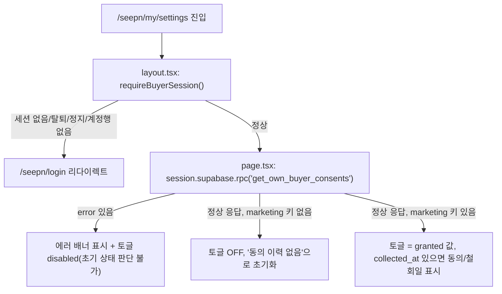
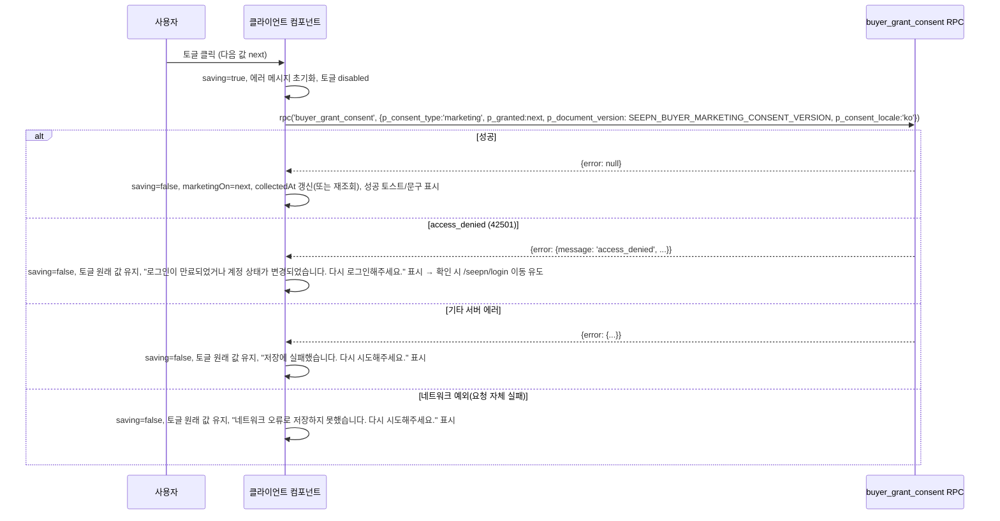

# SEEPN 바이어 — 마케팅 동의 설정 화면 (P-18 해소) — 화면 정의서

> 대상: 바이어(회원) 마케팅 정보 수신 동의 자율 철회 화면 (토글 1개짜리 소형 화면)
> 배경: `docs/03-security/legal-review-queue.md` P-18 — 가입 화면은 체크박스 1클릭으로 동의를 받는데 철회는 고객센터 이메일뿐인 비대칭. 대표 결정(2026-09-10): "체크박스는 유지, 자율 철회 화면을 빠르게 만든다"
> 작성자: service-planner · 작성일: 2026-09-10
> 참고(재사용) 화면: `app/supplier/profile/settings/page.tsx` + `SettingsForm.tsx`의 "마케팅 수신 동의" 섹션(§246~256행) — 이 화면은 그 섹션 하나만 떼어낸 축소판이다. 나머지(공개노출/비밀번호변경/탈퇴)는 포함하지 않는다.
> 백엔드 계약(전제, 이 문서에서 재정의하지 않음): `public.get_own_buyer_consents()`(인자 없음, jsonb 반환), `public.buyer_grant_consent(p_consent_type text, p_granted boolean, p_document_version text default null, p_consent_locale text default 'ko')` — `p_consent_type='marketing'`만 self-service 허용, 그 외 값/미인증/탈퇴 계정은 `access_denied`(42501)

---

## 1. 진입 경로 · 접근 제어

| 항목 | 내용 |
|---|---|
| 경로 | `/seepn/my/settings` (신규) — `app/seepn/my/layout.tsx` 하위에 배치해 `app/seepn/my/bookmarks`, `app/seepn/my/inquiries`와 동일한 헤더/네비/`AccountMenu`를 공유한다 |
| 접근 제어 | 별도 가드를 새로 만들지 않는다. `app/seepn/my/layout.tsx`가 이미 모든 하위 페이지 진입 시 `requireBuyerSession()`을 호출해 **비로그인 → `/seepn/login` 리다이렉트**, **`buyer_account.status`가 `withdrawn`/`suspended` → `/seepn/login` 리다이렉트**, **`buyer_account` 행 자체가 없음(파트너/관리자 세션이 잘못 진입) → `/seepn/login` 리다이렉트**를 페이지 렌더 전에 처리한다. 이 화면의 `page.tsx`도 다른 `my/*` 페이지와 동일하게 `requireBuyerSession()`을 최상단에서 다시 호출한다(레이아웃과 별개로 각 페이지가 자기 요청에서 재검증하는 기존 컨벤션 유지) |
| 로그인 상태에서 정상 접근 | `status === 'active'`(또는 `pending_email`이어도 레이아웃 가드는 통과 — 이메일 미인증 바이어의 이 화면 접근을 막을지는 기존 `my/bookmarks`, `my/inquiries`와 동일 정책을 따른다. 즉 **이 화면만 별도로 더 막지 않는다** — 다른 `my/*` 화면과 다른 취급을 할 근거가 없음) |

---

## 2. 데이터 로딩 (최초 진입)

서버 컴포넌트(`page.tsx`)에서 `requireBuyerSession()`으로 얻은 `session.supabase`로 `get_own_buyer_consents()`를 호출하고, 결과를 클라이언트 컴포넌트에 초기값으로 내려준다 (`app/supplier/profile/settings/page.tsx`와 동일한 서버→클라이언트 데이터 전달 패턴).

| 응답 형태 | 화면 표시 |
|---|---|
| `{}` 또는 `marketing` 키 없음 | 토글 **OFF**, 하단에 "동의/철회 이력 없음" 정도의 문구(과거에 한 번도 동의도 거부도 안 한 상태 — "미동의"와 구분되는 뉘앙스이나 토글 값 자체는 OFF로 동일) |
| `marketing.granted === true` | 토글 **ON**, `marketing.collected_at`을 "동의일: YYYY-MM-DD"로 표시 |
| `marketing.granted === false` | 토글 **OFF**, `marketing.collected_at`을 "철회일: YYYY-MM-DD"로 표시 |
| RPC `error` (네트워크 실패, DB 오류 등) | **파트너 쪽 패턴과 다르게 처리 — 명시적 개선점**: 파트너 `SettingsForm`은 초기 로드 실패를 별도 처리하지 않고 `(consentsData ?? {})`로 조용히 "미동의"에 빠뜨린다. 이 화면은 토글 1개가 전부인 화면이므로, 실제로는 동의 중인데 조회 실패로 OFF처럼 보이면 사용자가 오해할 수 있다 → **로드 실패 시 토글을 OFF/ON 어느 쪽으로도 단정하지 말고, "동의 상태를 불러오지 못했습니다. 새로고침해 주세요." 배너를 보여주고 토글은 disabled로 렌더**한다 (구현 비용 거의 없음 — `page.tsx`에서 `{ data, error } = await session.supabase.rpc(...)`의 `error`를 클라이언트 컴포넌트에 함께 넘기기만 하면 됨) |

---

## 3. 화면 정의서

| 화면명 | 구성요소 | 동작 | 상태별 표시 |
|---|---|---|---|
| 설정(`/seepn/my/settings`) | 제목 `<h1>` "설정" | 정적 텍스트 | — |
| | 섹션: "마케팅 정보 수신 동의" 라벨 + 토글(`ToggleSwitch` 재사용 또는 동일 컴포넌트 복제) | 클릭 시 §4의 저장 플로우 실행 | 로딩 중: disabled + 트랙 회색(기존 `ToggleSwitch`의 `disabled` 스타일 그대로) / 저장 중: disabled + 옆에 "저장 중..." 텍스트 또는 스피너 |
| | 캡션 텍스트(동의일/철회일 또는 이력 없음) | 정적, RPC 응답 기반 | §2 표 참조 |
| | 안내 문구(마케팅 동의가 무엇인지, 끄면 어떻게 되는지) | 정적 | 파트너 화면에는 없던 요소지만, 이 화면은 "동의/철회 화면" 그 자체이므로 최소 1~2줄의 설명은 필요(§6 문구안) |
| | 인라인 에러/성공 메시지 영역 | 저장 성공/실패 시 노출 | §4·§5 참조 |
| | 초기 로드 실패 배너 | RPC 에러 시에만 노출 | §2 표 참조 |

---

## 4. 토글 on/off 시 저장 플로우

`app/supplier/profile/settings/SettingsForm.tsx`의 `handleMarketingToggle`과 동일한 구조로 구현한다 — **비관적(non-optimistic) 갱신**: 클릭 즉시 토글 위치를 바꾸지 않고, RPC 성공 응답을 받은 뒤에만 토글 상태를 바꾼다. 저장 중에는 토글을 `disabled`로 만들어 연속 클릭을 원천 차단한다(별도 디바운스 로직 불필요 — 버튼 자체가 잠긴다).

동의일/철회일 캡션 갱신은 서버가 반환하는 `collected_at`을 다시 받지 않는(RPC가 `void`/성공 여부만 반환) 전제이므로, 성공 시 클라이언트에서 `new Date().toISOString()` 낙관적 표시가 아니라 **성공 직후 `get_own_buyer_consents()`를 한 번 더 호출해 캡션을 갱신**하거나(정확하지만 호출 1번 추가), 혹은 캡션을 "방금 저장됨"류의 상대 표현으로 단순화해 재조회를 생략한다 — 어느 쪽이든 토글 1개짜리 화면 규모에 맞는 선택이면 되고, developer 재량으로 둔다(성능·정확성 트레이드오프가 크지 않음).

---

## 5. 엣지케이스

| 상황 | 처리 |
|---|---|
| 네트워크 실패(요청 자체가 안 나감/타임아웃) | 저장 실패 메시지, 토글은 클릭 전 상태 유지, disabled 해제(재시도 가능) |
| 세션 만료(RPC가 401 성격의 인증 실패 반환) | `buyer_grant_consent`는 인증 안 됨을 `access_denied`(42501)로 통일해 던지므로, 이 경우와 "탈퇴 계정" 경우를 프론트에서 구분할 필요 없음 — 둘 다 동일 문구("로그인이 만료되었거나 계정 상태가 변경되었습니다. 다시 로그인해주세요.") + 로그인 페이지 유도로 처리 |
| 연속 클릭(더블클릭, 응답 오기 전 재클릭) | 저장 중(`saving=true`) 동안 토글 자체를 `disabled` — `ToggleSwitch`가 이미 `disabled` prop을 지원하므로 별도 debounce 불필요 |
| 다른 탭/기기에서 이미 상태를 바꾼 뒤 이 탭에서 오래된 초기값으로 저장 시도 | 이 RPC는 매번 새 `granted` 값을 절대값으로 기록하는 구조(증분이 아님)이므로 충돌이 나지 않는다 — 마지막 클릭이 이긴다. 별도 낙관적 락/버전 체크는 P0 범위에서 불필요 (필요하면 이후 이슈로 분리) |
| `access_denied` 원인이 "탈퇴 계정"인 경우(예: 다른 탭에서 방금 탈퇴 처리) | 위와 동일 문구로 처리 + 확인 클릭 시 `/seepn/login`으로 이동(레이아웃의 `requireBuyerSession()`이 다음 진입 시 어차피 다시 걸러냄) |
| `p_consent_type`에 `'marketing'` 외 값이 전달되는 경우 | 이 화면 자체는 하드코딩된 `'marketing'`만 호출하므로 발생하지 않음(방어 코드 불필요, 다만 상수를 직접 문자열로 두지 말고 리터럴 타입으로 고정해 실수 방지 권장) |
| 최초 로드 RPC 실패 | §2 표 참조 — 토글 disabled + 재조회 안내, OFF로 단정하지 않음 |
| 이메일 미인증(`status='pending_email'`) 바이어의 접근 | 레이아웃 가드가 막지 않으므로 다른 `my/*` 화면과 동일하게 접근 허용(별도 차단 없음) — **이 결정이 맞는지는 product-manager 확인 대상이 아니라 이미 존재하는 `my/bookmarks`/`my/inquiries`의 기존 정책을 그대로 따르는 것이므로 이 화면만 새로 논의할 필요 없음** |

---

## 6. 진입 동선 제안

현재 `components/seepn/AccountMenu.tsx` 드롭다운에는 "로그아웃"/"탈퇴" 두 항목만 있다. 제안:

- `AccountMenu.tsx`의 드롭다운에 **"설정"** 메뉴 항목을 "로그아웃" 위(또는 사이)에 추가하고 `/seepn/my/settings`로 이동하는 `<Link>`로 연결한다. 파괴적 동작(탈퇴)과는 시각적으로 분리 유지.
- 대안으로 `app/seepn/my/layout.tsx` 상단 네비(관심목록/내 문의 옆)에 "설정" 링크를 나란히 추가하는 방법도 가능하나, 그러면 헤더가 3개 링크 + 드롭다운으로 다소 붐빈다. **AccountMenu 드롭다운 추가 쪽을 권장** — 파트너 쪽에서도 설정류는 상단 네비가 아니라 별도 진입(URL 직접)이었고, "계정" 성격의 메뉴(로그아웃/탈퇴)와 같은 그룹에 두는 편이 사용자 멘탈 모델에 맞는다.
- 가입 화면(`app/seepn/signup/page.tsx`)의 마케팅 동의 체크박스 근처에 "가입 후 언제든 설정에서 철회할 수 있습니다" 안내 문구를 추가하는 것도 검토할 만하다(법무 큐 P-18의 "철회가 수집보다 쉬워야 한다"는 논점에 대한 직접적 답변이 됨) — 이건 서비스 기획 판단이므로 여기 제안만 남기고, 문구 자체는 ux-writer 영역.

---

## 7. 문구 초안 (의미만 — 최종 톤은 ux-writer)

| 위치 | 필요한 의미 |
|---|---|
| 화면 제목 | "설정" |
| 토글 라벨 | "마케팅 정보 수신 동의" (가입 화면 체크박스와 동일 표현 유지 — 사용자가 같은 항목임을 인지해야 함) |
| 안내 문구(토글 아래, 상시) | "SEEPN의 새로운 소식, 이벤트, 혜택 정보를 이메일 등으로 받아보실 수 있습니다. 언제든 여기서 껐다 켤 수 있습니다." |
| 동의 상태 캡션(ON) | "동의일: {날짜}" |
| 동의 상태 캡션(OFF, 철회 이력 있음) | "철회일: {날짜}" |
| 동의 상태 캡션(이력 없음) | (표시 안 함 또는 "아직 동의/철회 이력이 없습니다") |
| 저장 중 | "저장 중..." |
| 저장 성공 | "저장되었습니다" (짧은 인라인 표시 또는 토스트 — 이 프로젝트 기존 패턴은 인라인 텍스트가 더 흔함, `SettingsForm.tsx`의 비밀번호 변경 성공 표시 참고) |
| 저장 실패(일반) | "저장에 실패했습니다. 다시 시도해주세요." |
| 저장 실패(네트워크) | "네트워크 오류로 저장하지 못했습니다. 다시 시도해주세요." |
| 저장 실패(access_denied) | "로그인이 만료되었거나 계정 상태가 변경되었습니다. 다시 로그인한 뒤 시도해주세요." |
| 최초 로드 실패 배너 | "동의 상태를 불러오지 못했습니다. 새로고침해 주세요." |

---

## 8. 구현 메모 (developer 참고, 강제 아님)

- 파일 구성 제안: `app/seepn/my/settings/page.tsx`(서버 컴포넌트, `requireBuyerSession()` + `get_own_buyer_consents()` 호출) + `components/seepn/MarketingConsentToggle.tsx`(`'use client'`, 토글 상태·저장 로직).
- `ToggleSwitch`는 `components/supplier/ToggleSwitch.tsx`를 그대로 import해 재사용해도 무방하다(공급자 도메인 로직이 전혀 없는 순수 UI 프리미티브). 도메인 분리가 더 중요하다고 판단되면 `components/seepn/ToggleSwitch.tsx`로 복제해도 되는데, 이건 작은 화면 규모상 developer 재량.
- `SEEPN_BUYER_MARKETING_CONSENT_VERSION`은 `lib/legal/buyerConsentVersions.ts`에서 import.
- 클라이언트 RPC 호출은 `lib/supabase/buyerBrowserClient.ts`의 `getBuyerBrowserClient()` 사용(파트너 쪽 `getSupplierBrowserClient()`와 동일 패턴).
- 타입: `lib/seepn/types.ts`에 `BuyerConsentsByType = Partial<Record<'terms' | 'privacy' | 'marketing', ConsentRecord>>` 정도로 추가하는 것을 권장(파트너 `ConsentsByType`과 동일 패턴, `public_listing`은 바이어에게 없는 개념이므로 제외).
