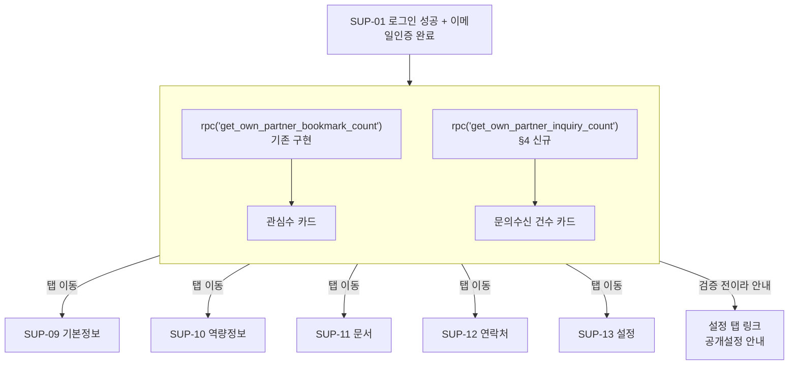

# SEEPN 파트너 대시보드 (P6 재정의 / Opportunity Feed) — 화면 정의서

> 대상: **파트너(공급사) 로그인 후 랜딩 화면 — 관심수 + 문의수신 건수 노출**
> 근거 PRD: `docs/01-plan/features/seepn-unified-platform-v1.0.prd.md` — §3.2.1 SS-14 재검토(rev7), §4.1 P6 행(재정의), §7.2 SP-15
> 작성자: service-planner · 작성일: 2026-09-11
> **이 문서가 하지 않는 것**: 조회수/매칭 알림 화면 설계(PRD가 이번 범위에서 명시적으로 제외), 실제 DB 마이그레이션 SQL 작성(§4는 backend-developer 착수를 위한 계약 초안이지 최종본이 아님), privacy-security-officer 사전검토(§8에 확인 항목만 정리), ux-writer 문구 확정(의미 수준 초안만 표기)

---

## 0. 요약 — 화면 설계보다 먼저 봐야 할 것

### 0.1 무엇이 바뀌는가 (한 줄 요약)

P6은 원래 "Partner 자가등록 계정 시스템(풀버전)"이었으나 그 작업은 P1에서 이미 끝났다(PRD rev7). 오늘 project-manager가 P6을 **"파트너 대시보드 — 관심수 + 문의수신 건수를 보여줘서 재로그인 이유(Opportunity Feed)를 만드는 것"**으로 재정의했다. 이 문서는 그 재정의를 실제 화면 1개(+ 탭 네비게이션 변경 1건, 신규 RPC 1개)로 구체화한다. **규모는 S~M — 숫자 카드 2개짜리 화면이라는 전제를 넘는 설계를 하지 않는다.**

### 0.2 핵심 설계 결정

| # | 결정 | 근거 |
|---|------|------|
| **D-D1** | 대시보드는 **`/supplier/profile` 셸(SUP-08) 안의 새 탭(SUP-15)**으로 만든다 — 별도 최상위 화면(`/supplier/dashboard` 같은 신규 섹션)을 신설하지 않는다 | 기존 셸(상태배너+탭+체크리스트)이 이미 "로그인 후 랜딩"의 자리이므로, 새 섹션을 만들면 상태배너·공지위젯·체크리스트를 중복 구현하거나 셸을 쪼개야 한다. 탭 추가가 가장 작은 변경이다(§1.1) |
| **D-D2** | 이 탭을 **로그인 후 기본 랜딩(default tab)**으로 승격한다 — `app/supplier/profile/page.tsx`의 리다이렉트 대상을 `/basic`에서 `/dashboard`로 변경 | SP-15 항목4("재로그인 유인을 UI만으로") 의 실체가 이것이다. 이메일/푸시가 없는 v1.0에서 "로그인하면 제일 먼저 보인다"가 유일하게 만들 수 있는 유인이다 |
| **D-D3** | 관심수/문의수신 건수 조회 RPC는 **대시보드 탭 페이지에서만 호출**한다 — 셸(`SupplierProfileShell`/`profile/layout.tsx`)에 얹어 모든 탭에서 상시 호출하지 않는다 | 기본정보/역량정보/문서/연락처/설정 탭에서는 이 숫자가 필요 없다. 매 탭 이동마다 RPC 2개를 더 태우는 것은 규모(S~M)에 맞지 않는 과설계다. 대신 대시보드 탭이 로그인 후 첫 화면(D-D2)이므로 "로그인 시 1회는 반드시 보임"이라는 목적은 그대로 달성된다 |
| **D-D4** | 두 숫자 모두 **집계 카운트 1개씩만 반환하고, 시계열/최근 N일 breakdown을 만들지 않는다** | `get_own_partner_bookmark_count()`의 코드 주석이 이미 이 원칙을 명시적으로 경고했다 — *"a time-bucketed series at low counts would let re-identification creep back in — explicitly warned against in the review, so deliberately not built"*. 신규 RPC(§4)도 동일 원칙을 그대로 승계한다. 이는 이 화면 전체의 상한선이다: **"오늘 3건", "이번 주 추이" 같은 위젯은 이 문서의 범위에 없다** |
| **D-D5** | 문의수신 건수는 **"어느 바이어가 왜 문의했는지"로 이어지는 어떤 진입점도 만들지 않는다** — 숫자만 있고 목록/상세로 드릴다운하지 않는다 | PRD 원칙("어느 바이어가 문의했는지는 절대 노출 안 함")과 이미 배포된 `seepn_inquiry`/`admin_list_seepn_inquiries` 설계(본문·목록 전부 Admin 전용, 파트너용 조회 경로가 아예 없음)를 그대로 따른다. 후속 대응은 운영자가 오프라인으로 한다(Human Matching 모델과 동일) |
| **D-D6** | 이 화면은 **검증 상태·공개 여부와 무관하게 모든 파트너에게 노출**한다(단, 0건일 때 상태별로 다른 안내 문구를 붙인다) | §3.4에서 상술. 최소 개수 게이트 없이 열자는 D-13②의 정신을 이 화면에도 적용 — "아직 0건"을 숨기지 않고 왜 0건인지 설명하는 쪽이 재로그인 유인 취지에 더 맞는다(§6에 확인 필요 항목으로도 남김) |

### 0.3 화면 목록

| ID | 화면명 | 로그인 | 신규/재사용 |
|---|---|:---:|---|
| **SUP-15** | **탭: 대시보드**(관심수 · 문의수신 건수) | 필요(기존 `/supplier/profile/*`와 동일) | **신규 탭 페이지** — 셸(SUP-08)·탭 네비게이션(`ProfileTabs.tsx`)은 재사용, 콘텐츠 영역만 신규 |

기존 SUP-01~14는 변경 없음. `app/supplier/profile/page.tsx`(인덱스 리다이렉트)만 대상 경로가 바뀐다(§1.1).

### 0.4 이 문서가 뒤집는 기존 결정

`docs/02-design/features/partner-supplier-app.screen-spec.md` §0.1 **D-S3**("전용 대시보드(SS-14)는 만들지 않는다. 로그인 후 랜딩은 `/supplier/profile`이며, 화면 상단 '상태 배너'만으로 검증 진행 상황을 알린다")는 **PRD SS-14가 Won't이던 시점의 결정**이다. PRD rev7이 SS-14를 관심수·문의수신 건수로 좁혀 Could로 승격했으므로 D-S3는 **이 범위 내에서 무효**다. 단, D-S3가 지킨 원칙("상태배너로 검증 진행 상황을 알린다")은 그대로 유지한다 — 대시보드 탭은 상태배너를 대체하는 것이 아니라 **상태배너 아래에 새로 생기는 콘텐츠**다(셸 구조는 그대로, §1.1).

> `app/supplier/profile/page.tsx`, `components/supplier/ProfileTabs.tsx`, `lib/supplier/tabGaps.ts`의 코드 주석이 D-S3/SS-14 Won't를 인용하고 있다 — 구현 시 이 세 파일의 주석도 함께 갱신 필요(qa-reviewer 체크 항목).

---

## 1. 공통 규칙

### 1.1 재사용 자산 / 변경 대상 파일

| 자산 | 위치 | 이 문서에서의 용도 |
|---|---|---|
| `SupplierProfileShell` (상태배너 + 공지위젯 + 탭 + 체크리스트) | `components/supplier/SupplierProfileShell.tsx` | **그대로 재사용, 수정 없음** — 대시보드 탭도 이 셸의 `children`으로 렌더링됨 |
| `ProfileTabs` | `components/supplier/ProfileTabs.tsx` | **수정 대상** — `TABS` 배열 맨 앞에 `{ id: 'dashboard', label: '대시보드', href: '/supplier/profile/dashboard' }` 추가(라벨은 ux-writer 확정 전 가안) |
| `SupplierTabId` 타입 | `lib/supplier/tabGaps.ts` | **수정 대상** — 유니온에 `'dashboard'` 추가. `GAP_KEY_TO_TAB`에는 매핑을 추가하지 않는다(대시보드는 입력 필드가 없으므로 미입력 점(dot) 표시 대상이 아님) |
| `requireSupplierSession()` | `lib/supplier/session.ts` | **그대로 재사용** — 이미 `partner.verification_state`, `partner.public_listing_state`를 포함한 `partner` 행 전체를 반환하므로 대시보드 페이지가 추가 조회 없이 바로 씀 |
| `get_own_partner_bookmark_count()` | `supabase/migrations/20260910100000_seepn_buyer_web_p5a.sql` §10 | **이미 구현·배포됨** — 인자 없음, `returns integer`, `authenticated`에게만 grant. 그대로 호출 |
| `getSupplierBrowserClient()` / 서버 `supabase` 인스턴스(`requireSupplierSession()`의 반환값) | `lib/supabase/supplierBrowserClient.ts`, `lib/supplier/session.ts` | RPC 호출 클라이언트. 이 화면은 서버 컴포넌트에서 `requireSupplierSession()`이 이미 만들어 둔 `supabase` 인스턴스로 두 RPC를 병렬 호출하면 충분 — 별도 클라이언트 컴포넌트/브라우저 호출 불필요(정적 숫자, 사용자 인터랙션 없음) |
| `rounded-card border border-neutral-200 bg-neutral-0 p-…` + `text-h1`/`text-label-caption` 톤 | `NoticePreviewWidget.tsx`, `tailwind.config.ts`(`h1`/`h2`/`body-sm`/`label-caption`) | 숫자 카드 스타일의 참고 톤(버튼/폼이 아니라 지표 카드이므로 `/admin` 대시보드의 `StatCard` 레이아웃 아이디어를 buyer 계열 타이포 토큰으로 옮겨 재현 — `admin-*` 토큰은 쓰지 않는다, `partner-supplier-app.screen-spec.md` D-S2 원칙 승계) |
| `EnvelopeIcon` | `components/icons/SupplierIcons.tsx` | 문의수신 카드 아이콘으로 재사용 가능. 관심수 카드용 하트 아이콘은 **미존재 — 신규 1개 필요**(동일 컨벤션: 24 viewBox, `stroke=currentColor`, 외부 아이콘 패키지 금지 원칙 승계) |

### 1.2 URL

```
/supplier/profile/dashboard   (SUP-15, 신규)
```

`app/supplier/profile/page.tsx`(인덱스, 현재 `/supplier/profile/basic`으로 리다이렉트)를 `/supplier/profile/dashboard`로 변경한다(D-D2).

### 1.3 용어

PRD §3.0 OQ-6에 따라 "파트너"를 쓴다. 화면 라벨은 PRD 원문 표현("관심수", "문의수신 건수")을 그대로 따르되 최종 카피는 ux-writer 확정 대상.

---

## 2. 전체 정보구조 (플로우)



**단계 요약**

1. 파트너가 로그인(SUP-01) + 이메일 인증 완료 → 셸(SUP-08)이 렌더링되고, 인덱스 리다이렉트가 **대시보드 탭(SUP-15)**으로 향한다(기존엔 기본정보 탭이었음, D-D2).
2. 대시보드 탭 서버 컴포넌트가 `requireSupplierSession()`으로 세션·`partner` 행을 확보한 뒤, `get_own_partner_bookmark_count()`와 `get_own_partner_inquiry_count()`(신규)를 병렬 호출한다.
3. 두 숫자를 카드 2개로 표시. `partner.verification_state`/`partner.public_listing_state`에 따라 카드 하단 안내 문구가 달라진다(§3.4).
4. 파트너는 언제든 상단 탭으로 다른 탭(기본정보~설정)으로 이동 가능 — 대시보드는 다른 탭의 입력을 막지 않는다(체크리스트 사이드바도 그대로 유지).
5. 다음 로그인 시 다시 대시보드로 랜딩 — 그 사이 관심수/문의수신 건수가 늘었으면 **"재방문 시 반영"**되는 방식으로 자연스럽게 보인다(실시간 알림 없음, M-R13/§7.3 BY-12 선례와 동일 원칙).

---

## 3. SUP-15 파트너 대시보드

### 3.1 진입 조건

| 상태 | 처리 |
|---|---|
| 로그인 + 이메일 인증 완료 | 정상 렌더링(§3.3) |
| 로그인했지만 이메일 미인증 | 셸(SUP-08)이 이미 처리 — 인증 대기 인터스티셜이 먼저 뜨고 이 탭에 도달하지 않음(기존 동작 그대로, 변경 없음) |
| `verification_state`가 `draft`/`submitted`/`under_review`/`rejected`/`suspended` | **진입 허용**(D-D6) — 카드 자체는 보이되 0건 + 상태별 안내 문구(§3.4) |
| 세션 만료 중 접근 | 셸의 기존 세션 재검증(`requireSupplierSession`)이 `/supplier/login`으로 리다이렉트 — 기존 다른 탭과 동일 |

### 3.2 레이아웃 (ASCII 와이어프레임 — 세부 비주얼은 ui-ux-designer 재량)

```
┌ (셸: 상태배너 + 공지위젯 — 기존 그대로) ──────────────────┐
│ [대시보드] [기본정보] [역량정보] [문서] [연락처] [설정]   │ ← 탭, "대시보드"가 맨 앞(D-D1)
├────────────────────────────────────────────────────────┤
│  ┌───────────────────┐   ┌───────────────────┐          │
│  │ ♡ 관심수           │   │ ✉ 문의수신 건수     │          │
│  │                    │   │                    │          │
│  │        3           │   │        1           │          │
│  │                    │   │                    │          │
│  │ (상태별 안내 1줄)   │   │ (상태별 안내 1줄)   │          │
│  └───────────────────┘   └───────────────────┘          │
│                                                          │
│  (그 아래로는 아무것도 없음 — 목록/추이 그래프/알림 없음) │
└──────────────────────────(체크리스트 사이드바는 셸이 그대로 옆에 유지)┘
```

카드 2개, 나란히(모바일은 세로 스택). **이 화면에 이보다 더 넣지 않는다**(D-D4/D-D5, 규모 S~M 준수).

### 3.3 화면 정의표

| 구성요소 | 동작 | 상태별 표시 |
|---|---|---|
| 관심수 카드 | `get_own_partner_bookmark_count()` 결과를 큰 숫자로 표시 | 로딩: 스켈레톤(숫자 자리만) · 에러: 숫자 대신 "불러오지 못했습니다" + 새로고침 안내(§3.4/§6) |
| 문의수신 건수 카드 | `get_own_partner_inquiry_count()`(§4 신규) 결과를 큰 숫자로 표시 | 관심수 카드와 동일한 로딩/에러 패턴, **카드별로 독립적**(한쪽이 실패해도 다른 쪽은 정상 표시, §6 EDGE-D3) |
| 카드 하단 안내 문구 | `partner.verification_state`/`partner.public_listing_state` 조합에 따라 1줄 | §3.4 매트릭스 |
| 검증 대기/반려 상태일 때 추가 안내 | "검증이 완료되면 집계가 시작됩니다" 류 | §3.4 |
| 설정 탭 바로가기(검증완료+미공개일 때만) | "SEEPN에 공개하면 …" 문구에 `/supplier/profile/settings`로 가는 링크 병기 | 기존 `StatusBanner`의 "공개설정 바로가기" 링크와 동일 패턴 재사용 |

### 3.4 카드 상태 매트릭스 (엣지케이스 5번 항목 — 0건 표시 + 미검증 노출 정책)

| `verification_state` | `public_listing_state` | 관심수 카드 안내 | 문의수신 카드 안내 |
|---|---|---|---|
| `draft`/`submitted`/`under_review`/`rejected`/`suspended` (미검증) | (무관 — 구조적으로 `off`) | 숫자는 **0** + "검증이 완료되면 집계가 시작됩니다" | 숫자는 **0** + "검증이 완료되면 집계가 시작됩니다" |
| `verified` | `off` | 숫자는 (이론상 대부분 0) + "SEEPN에 공개하면 관심수가 집계됩니다 → 공개설정 바로가기" | 숫자는 (이론상 대부분 0) + "SEEPN에 공개하면 문의를 받을 수 있습니다 → 공개설정 바로가기" |
| `verified` | `on`, 카운트=0 | "아직 관심등록한 바이어가 없습니다" | "아직 접수된 문의가 없습니다" |
| `verified` | `on`, 카운트>0 | (안내 문구 없음 또는 "누적 관심수입니다" 정도) | **"운영자가 확인 후 별도로 연락드립니다"**(이 문구가 중요 — 파트너가 "문의 내용을 어디서 보나"를 찾다가 헤매지 않도록 D-D5를 화면에서 직접 설명) |
| `on` 이지만 `verification_state`가 `rejected`/`suspended`로 나중에 바뀐 경우 | (§6 EDGE-D2 참고 — DB 제약상 이 조합은 `partner_reject_partner`/관리자 정지 시 `public_listing_state`도 함께 `off`/`suspended`로 바뀌므로 실제로는 발생하지 않음, 방어적으로만 "off"와 동일 문구 처리) | — | — |

> **비검증 상태에서도 0을 그대로 보여줄지, 카드 자체를 흐리게(dim) 처리할지는 ui-ux-designer 재량.** 이 문서는 "화면에서 사라지게 하지 않는다(D-D6)"까지만 확정한다.

---

## 4. 신규 RPC 계약 설계 — `get_own_partner_inquiry_count()`

### 4.1 계약

| 항목 | 값 |
|---|---|
| 이름 | `public.get_own_partner_inquiry_count()` |
| 인자 | 없음 |
| 반환 타입 | `integer` — 호출자 본인 파트너 row를 참조하는 `seepn_inquiry` 건수(전체 누적, 상태 무관) |
| 언어/속성 | `language sql`, `stable`, `security definer`, `set search_path = ''` — `get_own_partner_bookmark_count()`와 완전히 동일한 패턴(§0의 D-D4/D-D5가 요구하는 정확히 그 형태) |
| 권한 | `revoke all from public` 후 `grant execute to authenticated`만. `anon`은 호출 불가 |
| 인증 안 됨(anon 세션) | grant가 없으므로 PostgREST가 권한 오류(42501 계열)로 거부 — 화면에서 별도 처리 불필요(애초에 이 화면은 `requireSupplierSession()` 뒤에서만 렌더링됨) |
| 로그인은 됐지만 파트너가 아님(이론상 도달 불가, admin/buyer 세션) | `private.current_partner_id()`가 `null` → 서브쿼리가 `null` → `count(*)`가 자연스럽게 **0** 반환 (예외를 던지지 않음, `get_own_partner_bookmark_count()`와 동일한 관용적 설계) |
| 정상 케이스 | 호출자 소유 `partner.id`를 참조하는 `seepn_inquiry_partner` 행 수 = 그 파트너를 참조한 **서로 다른 문의(inquiry) 건수**(PK가 `(inquiry_id, partner_id)`라 한 문의당 중복 카운트되지 않음) |

### 4.2 참고 구현 스케치 (backend-developer 최종 결정 대상 — 그대로 채택해도 되는 수준까지 좁혀둠)

```sql
create or replace function public.get_own_partner_inquiry_count()
returns integer
language sql
stable
security definer
set search_path = ''
as $$
  select count(*)::integer
  from public.seepn_inquiry_partner sip
  where sip.partner_id = (select id from public.partner where owner_account_id = private.current_partner_id());
$$;

comment on function public.get_own_partner_inquiry_count is
  'SUP-15 (P6 Opportunity Feed): mirrors get_own_partner_bookmark_count() exactly.
  The ONLY thing a partner may learn about seepn_inquiry is a single aggregate
  integer for their OWN partner row — never which buyer, never inquiry body,
  never a time-bucketed series (same re-identification concern already
  documented on get_own_partner_bookmark_count). seepn_inquiry_partner has no
  partner-facing RLS SELECT policy by design (20260910180000 §1) — this
  SECURITY DEFINER function is the sole partner-side read path.';

revoke all on function public.get_own_partner_inquiry_count() from public;
grant execute on function public.get_own_partner_inquiry_count() to authenticated;
```

**왜 `seepn_inquiry_partner`를 직접 세는가, `seepn_inquiry`를 조인하지 않는가**: GAP-C1(2026-09-10) 이후 참조 파트너는 `seepn_inquiry_partner` 조인 테이블에만 있다(`seepn_inquiry.partner_id` 컬럼은 이미 drop됨). 파트너 관점에서 "나를 참조한 문의 수"는 이 조인 테이블에서 `partner_id = 내 파트너 id`인 행 수와 정확히 같다 — `seepn_inquiry` 본문 테이블을 조인할 필요가 없고(본문·상태·발신자 등 어떤 컬럼도 이 함수가 읽을 이유가 없음), 조인을 안 할수록 "실수로 컬럼을 하나 더 얹어 PII가 새는" 위험도 줄어든다.

### 4.3 이 RPC가 절대 하지 않는 것 (backend-developer 스코프 경계)

| 하지 않는 것 | 이유 |
|---|---|
| 상태별(`new`/`in_progress`/`closed`) 분리 카운트 | 화면 요구사항이 총계 1개뿐(§3.3). 상태별 분리는 "어떤 문의가 처리 중인지" 추론의 실마리가 되어 D-D5 취지에 안 맞음 |
| 최근 N일/시계열 | D-D4에서 이미 금지 — 저카운트 구간에서 재식별 위험 재발 |
| 문의 목록/상세로 이어지는 파라미터(문의 id 등) 반환 | D-D5. 이 함수는 정수 1개만 반환한다 |
| 참조 파트너가 여러 개인 문의(P5b 비교 문의, 최대 5곳 동시 참조)를 특별 취급 | 불필요 — `seepn_inquiry_partner`가 이미 "이 파트너가 참조된 각 문의당 정확히 1행"을 보장하므로 다자간 문의든 단일 문의든 카운트 로직이 동일하다 |

---

## 5. "재로그인 유인"을 UI만으로 달성하는 범위 (SP-15 항목4)

v1.0에는 이메일/푸시 알림 인프라가 없다(§7.2 SP-15 명시). 이 문서가 채택하는 유일한 메커니즘은:

1. **로그인 후 첫 화면이 이 대시보드다**(D-D2) — "로그인하면 뭔가 새로운 게 있을 수도 있다"는 기대를 만드는 것은 이 한 가지 장치뿐이다.
2. 숫자가 0에서 올라가 있으면(다음 로그인 시점 기준) 그 자체가 "다녀갈 이유가 있었다"는 사후 확인이 된다.

**명시적으로 이 범위에 넣지 않는 것**(task 지시 및 PRD와 동일):
- 이메일/푸시로 "새 관심등록/문의가 있습니다" 알림 발송 — 인프라 자체가 없음, 별도 Phase
- 배지 카운트(브라우저 탭 타이틀 `(1)` 표시 등) — 실시간 갱신 인프라가 없는데 이런 장치만 만들면 "안 갱신되는 배지"라는 반대 효과
- 조회수·매칭 알림 — PRD가 이번 P6 범위에서 명시적으로 제외(데이터 없음, §0.1)

---

## 6. 엣지케이스 종합표

| # | 상황 | 처리 |
|---|---|---|
| EDGE-D1 | 관심수/문의수신 건수가 둘 다 0 (신규 가입 직후) | §3.4 매트릭스의 "verified+on+0" 또는 "미검증" 행 그대로 — 빈 화면처럼 보이지 않도록 반드시 안내 문구를 붙인다(빈 카드만 두지 않음) |
| EDGE-D2 | `verified`+`on` 상태였다가 운영자가 강제로 `suspended`/반려 처리(신뢰 문제 등) | `admin_reject_partner`/정지 RPC가 이미 `public_listing_state`도 함께 끄도록 구현돼 있음(§0.3, 20260829140000 확인) — 대시보드는 이 조합을 별도로 감지할 필요 없이 최신 `partner` 행 기준으로 §3.4의 "off" 행을 그대로 적용 |
| EDGE-D3 | 두 RPC 중 하나만 실패(네트워크/일시적 DB 오류) | **카드별 독립 에러 처리** — `Promise.all([rpc1, rpc2])`로 병렬 호출하되, 각 결과의 `{data, error}`를 카드별로 따로 검사해 한쪽만 "불러오지 못했습니다"로 표시하고 다른 카드는 정상 렌더링(공급-side 컴포넌트가 실제로 throw하는 경우는 네트워크 완전 단절 정도이므로 페이지 자체는 에러 바운더리로 처리) |
| EDGE-D4 | 새로고침 없이 페이지를 오래 열어둔 상태에서 관심수가 실제로 늘어남(바이어가 그 사이 찜함) | **실시간 반영하지 않는다** — 재방문/새로고침 시에만 갱신(M-R13, BY-12 §7.3과 동일 원칙, PRD가 알림 인프라 부재를 이미 전제) |
| EDGE-D5 | 파트너가 대시보드 탭에서 다른 탭으로 이동했다가 다시 대시보드로 돌아옴(같은 세션 내) | 매번 서버 컴포넌트 재렌더링이므로 최신 값으로 재조회됨(캐싱 안 함) — 셸의 `DirtyGuardProvider`(입력 미저장 이탈 경고)는 대시보드엔 입력 필드가 없으므로 아예 트리거되지 않음 |
| EDGE-D6 | 파트너 본인 파트너 row가 여러 개 존재하는 경우 | 스키마상 불가능(`owner_account_id`는 `partner_account`당 1개 파트너 row로 설계돼 있음, PC 원칙) — 별도 처리 불필요 |
| EDGE-D7 | 문의수신 건수가 매우 큰 값(향후 파트너 인기 급상승)으로 자릿수가 카드 레이아웃을 깨는 경우 | v1.0 규모(파트너 최대 수백 곳, 문의는 그보다 훨씬 적음)에서는 발생 가능성 낮음 — 큰 수 서식(1,234 형태)만 적용해두면 충분, 별도 축약 표기(1.2k 등) 불필요 |
| EDGE-D8 | 관리자 세션이 실수로 `/supplier/profile/dashboard`에 접근 | 기존 `requireSupplierSession()`의 자연 차단(파트너 계정 행이 없으면 즉시 `/supplier/login` 리다이렉트) — 이 화면만의 별도 방어 불필요 |

---

## 7. Open Questions (product-manager 확인 필요)

| ID | 질문 | 서비스기획자 권고(기본값) |
|---|---|---|
| **OQ-D1** | 미검증 파트너에게도 대시보드(0건)를 그대로 노출할지, 검증 완료 전에는 탭 자체를 숨기거나 비활성화할지 | **[2026-09-12 대표 확정] 노출.** 권고안(D-D6) 그대로 채택 |
| **OQ-D2** | 문의수신 건수를 "전체 누적"으로 할지, "미종결(`new`+`in_progress`)만" 셀지 | **[2026-09-12 대표 확정] 전체 누적.** 권고안 그대로 채택 — 관심수와 의미론 일치 |
| **OQ-D3** | `/supplier/profile` 기본 랜딩을 `/basic`에서 `/dashboard`로 바꾸는 것에 대한 최종 승인 | **[2026-09-12 대표 확정] 변경 승인.** 권고안(D-D2) 그대로 채택 |
| **OQ-D4** | 탭 라벨 문구("대시보드"/"현황"/"홈" 등) | ux-writer 결정 사항, 이 문서는 "대시보드"를 가안으로만 사용 |

---

## 8. privacy-security-officer 핸드오프 체크리스트

CLAUDE.md 원칙("개인정보를 다루는 기능은 privacy-security-officer 점검 없이 배포하지 않는다")에 따라, 이 화면이 새로 추가하는 유일한 데이터 접근면(§4 신규 RPC)은 배포 전 확인이 필요하다. 단 **`get_own_partner_bookmark_count()`가 이미 동일 패턴으로 사전검토를 통과한 선례**이므로, 신규 전면 검토가 아니라 **패턴 일치 여부 확인** 수준으로 충분할 것으로 예상된다.

| # | 항목 | 왜 확인이 필요한가 |
|---|---|---|
| PSO-D1 | `get_own_partner_inquiry_count()`가 `get_own_partner_bookmark_count()`와 정확히 동일한 보안 속성(SECURITY DEFINER, 집계 1개만 반환, 시계열 없음, `authenticated`만 grant)을 갖는지 코드 리뷰 시점에 재확인 | §4.1의 계약이 실제 구현과 어긋나면 이 화면 전체의 전제(D-D4/D-D5)가 깨짐 |
| PSO-D2 | `seepn_inquiry_partner`에 파트너용 SELECT RLS 정책이 실수로 추가되지 않는지(현재는 buyer 자기조회 정책만 존재, §4.2 인용) | 만약 누군가 "파트너도 이 테이블을 직접 읽게 하자"고 편의상 정책을 추가하면 RPC 우회 경로로 문의 본문·상대 파트너 목록이 새어나갈 수 있음 |
| PSO-D3 | 대시보드 탭이 미검증 파트너에게도 노출되는 것(OQ-D1)이 확정될 경우, 0건 카드에 붙는 안내 문구가 "검증 전 상태"를 필요 이상으로 상세히 드러내지 않는지(예: 반려 사유 재노출 등 — 이미 상태배너에 있는 정보를 중복 노출하는 수준으로 제한) | 신규 노출면은 아니지만 문구 확정 시 재확인 권고 |

---

## Version History

| Version | Date | Changes | Author |
|---|---|---|---|
| 1.1 | 2026-09-12 | **OQ-D1~D3 대표 확정 — 전부 서비스기획자 권고안 그대로 채택.** 미검증 파트너에게도 대시보드 노출(OQ-D1), 문의수신 건수는 전체 누적(OQ-D2), 기본 랜딩 `/basic`→`/dashboard` 변경 승인(OQ-D3). OQ-D4(탭 라벨)만 ux-writer 대상으로 남김. 구현 착수 가능 | 대표 확정, Claude(정리) |
| 1.0 | 2026-09-11 | 최초 작성 — PRD rev7(P6 재정의), §3.2.1 SS-14 재검토, §7.2 SP-15 기준. 관심수(기존 `get_own_partner_bookmark_count()`)와 문의수신 건수(신규 RPC 계약 설계, §4)를 숫자 카드 2개로 노출하는 SUP-15 신설. 로그인 후 기본 랜딩을 `/basic`→`/dashboard`로 전환(D-D2)하는 것으로 "재로그인 유인"을 UI만으로 구현. `partner-supplier-app.screen-spec.md` D-S3(전용 대시보드 미설계 결정)를 이 범위 내에서 무효화. 엣지케이스 8건, Open Question 4건, privacy-security-officer 핸드오프 3건 | service-planner |
